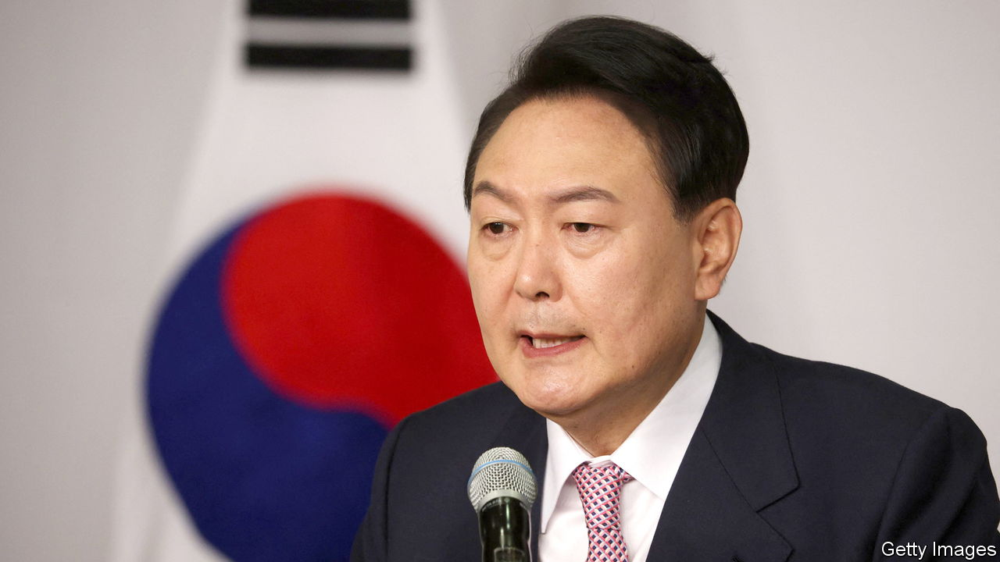

###### Dangerous waters

# South Korea’s incoming president faces a tough tenure 

##### Yoon Suk-yeol is already unpopular 

 

> May 7th 2022 

FOR ONCE, the braised shark fin is not the most controversial thing about Yeong Bin Gwan. The grand banquet hall in Seoul, famed for the dubious delicacy, is where Yoon Suk-yeol, South Korea’s incoming president, will have his inauguration on May 10th. The opposition Minjoo party complained that the event’s 3.3bn-won ($2.6m) budget makes it the most expensive inauguration ever. Mr Yoon’s people explained that the venue adds only a meagre 500,000 won to the bill. Still, a Minjoo spokesman said it was tantamount to declaring South Korea a country where “the president comes first”.

Petty point-scoring is not new to South Korean politics. High office attracts forensic scrutiny. It will soon become routine for Mr Yoon. Shark fin or not, he will have a lot on his plate after inauguration day. He must tackle many problems, including astronomical housing costs and the frustrations of young people who are well-educated but underemployed. Mr Yoon has also promised structural reforms in several areas, including welfare, corporate regulation and criminal justice. Even the executive branch is to be transformed: it will become an institution, his office has said, that “has autonomy, communicates and takes responsibility”.


And that is just at home. Mr Yoon must also deal with a dangerous world. He hopes to draw closer to America, but also wants to avoid antagonising China, his country’s largest trading partner. He has promised a harder line on North Korea, which has been increasingly bellicose in recent months, launching yet another missile on May 4th, just days before the inauguration.

Such Herculean ambitions would be challenging for the most experienced and popular of leaders. Mr Yoon is neither. In 2016 his role in the impeachment of Park Geun-hye, a disgraced former president, on corruption charges earned him a promotion to chief prosecutor under Moon Jae-in, her successor. In that job Mr Yoon zealously pursued figures in Mr Moon’s government, bolstering his own anti-corruption credentials. But he entered politics only when he announced his candidacy for president in June last year.

Mr Yoon has promised a “fair administration that does not allow privileges or foul play”. The public is sceptical about this claim, given the various allegations that tainted him and his family during the unedifying campaign, not to mention those flung at his opponent. Despite his frequent claims to embody the will of the people, he won the election on March 9th with a margin of only 0.7%, the narrowest in the history of modern Korean democracy. He enters office with the highest disapproval rating of any new president.

As if his historic unpopularity and long to-do list did not pose enough of a challenge, Mr Yoon also faces a third impediment: his party does not have a majority in the National Assembly. Barring a mass defection, the Minjoo party, which holds 168 of 300 seats, will control the legislature at least until elections in 2024. It can block Mr Yoon’s bills and try to force through its own. But the presidential veto is a trump card—the opposition lacks the numbers to overturn it. The most likely result will be paralysis. Mr Yoon has said he hopes his administration will be able to “overcome the division of ideologies”. But he will be encircled by sharks. ■

