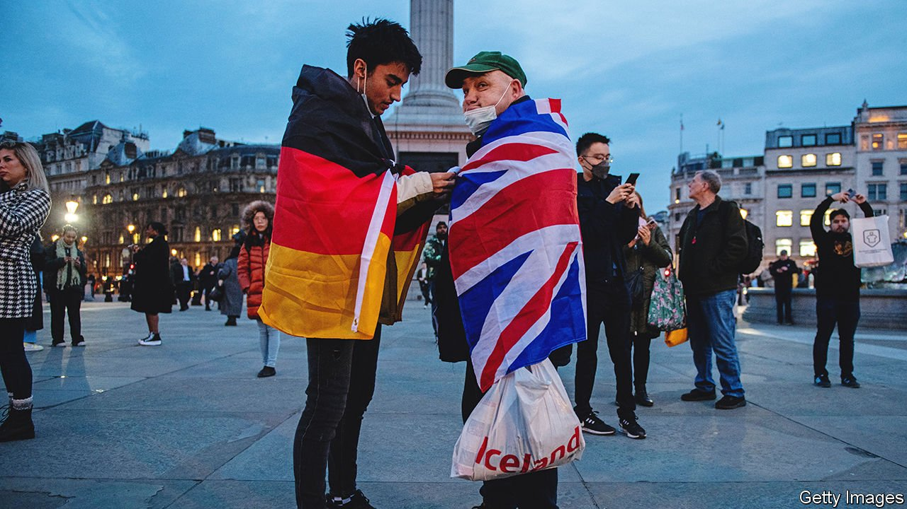

###### Take back contrôle

# Britain has become unexpectedly European 

##### How post-Brexit Britain came to look more like a European Union country 

 

> May 7th 2022 

THE DREAM of many Brexiteers was plain. Unshackled from the “corpse” of the EU, Britain would tear up Brussels red tape, take back control of immigration, switch its focus to fast-growing Asian markets and change from a low-wage into a high-wage economy. A European Britain would be replaced by a global Britain. Trade with the EU would continue freely under a new trade deal—indeed, relations might even be more harmonious.

A little more than two years after Britain left the club, free movement has ended but not much else of that vision has come to pass. Relations with the EU are scratchier than ever. And yet paradoxically Britain has in many ways become more, not less, like its EU neighbours.


As a member, it was less heavily regulated than most other rich countries. It had more opt-outs from EU policies than anyone else. Successive governments kept corporate taxes and national-insurance rates lower than most competitors, and spent less on health care. Within the EU Britain largely eschewed state intervention and subsidies to industry and avoided high minimum wages. And for most of the 1990s and 2000s, the British economy grew faster than its EU rivals.

Under Boris Johnson there has been little regulatory divergence from standards set in Brussels, partly because few firms (or consumers) want changes that might raise even bigger obstacles to trade with the EU. Charles Grant, director of the Centre for European Reform (CER), a think-tank, recalls that Germany and France seriously feared that post-Brexit Britain would move towards a low-tax, low-regulation version of “Singapore-on-Thames”, which is why they insisted on strong level-playing-field conditions in the trade deal. But in practice there has been little sign of such a shift.

Indeed, the direction of travel may be quite the opposite. As Jonathan Hill, a former British EU commissioner, puts it, Britain now looks more like the rest of Europe in a wide range of areas, including tax, public spending and borrowing, state intervention and subsidies, than it did in the days of David Cameron, let alone of Margaret Thatcher. Mr Johnson clearly likes spending public money. Citing the example of Michael Heseltine, a Tory minister from the Thatcher era who was keen on a big role for the state, he has called himself a “Brexity Hezza”.

Britain’s tax burden is set to be its heaviest since the late 1940s. Inflated by the response to covid-19, public spending is also near record levels. Employee national-insurance contributions, a proxy for EU social-security charges, have risen from 9% in the 1990s to over 13%. The main corporate-tax rate will go up from 19% to 25% next year. Public spending on health care has increased from a little over 8% of GDP in the early 2000s to nearer 12%, above the EU average. The minimum wage has risen substantially in recent years. Even British demography looks more European, as the fertility rate has plunged to 1.58—only just above Germany’s.

On climate change, Mr Johnson is a fervent cheerleader for the net-zero target for carbon emissions, which Britain was the first European country to enshrine in law. He claims to be almost as keen on nuclear power as France. Promises to improve growth by relaxing tough planning laws have come to nothing in the face of voter opposition. Despite Brexit, Britain seems closer to the  than it was under previous Tory prime ministers.

Mind your backyard

And what of global Britain? Last year’s integrated review of British foreign policy barely mentioned the EU, focusing instead on Asia and on helping America against China. But Russia’s invasion of Ukraine has shown that, in foreign and security policy, Europe still matters most.

Some observers hope that working with European allies on Ukraine could presage a mending of fences with the EU. Peter Mandelson, another former British EU commissioner, noted at a recent CER seminar that Ukraine had shattered the British illusion that it could turn its back on Europe when it comes to security, though he added that it would take a new prime minister to accept this obvious conclusion. Sir Ivan Rogers, a former British permanent representative to the EU, similarly told a recent EU-UK forum that the Ukraine war was a “game-changer”, creating a chance to reset relations with Brussels as well as with national capitals.

There is clearly scope to expand the thin trade agreement with the EU in areas like mobility or academic and scientific co-operation, and to work more closely on foreign and security issues. But Anand Menon, director of UK in a Changing Europe, an academic think-tank, thinks relations cannot be seriously improved so long as Mr Johnson keeps talking of legislation to allow him unilaterally to tear up the Northern Ireland protocol, which keeps the province in the single market for goods by creating a border in the Irish Sea. Hardline Tory Brexiteers want this to be done soon after the results of this week’s election to the Northern Ireland Assembly are known.

That would exemplify another paradox of post-Brexit Britain. As a member Britain was renowned for punctiliously observing all the EU’s rules. Yet Mr Johnson, who was recently found to have broken domestic law on covid restrictions, now threatens to break international law by unilaterally repudiating a treaty he himself signed and ratified barely two years ago. This would replicate another unedifying habit of some EU countries: signing up to something with no intention of implementing it. ■

For more coverage of matters relating to Brexit, visit our 

