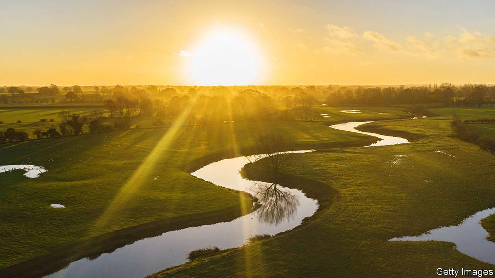
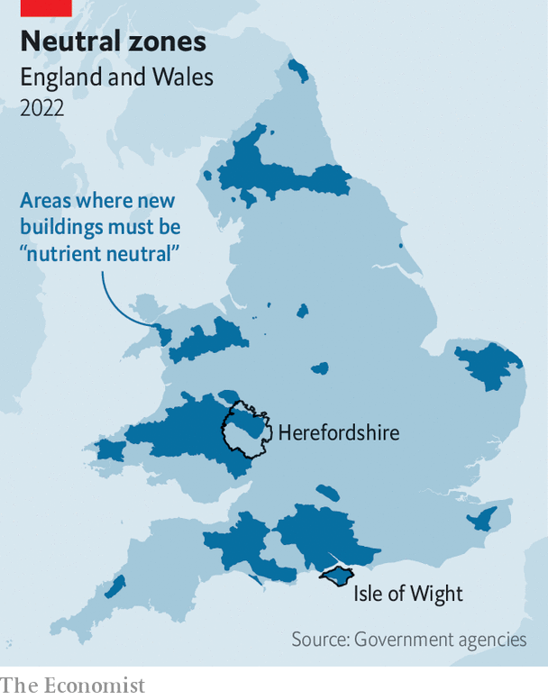

###### Nutrient neutrality

# Britain is tackling river pollution by going after the wrong culprits 

##### Whatever the problem, the solution always seems to be building fewer houses 

 

> May 7th 2022 

NUTRIENT NEUTRALITY came suddenly to Herefordshire, a pretty corner of western England, in 2019. “We had no warning. We just got a letter in the post,” says Merry Albright of Border Oak, a local house-builder. Like others, Ms Albright quickly discovered that she could no longer obtain permission to build homes across two-fifths of the county. She now travels across England, as far as Essex in the south-east, to seek work.

The rules that have paralysed house-building in Herefordshire are designed to protect rivers and wetlands. Nutrient neutrality means that no development likely to draw people to an area, from a new home to a campsite, can be approved if it will result in more nitrates or phosphates entering a protected river. That is a severe limitation, since water-treatment plants do not remove all pollutants before discharging into rivers. In practice, the rules make building much harder.


Like the algae that thrive in polluted water, nutrient-neutrality rules are spreading rapidly (see map). In March Natural England, a government agency, applied them to new areas including Teesside and part of the Lake District—again without warning. Natural Resources Wales, another agency, has issued similar guidance in large parts of that country. Both have been driven to act by a decision from the European Court of Justice, which ruled in 2018 that the Netherlands was failing to protect its natural areas with sufficient vigour.

 


The problem that the rules seek to tackle is real. Britain’s air is much cleaner than it was, its greenhouse-gas emissions far lower, but its rivers are as polluted as ever. Only a third are rated good or better by environment agencies, a proportion that has not changed for a decade. The number of salmon and trout caught in British rivers in 2019 was the lowest for at least 25 years, although pollution is not the only reason.

In theory, the extra pollution caused by new housing development can be offset. On the south coast of England, the Hampshire and Isle of Wight Wildlife Trust has started buying farms and returning the land to nature. Since agricultural fertiliser and farm animals also pollute rivers, taking land out of production generates credits. These can be sold to firms that wish to build homes near the Solent, a strait between mainland England and the Isle of Wight. Other places, including Herefordshire, are trying to create similar markets.

It is a neat solution. But Alex Rennie, the leader of Havant Borough Council, says that it could have an unfortunate effect on the housing market around the Solent. A builder who wants to erect new homes on farmland may have to buy fewer credits than somebody who is trying to build on urban wasteland, because obliterating farmland reduces pollution, which is counted in the developer’s favour. The rules seem to encourage urban sprawl more than the “brownfield” development that local and national politicians favour.

A bigger criticism is that the nutrient-neutrality rules prevent only additional pollution from new development. They do not tackle existing operations, and barely touch the most important source of the problem. Across England and Wales, farming accounts for 50-60% of nitrate pollution, according to the Environment Agency. Applying too much fertiliser is bad for nearby rivers; intensive livestock farming is even worse. “We have had far too many chicken sheds,” says David Hitchiner, the leader of Herefordshire Council.

In the Netherlands the 2018 court ruling led to a government crackdown on agriculture, which so irked farmers that they drove their tractors to The Hague (the government had also cut speed limits on roads). Britain has chosen to duck that fight. In March, shortly after the rules were applied to new areas, the environment ministry announced that it would not ban the practice of spreading manure on fields in autumn and winter—something likely to cause river pollution—and that the Environment Agency would favour “advice and guidance” to farmers over enforcement. The National Farmers’ Union, which had lobbied against a stricter interpretation of the water rules, declared itself pleased. Aspiring homeowners should not be. ■

