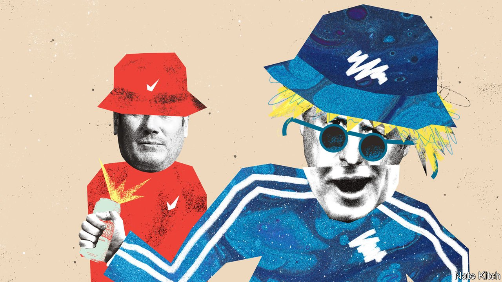

###### Bagehot

# British politics is stuck in a 1990s time-warp 

##### Sleaze, waiting lists and an unpopular prime minister give politics a retro feel 

 

> May 7th 2022 

BUCKET HATS are back. The 1990s fashion staple that used to grace the head of Liam Gallagher, a singer, is enjoying a renaissance. Dior sells one for £560 ($700); Sports Direct flogs an Adidas one for £13. Across Britain teenagers sport headwear that was last in vogue before they were born.

If the 1990s are in fashion, then British politics is à la mode. Westminster has fallen into a time-warp and found itself back in that decade. That would be no bad thing if it were the second half of the 1990s, a time of Euro 96, Cool Britannia and sustained economic growth. Unfortunately, British politics has returned to a grimmer period, and specifically to 1994. As then, various scandals grab the headlines. As then, an unpopular leader leads an exhausted Tory government which has little sense of what to do with power and lacks the nous to push through those ideas it does have.


Sleaze, the preferred Westminster term for financial and sexual misdeeds, has returned. Neil Parish, an MP with an interest in rural affairs, has resigned after admitting to twice looking at pornography in the House of Commons. In the first instance, he said he was trying to find tractor-related material. In the second, he was doing it for fun. At the start of April Imran Ahmed Khan, the MP for Wakefield, stepped down after being found guilty of molesting a 15-year-old boy. In November Owen Paterson, then the MP for North Shropshire, resigned after lobbying on behalf of paid clients in Parliament. It is a run that rivals the early 1990s, when MPs were accused of accepting cash for posing parliamentary questions and one minister was eventually jailed for perjury.

An unpopular prime minister again sits in Downing Street. Boris Johnson’s net approval rating bottomed out in January at -46, the lowest such level since Sir John Major, the prime minister in 1994. Conservative MPs would probably remove the prime minister if they had the chance, but the lack of alternatives provides a reason (or, rather, an excuse) not to move against him. Liz Truss, the foreign secretary, is painted as fundamentally unserious. Rishi Sunak, the chancellor, is seen as a political ingénu. Critics say Jeremy Hunt, a moderate Conservative MP, is a deluxe version of John Redwood, the slightly odd Welsh secretary who unsuccessfully challenged Sir John for leadership of the Tories in 1995.

Mr Johnson sits atop a weak government. He has a mighty majority of over 70 but a puny legislative agenda. Bold plans to reform Britain’s growth-throttling planning laws have been scrapped, as Conservative MPs ran scared of NIMBY voters flocking to the Liberal Democrats. The government did, however, find time to support a ban on glue traps. There is no point in having a majority if a government does not use it. Yet there are few ideas floating around. Conservative MPs privately wonder whether a stint in opposition would be restorative. In the early 1990s the Conservative government lurched between confidence votes in a bid to stay alive. The pulse of the current government is barely discernible.

Yet there are things to do. Public services are exhausted. Satisfaction with the NHS is at its lowest levels since 1997, as it grinds to a halt amid a backlog of cases built up through the pandemic. Waiting lists, the emblematic symbol of the 1990s, are at their highest levels since records began. Public services fell apart in the first part of the 1990s, but at least the economy still clipped along. This time the private sector is in a similar state to the public one, with growth slowing. Like its counterpart in 1994, the government has been in power too long to dodge blame. In an interview this week, Mr Johnson was challenged about a 77-year-old woman forced to ride a bus all day simply to keep warm; his first response was to boast that he was responsible for giving her a free bus pass.

Two things mean that the return to the mid-1990s need not end as painfully for the Conservatives. The first is the calibre of the opposition. Labour has learned to love the 1990s: the 25th anniversary of its landslide victory in 1997 has just produced a bout of political onanism. But Labour seems determined to love the wrong things about it. New Labour was radical, embedding Thatcherism in Britain’s economy and redistributing the gains (in theory, at least). It was an ideological project, disguised as a pragmatic one. Labour’s current management offers little such vision. Tony Blair was a zealot; Sir Keir Starmer preaches platitudes. Labour appears allergic to policy ideas, never mind ideology. It is the Labour Party’s stultifying leadership that keeps Conservatives calm and Mr Johnson in Downing Street.

The second is the size of the government’s majority. Executive inactivity is a choice. The government could still overhaul Britain, if it wished. Indeed, this was the fundamental motivation behind its support for leaving the EU. But whereas Conservative ideas about freedom used to come in two flavours—freedom from constraints and freedom to get ahead—Brexit has created a third: the freedom to do nothing at all.

Don’t look back in anger

Mr Johnson, once a consummate political gambler, has become paranoid about upsetting backbenchers, even with a large majority. Levelling Up looks destined to remain a slogan rather than a policy. Instead, the government will probably produce increasingly specific legislation against animal cruelty and ideas designed to annoy liberal voters rather than change the country.

Mr Johnson still has a chance to emulate his idol, Michael Heseltine, a former Conservative cabinet minister who straddled the 1980s and 1990s, and who oversaw the regeneration of Liverpool and London’s East End. Mr Heseltine shaped modern Britain, even if he never ran it. Mr Johnson has the chance to succeed where Lord Heseltine failed, by leaving behind a rebalanced and reformed country. If he flunks it, he will be remembered as the second coming of Sir John, presiding over an era of sleaze, inertia and decline. A return to the 1990s could be ugly. Bucket hats do not suit everyone, least of all politicians. ■

Read more from Bagehot, our columnist on British politics: (Apr 30th)

 (Apr 23rd) (Apr 16th)

