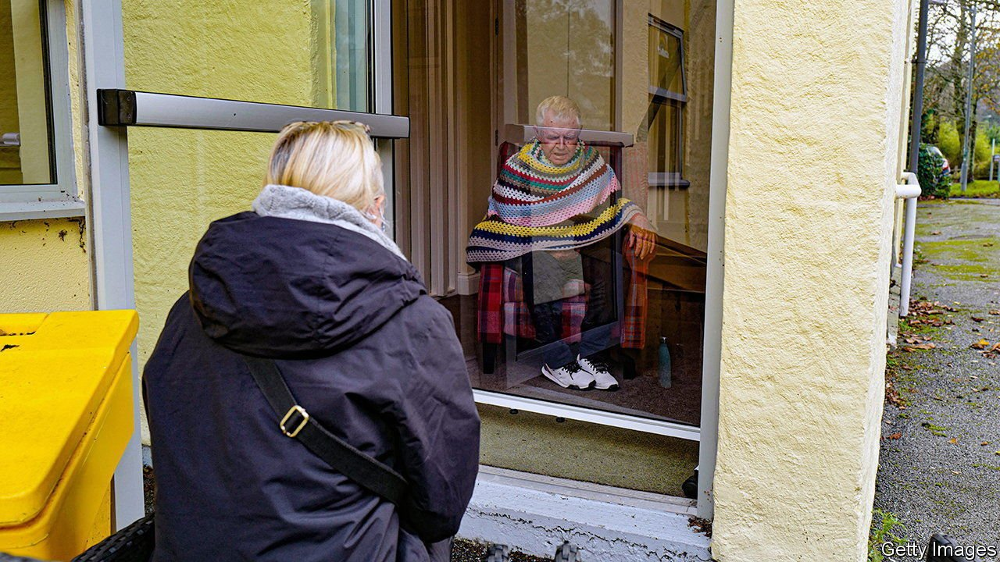
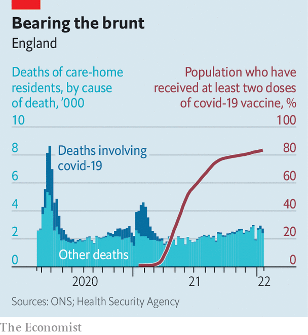

###### Isolated incidence

# Life for Britons in care homes is still full of restrictions 

##### Campaigners argue that residents need more human contact 

 

> May 7th 2022 

NO GROUP suffered more during the pandemic than care-home residents. Figures for England produced by the Office for National Statistics show that just over 45,000 residents have died after contracting covid-19 since the pandemic took hold in March 2020. A group that comprises fewer than one in every 100 people bore more than one in four covid deaths. They also suffered disproportionately from measures designed to protect them and the wider public from covid-19. Residents have regularly been prevented from seeing family and friends for weeks or months at a time. Many of the victims died alone.

The government has already been taken to task for the death toll. On April 27th the High Court ruled that the transfer of asymptomatic patients from hospitals into care homes in the early days of the pandemic, seeding infections that then spread rapidly, was unlawful. The government “failed to take into account the highly relevant consideration of the risk to elderly and vulnerable residents from asymptomatic transmission”, the justices wrote.


Deaths from covid-19 have eased as vaccination rates have climbed (see chart). But the issue of restrictions has not gone away. As Britain was opening back up in January, Sajid Javid, the health secretary, said care homes should “do everything they can” to bring visitors back. The government scrapped its guidance for homes entirely in April. But in many cases restrictions blocking residents from human contact remain. There are still “rolling lockdowns in some care homes, blanket visiting bans in some hospital wards”, says Julia Jones of John’s Campaign, which advocates on behalf of people with dementia.

 


Groups like John’s Campaign say the laws protecting the rights of care-home residents to have contact with family members—such as Article 8 of the Human Rights Act and clauses on deprivation of liberty in the Mental Capacity Act—are still being ignored. Politicians are getting behind the campaigners. On April 28th a group of MPs wrote to the Telegraph and called for an end to “all unlawful visiting restrictions”. An overlapping group has urged Mr Javid to create legislation that would guarantee a “legal right” to receive visits and support. Organisations such as Mencap, Mind and the Alzheimer’s Society have signalled their agreement.

But the reality is complex. Mike Padgham, who runs a group of care homes in Yorkshire, says that, although many residents’ families want restrictions ended, others want them to stay to protect their relative from covid. Managing visits in a way that minimises the risk of transmission puts an extra load on staff. And if transmission does occur, then employees who catch covid have to stay away from work, creating a feedback loop. This, he says, puts care providers “between a rock and a hard place”.

Hospitals are also grappling with the task of managing visitors, maintaining staff levels and keeping patients safe. Alison Hodge, who cares for her 98-year-old mother at home in Yorkshire, says her mother was moved to a covid isolation ward shortly after arriving at York and Scarborough hospital in late March for a routine operation, having been a close contact of a covid-positive patient. After testing positive herself, Ms Hodge’s mother ended up being kept in hospital for six weeks. Ms Hodge was able to visit her twice; she says her mother, who is now back at home, begins crying whenever she is left alone.

Campaigners argue that the dangers of isolation now outweigh those posed by the virus. Reliable data on any causal links between human contact and dementia outcomes do not exist. Running controlled experiments in which a set of study participants is systematically isolated would be unethical. But qualitative and observational studies suggest that maintaining human contact with a known caregiver improves dementia patients’ scores on tests for depression and cognitive ability.

Mr Padgham has no doubts: “Human contact with loved ones is fundamental to their well-being. It can slow down the dementia.” One fact is especially salient in this regard. Dementia and Alzheimer’s were the second most common cause of death in care homes over the course of the pandemic, running only slightly behind covid-19 infections. Now they are again the most common. ■

