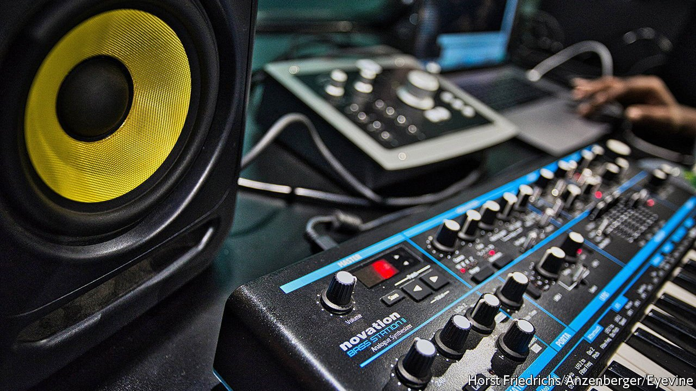

###### Drill down

# The British police unit helping remove drill-music videos from the web 

##### Project Alpha angers artists and free-speech advocates alike. But does it work? 

 

> May 7th 2022 

“CENSORED” BEGINS like most pieces of drill music, a genre of rap. Dressed in black puffer jackets and balaclavas, members of the group “Zone 2”, who come from Peckham in south London, spit lines about their “opps” (enemies). But listen to the track on YouTube—where it has garnered 2.8m views—and you will notice something unusual. A ringing sound obscures certain words, such as the names of deceased gang rivals. This is probably not artistic choice. Some rappers now soften or mask their lyrics to avoid getting on the wrong side of the law.

Their particular concern is a unit of the Metropolitan Police Service called “Project Alpha”, which patrols the internet for “gang-related content”. Around 30 officers spend most of their time scrutinising drill songs, which sometimes reference real violence and gang disputes (though many tracks are not autobiographical and some entirely fictional). They dissect slang to determine which tracks might incite offline attacks. Alpha officers then tell social media platforms—chief among them YouTube, where songs receive most attention—that the video breaches the website’s own rules prohibiting harmful content. YouTube usually agrees to delete the clips.


More than 350 pieces of online content, mostly YouTube videos, have been removed this year after requests from Alpha; just 130 were removed in 2019. The real numbers are probably higher still. Industry insiders say that officers sometimes warn YouTube channels that they plan to flag videos to the platform, at which point channel owners may remove the clips themselves. Some, like “Zone 2”, bleep out words or upload censored tracks.

Civil-liberties groups view Alpha as a concerning creep towards censorship. Rappers feel unfairly singled out—heavy-metal bands have been screaming about death and destruction for decades. Many musicians also doubt that police officers can properly parse drill’s hyperlocal slang. “People in the Met aren’t coming from these areas [where drill is recorded]. There’s only so much training you can do,” says Toby Egekwu (“TK”), co-founder of a record label that signs drill artists.

The Met denies Alpha is restricting free speech. James Seager, who leads the unit, says it doesn’t track every drill song—just those by people involved in real, violent disputes. To keep abreast of slang, Alpha has hired people familiar with the sorts of estates where drill music is often made.

The bigger question is whether Alpha is doing any good. If rappers taunt rivals by belittling victims or referencing previous killings, that crosses a line, says Mr Seager. “The intention is to incite a response, which is often violent…If we remove the content, it prevents an escalation.”

But there is little evidence that drill songs lead directly to offline aggression. “In most of these feuds, people don’t need a YouTube video to hurt each other. They were going to do it anyway,” says Forrest Stuart of Stanford University, who has studied drill music in Chicago, where the genre originated. Social media may even reduce violence in some cases, says Mr Stuart, because gang members can now build a tough reputation without stabbing people in the streets.

In some cases Alpha’s work might be counterproductive. Removing the videos—and potential income—of up-and-coming drill artists can “put them off doing music”, so some focus on “street stuff” (crime) to make money instead, says TK. Banning videos can simply make them more alluring. And when songs are removed from YouTube, some rappers have simply re-uploaded them elsewhere. “Censored” is available, in full, on Spotify.

Nonetheless, the number of videos that will be removed from the internet is likely to grow. YouTube says it currently relies on the Met to interpret slang and identify real threats in drill-music videos. But the Online Safety Bill, which is going through Parliament at the moment, is designed to hold tech giants directly to account for harmful content. Executives face hefty fines and even jail time if they cannot properly police their platforms. Social-media moderators are also going to have to spend time brushing up on their “bars”. ■

