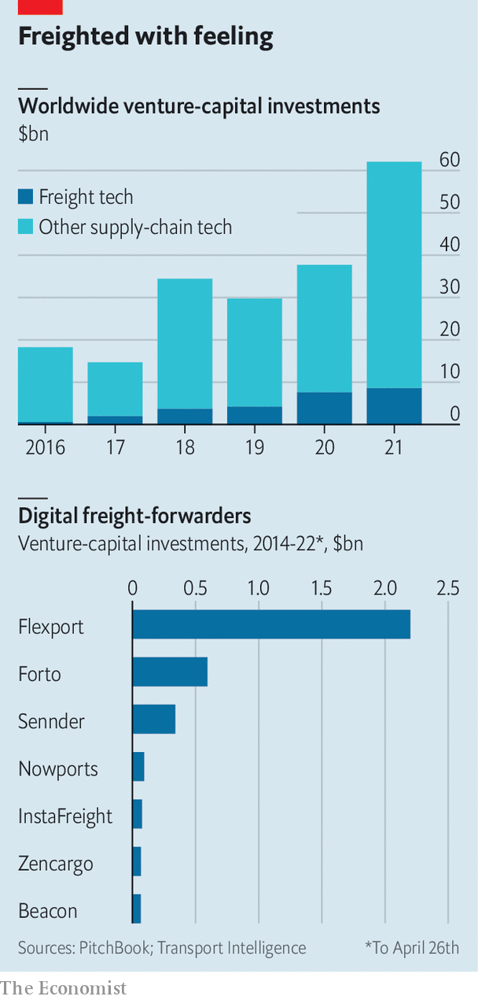

###### Digital decongestants

# A flotilla of startups wants to streamline global supply chains 

##### Digital disruption comes for the paper-loving freight-forwarders 

 

> May 7th 2022 

FORTO SEEMS an unlikely tech darling. It does not make gadgets, build the metaverse, forge cryptocurrencies or launch rockets. The six-year-old startup from Berlin, whose main business is arranging the transport of cargo from one place to an other, has nevertheless managed to raise nearly $600m from venture capitalists. Its backers reckon the firm can shake up the archaic freight-forwarding industry. It has tripled its business in each of the past four years, boasts Michael Wax, its boss, and is now one of the top ten forwarders in the busy trade lane between China and Germany. In March it announced $250m in new funding at a valuation of $2.1bn.

Forto is not the only freight tech startup attracting investors’ attention. With the world’s supply chains gummed up by bottlenecks, lockdowns and other disruptions, venture-capital (VC) firms are pouring billions into companies offering ways to make freight transport more efficient. In 2021 supply-chain-technology firms raised more than $62bn, according to PitchBook, a data provider, more than twice the figure in pre-pandemic 2019 (see chart). Of that, nearly $9bn went to freight-tech startups. PitchBook counts more than a dozen private freight-tech “unicorns”, valued at more than $1bn. Viki Keckarovska of Transport Intelligence, a firm of consultants, expects more funding rounds this year.


 


Part of the appeal lies in the industry’s size and potential for disruption. The freight-forwarding business alone is worth $475bn in annual revenues, reckons Armstrong &amp; Associates, a supply-chain research and consulting firm. The broader “third-party logistics” market, which includes transport management and warehousing, generates sales of $1.4trn. At the same time, freight remains technologically backward, especially the cross-border sort. “This industry is completely offline,” marvels Zvi Schreiber, boss of Freightos, a digital-freight marketplace. “You would expect that shipping a container would be just as digital as booking a flight,” he says, “but it is not at all.” Just getting a quote can be a headache. “For 90% of the freight-forwarders today it still takes one or two days to come back with a price,” says Mr Wax.

This is starting to change thanks in part to whizzy new software platforms designed to streamline the process of shipping freight overseas. Flexport, a digital freight-forwarder based in San Francisco, automates many of the supply-chain processes that were traditionally done manually, including getting quotes, filling out documents and co-ordinating with shippers and carriers along the supply chain. The nine-year-old startup, which earned $3.2bn in revenues in 2021, was recently valued at more than $8bn. Project44, a supply-chain visibility platform from Chicago, lets retailers and brands monitor milestones in their cargo’s journey, such as when it is loaded onto a ship, leaves the port or arrives at its final destination—all in real time. They can also make adjustments or reroute shipments if needed.

One common feature of such platforms is the ability to glean insights from data. Big shippers and logistics providers typically manage their shipments in software known as a transport-management system (TMS), which tracks shipments as they make their way along logistics networks, from the factory to the port and finally to the customer. Such systems, which have been around since the late 1980s, are useful databases of information, says Evan Armstrong, president of Armstrong &amp; Associates. But they are not clever. “The first step was getting everything onto a TMS. Now the next step is taking those TMSs and making them intelligent.”

Although recent supply-chain snarl-ups have played a part in boosting demand for logistics software, they are not the main force behind the boom. That, industry-watchers agree, would be Amazon. The e-emporium “is the absolute number-one catalyst for supply-chain transformation, no question”, says Julian Counihan of Schematic Ventures, a VC firm. Whereas the supply chain has historically been seen as a cost centre, Amazon has turned it into a money-maker. With the rise of next-day and same-day delivery, consumers’ expectations have changed dramatically. As shipping times plummet, logistics requires “way, way more supply-chain technology”, says Mr Counihan.

Some scepticism is in order. Many of the startups look little different from the incumbents they are seeking to disrupt. Kuehne + Nagel, a big Swiss freight-forwarder, has invested heavily in digitisation even if it doesn’t “sing and dance that they are a ‘digital’ freight forwarder”, as Mr Schreiber of Freightos freely admits. C.H. Robinson, a big American logistics firm, is “really a digital freight broker”, says Mr Armstrong. And although some of the big incumbents rely on antiquated technology, he adds, they have much more scale than any of the newcomers. That lets them secure lower prices from ocean liners, air freighters and other carriers.

Still, as Ms Keckarovska points out, the upstarts have a shot. The freight-forwarding market remains highly fragmented, so they need not take on a huge incumbent. DHL and Kuehne + Nagel, the two biggest brokers, have a combined global market share of just 6%. And despite their digital aspirations, the incumbents’ tech nous leaves plenty of room for improvement. Of the 20 biggest established freight-forwarders, 15 apparently use the same off-the-shelf TMS to manage their shipments. ■


