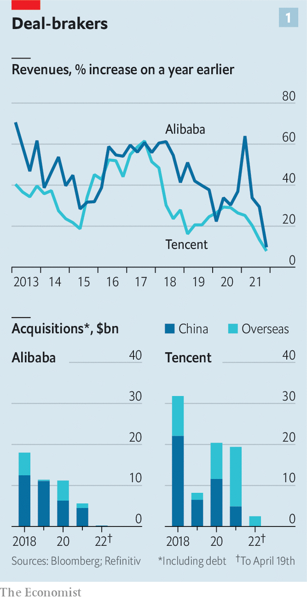
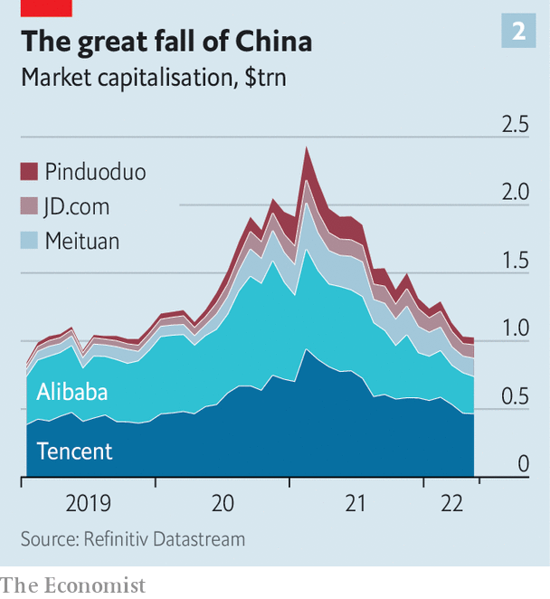

###### Alibaba and the 40 officials

# Can Chinese big tech learn to love Big Brother? 

##### The government’s crackdown eases, but the damage has been done 

 

> May 7th 2022 

JACK MA, CHINA’S most famous entrepreneur, has not been one to mince his words about the role of government and business. At a meeting with corporate leaders in Bali in 2018 he told the audience that it is not the government that makes business and innovation happen. That is the work of entrepreneurs, he insisted: “They have the ideas and dreams.”

A  that began in late 2020 on China’s consumer-internet champions has made such inspiring sentiments harder to sustain. For the first time the leading firms’ sales growth is slowing. Alibaba’s revenues rose by just 10% in the final three months of 2021, the slowest quarterly expansion since going public in 2014. Tencent, an internet-services and video-game Goliath, notched up 8% revenue growth in the same period, its slowest rate as a public company (see chart 1). JD.com, another e-commerce group, announced solid revenues but Richard Liu, its founder and chairman, resigned in April, one of many high-profile entrepreneurs to do so in the past few years. Local media reported that Meituan, a delivery giant, plans to axe up to 20% of its employees in its core business units despite its sales rising by 30%. Shares in those four companies, along with Pinduoduo, one more e-commerce group, have shed about $1.5trn in value since February last year (see chart 2).


 


The techlash is moving into a new phase. The sorry state of the Chinese economy has forced regulators to delay further planned corporate punishment in the hope that the industry can help recharge growth. In the  in over a year, the central government said on April 29th that it planned to normalise regulation and to “promote the healthy development of the platform economy”. The share prices of several firms, including Alibaba, soared at the news. But some new rules have been merely put off rather than withdrawn, according to the Wall Street Journal. And much damage has already been done. The entrepreneurs behind China's biggest tech successes have come to a grim reckoning: that because of government meddling they will be unable to innovate, and may even become boring.

 


When Mr Ma celebrated Chinese enterprise in Bali, Alibaba and Tencent were two of China’s biggest private investors, pushing into an array of businesses. Acquisitions were giving them an early toehold in hot new areas. Online education and health, media and entertainment, banking and lending services: all were fair game. By 2020 Ant, Alibaba’s financial affiliate, had swallowed up 15%, or 1.7trn yuan ($257bn), of the market for total outstanding consumer loans in China. As Jeff Bezos, founder of Amazon, was buying the Washington Post, and Jack Dorsey of Twitter, a social-media group, was launching Block, a payments platform, Mr Ma was scooping up his own media assets and building a finance conglomerate.

American tech bosses are still reshaping and expanding their empires. Mark Zuckerberg, founder of Facebook, is seeking to turn his social-media group into a “”, bringing virtual reality to the mainstream. Elon Musk, boss of Tesla, an electric-car maker, is . Chinese empire-builders, by contrast, are tempering their ambitions.

Beijing’s regulatory crackdown has greatly discouraged risk-taking. Tencent’s foray into online education in 2019 is now a dead end, as is that whole industry, after sweeping new rules were enacted last year on the services that can be offered to school-age pupils. Investors want nothing to do with Chinese fintech after Ant’s initial public offering was crushed by Communist Party leaders in late 2020. Forget about massive data-crunching businesses, too, where the government’s new framework for control and ownership of personal and financial data will limit private innovation. Online video-games, Tencent’s chief revenue-generator, have also come under attack. The government has signalled it will no longer tolerate private investment in news-gathering, putting Mr Ma’s media empire at risk. It may even be planning to take small stakes in tech firms in order to guide their development.

The companies’ strategies reflect limited options for rapid growth. Take Alibaba and its three core areas of operation: international, such as Lazada, an e-commerce business based in Singapore; within China, dominated by e-commerce; and a tech division that counts cloud computing as its biggest engine of growth.

Alibaba’s solution to a long-expected slowdown in Chinese e-commerce as the market becomes saturated has been to move into smaller, poorer cities across the country with the expansion of Taobao Deals, a platform that allows groups of people to buy products at lower cost. The company has recently started playing down this strategy to analysts and investors, who are underwhelmed by its low margins.

Its global business has grown rapidly, mainly thanks to the fast expansion of Lazada. But its retail operations abroad have contributed only about 5% of overall annual revenues since 2017, and are unlikely ever to make up a meaningful part of the Alibaba empire. Its prospects of breaking into developed markets in America and Europe are close to non-existent. Some of that pessimism is based on America’s increasing distrust of Chinese companies. In 2018 Ant’s attempt to buy an American payments firm was shot down by regulators in Washington on national-security grounds. This has prompted Alibaba to focus more on developing markets with much less spending power.

Chinese regulators, too, have clamped down on the tech titans’ foreign investments. They have also stepped up prevention of monopolistic behaviour at home, stifling domestic investments. Alibaba was one of China’s biggest corporate acquirers in 2018, when it pulled off about $18bn in mergers and acquisitions. In 2021 that slumped to $5.7bn, over four-fifths of which was spent within China, according to Refinitiv, a data company. The more acquisitive Tencent’s dealmaking was valued at $20bn last year, down from $32bn in 2018; the company also sold about $16bn in shares in JD.com in December, sparking fears that regulators were pushing it to unwind its sprawling empire.

As customary sources of revenue come under further pressure, China’s internet giants have gamely talked up a new stage of innovation—one in which their . The government wants Chinese big tech to make or design semiconductors and artificial-intelligence (AI) software, and run cloud-computing businesses. It has been designating specific areas for companies to pursue, giving a green light for private entrepreneurs to go after the next big thing, as long as it lines up with policy goals. Baidu, best known as China’s online-search champion, is the government’s first choice for leading AI and autonomous-driving businesses. On April 28th the firm was awarded China’s first permit for driverless ride-hailing on public roads.

Many tech firms have taken the hint. Alibaba relies heavily on the success of its cloud-computing division, which leads the market and brought in 8% of total revenue in the last quarter of 2021. In February Daniel Zhang, Ailbaba’s chief executive, told analysts that cloud computing could be a trillion-yuan business by 2025 and be transformed into his firm’s main activity. Tencent and Baidu have large and growing cloud operations, too. Most business-to-business services will one day be dominated by the incumbent tech groups, says Elinor Leung of CLSA, an investment bank.

Such top-down delegation of entrepreneurial activity cannot be completely written off, says David Hsu of the Wharton School in Pennsylvania. State-backed research and development is commonplace in even the most market-driven economies. The momentum building in China may eventually enhance the underlying technologies on which a new wave of enterprise will take root.

Bottling up the genie

Finding state-endorsed technologies to invest in is politically expedient for the largest internet platforms, says Robin Zhu of Bernstein, a broker. Robin Li, Baidu’s founder, has embraced his firm’s party-picked mission with such zeal that he even wrote a book on autonomous driving last year. Yet even self-driving cars and other state-backed projects will probably fall short of the growth rates to which the companies became accustomed in the heady 2010s.

Alibaba is again a case in point. Aliyun, its party-approved cloud business, has suffered big setbacks recently. It lost ByteDance, the owner of TikTok, Western teenagers’ favourite time sink, as a customer. A steady stream of state-controlled companies are leaving it for cloud platforms owned by other state groups. China’s big telecoms firms, which have competing businesses, are expected to eat up market share in the lower-value-added part of cloud services. There are limits to how much Aliyun can earn in foreign markets, where a distrust of Chinese technology has led to the banishment of tech compatriots such as Huawei, a telecoms-equipment maker. Aliyun’s revenues grew by 20% year on year in the last quarter of 2021. Not bad, you might think. But much slower than analysts had anticipated. ■

For more expert analysis of the biggest stories in economics, business and markets, , our weekly newsletter.

