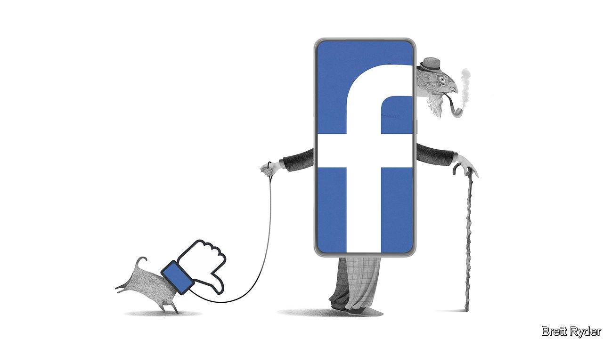

###### Schumpeter

# Facebook’s retirement plan 

##### What happens when the world’s biggest social network becomes its most doddery? 

 

> May 7th 2022 

“WHITE HOT”, a new documentary, traces the rise and fall of Abercrombie &amp; Fitch, an American fashion label that soared in the early 2000s before crashing just as dramatically. The film explores the firm’s obsession with employing a certain type of staff—handsome, chiselled, white—which led to damaging claims of racism and sexual harassment. But just as harmful to Abercrombie was that it became dated. Its low-rise jeans, cropped T-shirts and migraine-inducing cologne, “Fierce”, became inseparably linked with Americans who came of age around the turn of the century. The price of being so closely associated with one generation was that the next wanted nothing to do with it.

Facebook, which took off around the same time, may be experiencing a similar problem. Its millennial identity is embodied in its 37-year-old founder, Mark Zuckerberg, who still wears his college uniform of skinny jeans and hoodie (though these days his hoodies are bespoke). The social network, which began as a way for oversexed Harvard undergraduates to rate each other’s looks, is now seen by youngsters “as a place for people in their 40s and 50s”, in the words of one leaked internal memo. Investors consider Facebook unfashionable, too: its parent company, Meta, has lost 35% of its market value this year, including a plunge of $232bn in February, the biggest one-day drop in stockmarket history.


Some of Facebook’s problems are overstated. With 2bn daily users, nearly one in three humans, growth was bound to sputter. Its loss of 1m users in the last quarter of 2021—the firm’s first-ever fall—was attributed to a rise in the price of mobile data in India. A decline in European users in the latest quarter followed Meta’s ejection from Russia. Privacy rules introduced by Apple are a more serious problem, expected to cost Meta about $10bn this year by making it harder to target ads for iPhone users. But the company is devising workarounds. In February it said that since September it had clawed back half of the 15% reduction in its ability to determine ads’ effectiveness. Similarly, it may be better able than most to absorb the cost of new tech rules being written in Europe. Firms like Meta “have a cockroach-like ability to find ways to maintain business as usual”, says Mark Shmulik of Bernstein, a broker.

Yet if these hurdles can be overcome at a price,  seems inexorable. In rich countries, which matter most to advertisers, young users appear to be drifting away. Frances Haugen, a former Facebook executive, made headlines last year for blowing the whistle on failures of content moderation. But her more telling revelation was that engagement among young Americans had plummeted. In Facebook’s five most important countries, account registrations for under-18s had fallen by a quarter within a year, she said. Independent estimates corroborate her claims. In Britain 18- to 24-year-olds are spending half as much time on Facebook and Instagram, its sister app, as they were four years ago, estimates Enders Analysis, a research firm. Mr Zuckerberg admitted last year that, amid  and others, Facebook had neglected young people: “Our services have gotten dialled to be the best for most people who use them, rather than specifically for young adults.”

In the past, saving the flagship app was Mr Zuckerberg’s priority. After the acquisition of Instagram in 2012, Facebook reportedly limited its adoptive sibling’s ability to hire staff, out of fear that it would cannibalise Facebook’s users—“like the big sister that wants to dress you up for the party but does not want you to be prettier than she is”, in the words of a former Instagram executive quoted in “No Filter”, a book by Sarah Frier. Today Mr Zuckerberg seems willing to sacrifice his first-born to protect the wider business. Efforts to attract young people have focused on other apps, such as Messenger Kids and Instagram Kids (which was shelved last year). Reels, Meta’s TikTok clone, was rolled out first on Instagram. Last year Mr Zuckerberg even dropped the Facebook name from his company, the better to insulate the business from its least fashionable brand. Where once Mr Zuckerberg’s obsession was repairing the ageing Facebook mothership, now he is scrambling lifeboats in all directions:  are expected in the next two years, as well as a smart watch.

The Face that launched a thousand shops

That is the right thing to do. But it raises the question of what will become of the world’s biggest social network as it begins to decay. Once-mighty sites like MySpace endure, like abandoned digital ruins. Far in the future, will Facebook, too, become a ghost town?

Not necessarily. Young users are unlikely ever to return to Facebook for social networking, which they increasingly do on apps like Snapchat or BeReal, a photo-messaging service that is spreading on college campuses. But networking is only one function of social media. People also use it to be entertained, and increasingly to buy things. Facebook is losing its appeal as a place to socialise, but it may reinvent itself as a platform for other activities.

In entertainment, TikTok is well ahead. Meta’s first attempt to copy it, with Lasso, in 2018, failed. But having proved a hit on Instagram, where it accounts for 20% of time spent, Reels is building an audience on Facebook, too. Facebook’s newsfeed is being revamped along TikTokian lines, to recommend content suggested by artificial intelligence, whether or not it was posted by a friend. Facebook has long run an eBay-esque Marketplace, and in the pandemic launched Shops, to bring more e-commerce onto its own platform. Its latest earnings call promised investment in a service to let users send messages to companies through ads.

Abercrombie has dropped its elitist style in favour of “championing inclusivity and creating a sense of belonging”. Half-naked hunks are out, replaced by plus-size models in comfy athleisure wear, and last year revenue was back to 80% of its peak. Facebook will likewise never be cool again. But there is plenty of less glamorous money to be made. ■

Read more from Schumpeter, our columnist on global business:

 (Apr 30th)

 (Apr 23rd) (Apr 16th)

For more expert analysis of the biggest stories in economics, business and markets, , our weekly newsletter.

