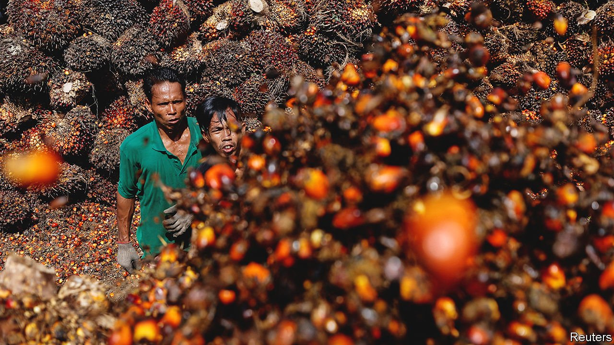

###### Palm roiled

# The war in Ukraine is rocking the market for edible oils 

##### Consumer-goods giants risk going hungry 

 

> May 7th 2022 

WHEN VLADIMIR PUTIN’S tanks rolled into Ukraine in late February, crude-oil markets reacted instantly to the uncertainty and, in short order, to the sanctions imposed on Russia, the world’s second-biggest exporter of the black stuff. The war’s impact on another set of crucial oils—the edible vegetable fats such as sunflower oil, of which Ukraine and Russia are the world’s two biggest exporters—has taken longer to digest. It is now causing heartburn for the consumer-goods giants that use them by the tonne to make everything from snacks to lipstick.

Exports from war-torn Ukraine have all but stopped. Russia has placed an export quota on its sunflower oil. Worries about scarce supplies have led countries including Egypt and Turkey to ban exports of edible oils. And from April 28th Indonesia has banned exports of palm oil, another widely traded variety.


 


The archipelagic country sold $18bn-worth of the stuff abroad in 2020, accounting for half of all palm-oil exports. So the move sent prices, which had dipped after the initial war-induced spike, soaring again (see chart). A tonne of palm oil for delivery in May is trading at over $1,700, 70% higher than the average spot price in 2021. This is piling more inflationary pressure on global producers of consumer goods—and sabotaging their environmental bona fides.

Unilever, a soap-to-soup group, spent $2.7bn on palm oil last year, around 15% of its total spending on commodities. Procter &amp; Gamble, a similarly sprawling giant, and big packaged-goods firms like Mondelez and Nestlé are in a similar pickle. Everyone is paying more for soyabean and other alternative oils, too, so substituting one kind for another would bring little financial relief. Investors typically view the big consumer firms as being resilient to economic shocks. But as input prices rise some may be beginning to doubt the companies’ ability to pass on the extra costs to shoppers, who are becoming fed up with rising bills.

The ban, which does not have a specified end date, will also complicate the companies’ efforts to present themselves as environmentally responsible. Palm-oil production has historically often come at the expense of rainforests, which were razed in places like Indonesia to make room for plantations. Today Nestlé says that 90% of the palm oil it purchased in 2021 was certified as deforestation-free, thanks to close monitoring of supply chains, from the plantation to the port. Such capacity has taken years to develop in Indonesia and will be hard to replicate elsewhere at short notice. If the Swiss giant and its rivals have to resort to buying oils from more opaque places, that could leave a greasy stain on their carefully manicured green reputations. ■


