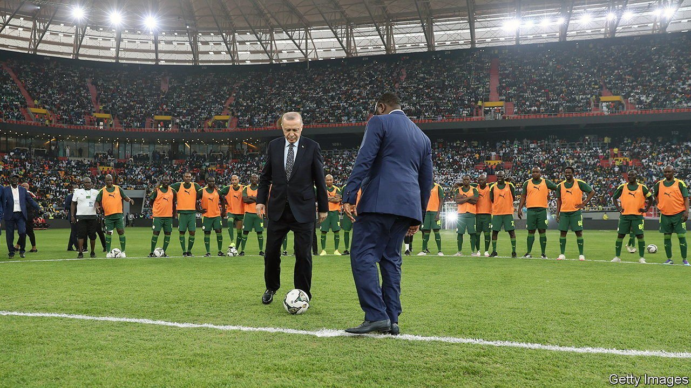

###### Ottomanpower

# Turkish builders are thriving in Africa 

##### And giving Chinese competitors a run for their money 

 

> May 7th 2022 

SELIM BORA has had quite a run. In March his company, Summa, won a contract to rebuild and run Guinea Bissau’s new international airport. Months earlier it had completed a 50,000-seat national stadium in Senegal, after less than 18 months of work—a sprint-like pace for such projects. The company’s résumé also includes convention centres in the Democratic Republic of Congo and Equatorial Guinea, a sports arena in Rwanda, and airports in Niger, Senegal and Sierra Leone. “Ten years ago we had no projects in Africa outside of Libya,” recalls Mr Bora, taking in the view from his office in Istanbul. “Today 99% of our work is in Africa.”

Turkey’s construction industry is an international heavyweight. Of the world’s 250 biggest contractors, 40 are Turkish, behind only China and America. Many have long had a big footprint in north Africa. Of late they have begun making inroads in the continent’s south. Last year alone the value of projects undertaken by Turkish builders in sub-Saharan Africa was $5bn, or 17% of all Turkish building projects abroad, up from a paltry 0.3% before 2008. The region has overtaken Europe (10%) and the Middle East (13%), and is second only to countries of the former Soviet Union. In parts of Africa Turks are even giving Chinese builders, which continue to dominate construction in Africa, a run for their money.


Many of the Turkish construction firms got their African start in Libya in the 2000s, where they locked up billions of dollars in contracts. The toppling of the country’s dictator, Muammar Qaddafi, in 2011 and the ensuing civil war forced them to flee. They found new opportunities south of the Sahara, where their reputation regularly preceded them: many African leaders who had visited Libya and admired Turkish projects there were eager to work with the companies responsible for them.

Some assistance for Turkish projects comes from Turkey’s export-credit bank and public lenders from Japan. Both countries are, for their own strategic reasons, keen to check Chinese interests in Africa. Still, the Turks concede that they can rarely compete with Chinese rivals on price. “We cannot match the Chinese, because they come in with their own financing and we have to go to the markets,” says Basar Arioglu, chairman of Yapi Merkezi, another big construction firm.

The Turkish firms are therefore stressing other selling points instead. They tend to work faster than Chinese rivals and to offer superior quality. Having completed a big railway project in Ethiopia a few years ago, Yapi Merkezi more recently beat Chinese rivals to build the first section of a Tanzanian railway connecting Dar es Salaam and Lake Victoria. In December it signed a $1.9bn deal to build the third section.

The Turks are also happy to comply with African governments’ demands to hire local subcontractors and workers, which the Chinese have been more reluctant to do. This is in large part making a virtue out of necessity: whereas Chinese firms can afford to bring their own skilled workers, including engineers, to Africa, Turkish ones often cannot. Since Turkey lacks China’s resources to be in all places at once, Mr Arioglu observes, “the only way we can survive in the long run is to become local in all the countries we work in.” When Summa began working in Senegal in the 2010s, its workforce was 70% Turkish, remembers Mr Bora. That figure is now down to 30%.

Some Africans still grouse about the Turkish presence in their countries. Like the Chinese, “they come and go,” grumbles one official, creating only fleeting jobs. Another complains that the Turks (and other newcomers) invest in construction, mining and ports rather than higher up the value chain, which would do more for Africa’s broader economic development. And they could launch more joint ventures with African companies.

Such gripes are, however, outweighed by one last consideration increasingly prized by African governments. “We came at a lucky time,” recalls Mr Arioglu, “when both Ethiopia and Tanzania were looking for alternatives to Chinese companies.” As more sub-Saharan countries follow suit, being non-Chinese is a Turkish trait that China’s builders cannot match. ■

