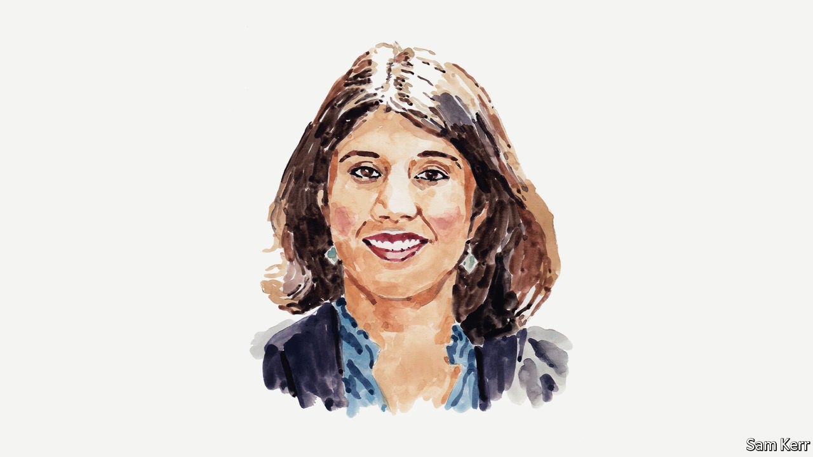

###### Russia and Ukraine

# Tanvi Madan explains why India is not in Russia’s camp 

##### The historian says that the longer the war continues, the trickier India’s balancing act becomes 

 

> May 7th 2022 

SINCE RUSSIA’S invasion of Ukraine, India’s position has widely been interpreted as supportive of Moscow. Delhi has , and abstained on several related votes at the United Nations. It has refused to rule out the  or oil. It hosted Russia’s foreign minister, Sergei Lavrov, and he was granted a meeting with Prime Minister Narendra Modi. Furthermore, China and Russia have both suggested that India shares their view of the current crisis and of the international order.

India is not, however, in Russia’s camp. It neither supports nor endorses the Russian invasion. Moreover, Indian interests have been adversely affected by Moscow’s move. The invasion endangered the lives of more than 20,000 Indian citizens in Ukraine, one of whom was killed. It has increased Indian concerns about further Chinese military action at their shared border while the world’s attention is on Europe. It has also jeopardised the Russian and Ukrainian links in the arms supply chain on which Indian forces depend.


In addition, Delhi is facing a more constrained economic environment thanks to Vladimir Putin’s invasion. India is particularly vulnerable to higher commodity prices, especially crude and edible oils and fertiliser, and worried about inflationary pressures. These pose multiple problems for the Modi government relating to energy, food security, India’s fiscal position and its politics.

Strategically, Mr Putin’s war complicates India’s long-standing goal of keeping apart its rival China from Russia. India-Soviet relations deepened in the 1960s and 1970s due to a shared concern about China, and, ideally, Delhi wants to see Moscow serve as a counterweight to Beijing in Eurasia. But the Russian invasion has put paid to Indian hopes of a Western rapprochement with Moscow as a means of luring Russia away from Beijing. Worryingly from Delhi’s perspective, it could even make Russia more dependent on China. There are already questions in India about the implications. For instance, what would a Russia more beholden to China do if Beijing asks Moscow to take actions that go against India interests, such as in international organisations or in an India-China crisis? Or, will Beijing now expect or demand Russia take its side more actively in the Indo-Pacific?

The crisis has also put pressure on India’s ties with several of its other partners, including America, Europe and Japan. These partners are crucial to India’s security and its economic and diplomatic objectives—arguably more so than Russia. But there is also concern that those partners’ attention could be diverted away from India’s priorities—the Indo-Pacific and the challenge posed by China—because of the war.

So, then, why has India not condemned Russia? It hopes to keep Moscow onside yet fears that it won’t stay onside. Delhi frets that Moscow could choose to hold back or slow down the supply of equipment, spare parts or maintenance support for the Russian hardware that the Indian military operates, or move from neutrality to China’s side at a time of heightened tension at the Sino-Indian border. More broadly, Russia could play spoiler vis-à-vis Indian interests concerning both China and Pakistan, and in international institutions. In addition, Russia has remained relevant for India as a partner in defence, trade and technology, as well as in the nuclear and space sectors. And the Indian government generally avoids direct condemnation—especially of its partners. Finally, it has wanted to keep channels of communication to Moscow open, including, in the immediate aftermath of the invasion, to enable the evacuation of Indian nationals.

Delhi’s stance has been hardening, however, in recent weeks. While there is some sympathy for Russian concerns about European security architecture, India has dropped references to “legitimate security interests of all sides” and stopped framing the war as a Russia-NATO problem. Statements at the UN and in the Indian Parliament have taken on a more critical tone, with the foreign minister stating that India is “strongly against the conflict”. It has reiterated its interest in respect for international law, territorial integrity and sovereignty and the UN charter on which the global order is built. It has expressed its disapproval of the use of force to resolve disputes and of unilateral changes of the status quo. And it has criticised the shelling of nuclear facilities and condemned the massacre in Bucha. It has also pushed back against Russian disinformation, such as Mr Putin’s assertion that Ukraine was taking Indians hostage. Furthermore, it has distanced itself from China’s more supportive position vis-à-vis Russia.

A former national security adviser has noted that, in private, Indian policymakers will likely also “have made their displeasure clear” about the invasion. Mr Modi has suggested that Mr Putin talk directly with President Volodymyr Zelensky, with whom the Indian prime minister has spoken twice. India has also provided humanitarian assistance to Ukraine, and offered to play a diplomatic role if helpful. And, willingly or not, Indian companies will largely comply with sanctions given their exposure to, and interests within, western economies. India’s economic ties with Russia are relatively limited by comparison. For instance, India-Russia trade in goods between April 2021 and the end of February 2022 stood at almost $12bn. Trade between India and America stood at $107bn in the same period. In that same time frame, 2.3% of the crude oil and 0.4% of the liquified natural gas India consumes came from Russia while the US accounted for 8.5% and 16.8% of those imports.

The longer the war continues, the trickier India’s balancing act could become. While it has been diversifying, its current overdependence on Russian defence supplies will be a liability for its strategic autonomy and its security—its army chief even alluded to the latter. In addition, the war could further weaken Russia’s ability to serve as an arms and technology supplier to India, a counterbalance to China and an effective player in the multipolar world Delhi desires. Moreover, while it wants to keep the European and Indo-Pacific theatres separate, the Russia-Ukraine war will have spillover ramifications for Asia. And Delhi will have to reconcile its willingness to align with like-minded partners to counter China—including via the quad of Australia, Japan, America and India, which Moscow opposes—with its desire to avoid isolating Russia, given the increasing alignment between Russia and China.

Europe and America, for their part, should recognise that India will continue to engage Moscow, but will remain outside the Russia-China camp. India understands how severely Russian actions have harmed its interests. For instance, Mr Modi has outlined how the war has caused difficulties and anxieties in every country in the world, particularly mentioning commodity-price rises as a direct impact. If America and Europe frame the situation as Russia versus the West, or declare the objective as weakening Russia, however, it will divert attention from Russian responsibility for these consequences. It will only widen the gap with India and others that have taken a similar stance—and play into Moscow and Beijing’s hands. Instead, it would be better to keep the focus on Russia’s violation of a country’s territorial integrity. And when engaging India on the crisis, it would be more effective to focus on cooperation on energy, food security and humanitarian assistance—as the Biden administration and most European governments have been doing—and on India using its influence to urge Mr Putin to cease hostilities. Over time, it is broader security and economic engagement with India that will do more to limit Russia’s lure as a partner than a “with us or against us” approach.

Tanvi Madan is a historian, author and director of The India Project at the Brookings Institution in Washington, DC.


