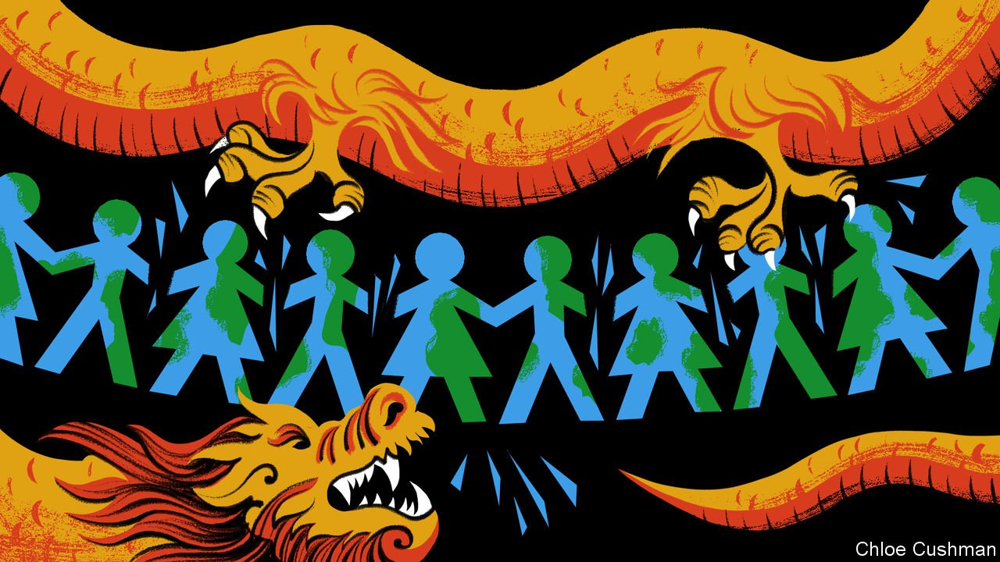

###### Chaguan

# China unveils its vision of a global security order 

##### Xi Jinping lays out a worldview with Chinese-Russian roots 

 

> May 5th 2022 

WITH EACH day that fresh blood is shed in Ukraine, it becomes more painfully clear that China and the West have clashing notions of how to preserve world peace. Since President Vladimir Putin first invaded his neighbour, hopeful voices in some Western capitals have called China an ideal mediator between Russia and Ukraine. Such optimists cite the supposed pragmatism of the modern Chinese Communist Party. They note the ties of trade and investment that bind the Chinese economy to Russia, Ukraine and wider Europe, and conclude that brokering peace is in China’s self-interest. Alas, their elegant arguments cannot overcome a stark and ugly point of difference. Most Western governments and citizens want Mr Putin to lose in Ukraine, and to pay an instructively high price for his aggression. China’s rulers want the opposite.

In part, Chinese sympathy for Russia—ill concealed behind protestations of neutrality—is explained by domestic politics. In February President Xi Jinping and Mr Putin declared a partnership with “no limits” between their countries. Mr Xi calls Russia’s boss his closest friend, seeing a kindred spirit in a fellow autocrat obsessed with traditional values and national revival. This is a sensitive year, during which Mr Xi is expected to secure a third term as party chief: an awkward time for him to be linked to a loser.


Nor does it suit China’s ruling party to concede that Russia is committing war crimes. Chinese officials insist that America caused Ukraine’s invasion by enlarging NATO up to Russia’s borders. The Chinese public is assured that the West is now prolonging the conflict to enrich American arms dealers, while Russian troops are praised for their restraint. Despite these efforts to turn reality on its head, the Chinese foreign-policy establishment does not deeply respect Russia, a country seen as admirably tough but in sad decline. As Chinese scholars tell it, America and the West may be trying to contain Russia now, but their main target is surely China, a far more important country. As a result, China has selfish reasons to root for Mr Putin to avoid paying a high price for aggression. Such an outcome may be the result of a Ukrainian surrender, the crumbling of Western unity or the flopping of international sanctions. China is strikingly indifferent to Ukraine’s suffering, but really wants to see the containment of Russia fail.

More disruptively for the world at large, China is growing more willing to adopt Russian arguments about how to organise a global security order. On April 21st Mr Xi presented a new “Global Security Initiative” to the Boao Forum for Asia, a Chinese gathering of bigwigs. Mr Xi’s initiative is dense, brow-furrowing stuff. He calls for a security order that is “common, comprehensive, co-operative and sustainable” and declares humanity “an indivisible security community”. This slab of party-speak is sprinkled with bromides about respecting sovereignty and territorial integrity that sound rich coming from a friend of Mr Putin’s.

Mr Xi’s speech is a code. Governments from Europe to Japan and Australia should take it seriously, for it is China’s latest bid to delegitimise the American-led defence alliances and treaties that have guaranteed their security for decades. Much of Mr Xi’s new initiative builds on “Asia for the Asians” arguments that China has promoted in its home region for years. In a commentary on his boss’s Global Security Initiative, China’s foreign minister, Wang Yi, traced the lineage of common, comprehensive, co-operative and sustainable security back to a “New Asian Security Concept” offered by Mr Xi in 2014 to the Conference on Interaction and Confidence-Building Measures in Asia (CICA), a multinational forum.

Eight years ago Mr Xi called for Asian countries to shun defence alliances that include some countries but exclude others (the meaning of calls for common and co-operative security) and to handle disputes by dialogue (ie, prodding them to bargain one-on-one with China, their giant neighbour). Mr Xi’s CICA speech included the declaration: “It is for the people of Asia to run the affairs of Asia, solve the problems of Asia and uphold the security of Asia”—an unusually bald hint for America to leave the region.

In contrast, Mr Xi’s talk of indivisible security is a more recent addition to China’s lexicon, and echoes Russian talking points about Europe. Europeans have debated indivisible security, the idea that countries should not ignore other nations’ legitimate security interests, ever since cold-war efforts to set ground rules for Soviet co-existence with the West. Russia’s definition of indivisible security is self-serving: a demand for a say over any European defence arrangements that offset Russia’s offensive capabilities. A Western diplomat summarises the argument as: “You can never be secure, as long as we do not feel secure.”

Building a world with impunity for great powers

Since the Ukraine crisis began Chinese diplomats have called for a “balanced, effective and sustainable European security architecture”. The same phrase then turned up in Mr Xi’s Global Security Initiative, shorn of European references. China has been studying Europe, says Wang Yiwei of Renmin University, and thinks that security deals there must involve Russia, as one of five permanent members of the UN Security Council, or the UN will lose its meaning. Indeed, for global agreements outside Europe to endure, China thinks that all five of those powers should be consulted, alongside such bodies as the African Union, Professor Wang suggests.

There is an obvious objection to a world order that grants veto rights to America, Britain, China, France and Russia, the five permanent Security Council members. Because the five agree about little, an international community that needs UN permission to act will often struggle to intervene. That would not break China’s heart, or Russia’s: both loathe Western powers acting as global policemen. China suspects that many developing countries agree, and will applaud its Global Security Initiative. America and its allies call their united actions over Ukraine proof that the West is not finished just yet. China sees a chance to prove them wrong. ■

Read more from Chaguan, our columnist on China: (Apr 30th)

 (Apr 23rd)

 (Apr 16th)

