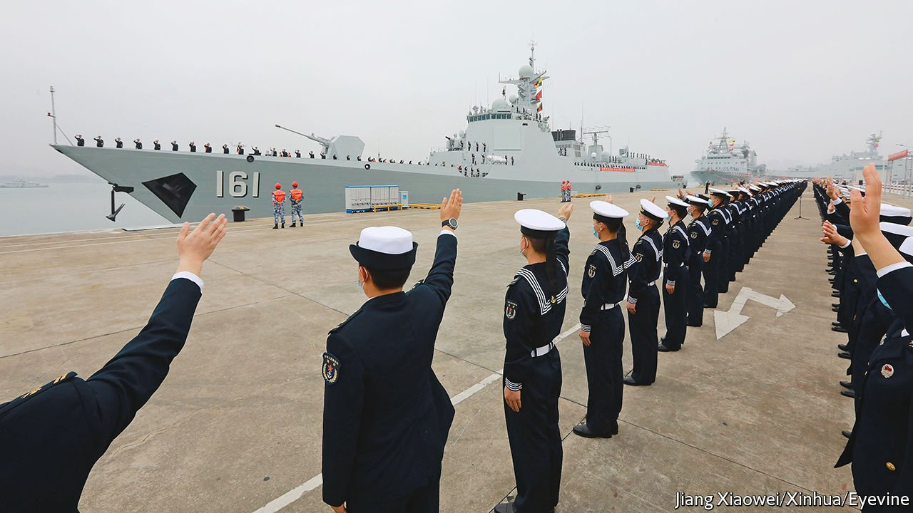
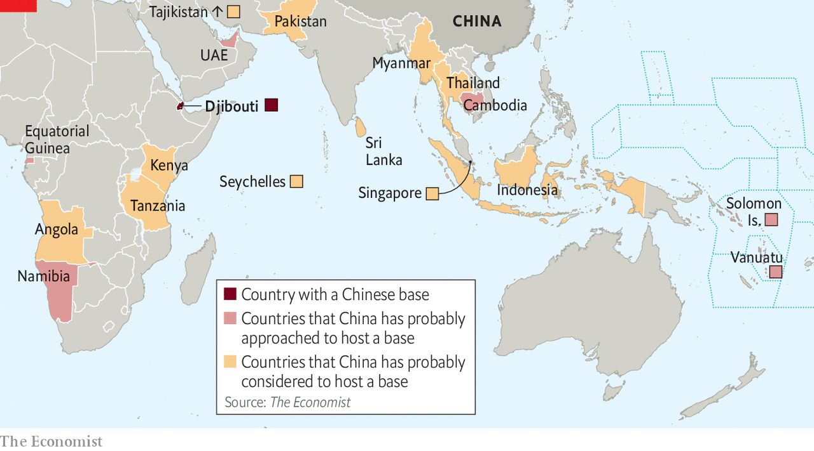

###### Base instincts

# China wants to increase its military presence abroad 

##### How concerned should America and its allies be? 

 

> May 5th 2022 

IN AUGUST 1942 an American-led task force landed on Guadalcanal, the largest of the Solomon Islands, for an offensive that would turn the tide in the Pacific war. The campaign dislodged Japanese troops, thwarted their plans to sever American supply lines to Australia and New Zealand, and gave the Allies a vital platform for later battles that helped vanquish Japan.

Small wonder, then, that American and allied nerves were rattled when it emerged in late March that China, their new Pacific rival, was signing a security deal with the Solomons that could give it a military foothold there. Over the past month, hurried visits from American and Australian officials prompted denials from China and the Solomons that a Chinese base was in the offing. Still, on April 27th an Australian minister predicted that China was “very likely” to send troops to the Solomons.


The exact contents of the deal have yet to be made public. America and its regional allies have promised fresh diplomatic engagement and threatened unspecified consequences if the agreement leads to any substantial Chinese military presence. So far, though, the saga represents a win for China—with important qualifications.

 


China still has just one military base abroad, a naval facility opened in 2017 in Djibouti. But it is accelerating and broadening its quest for more. American and allied officials believe it has approached at least five countries since 2018 and considered a dozen others as potential hosts (see map). Whether the Solomons deal translates into a Chinese base remains unclear. And if it does, the strategic value of such an isolated outpost is debatable.

Nonetheless, some who track China’s efforts predict more such deals in the coming years and say that America and its allies should focus on limiting their utility rather than trying to outbid China on each. The alternative is “a game of global whack-a-mole”, says Isaac Kardon of the US Naval War College. “I think part of it is just adjusting to the reality that the PLA (People’s Liberation Army) is going to be more global, and thinking about ways to make their assets vulnerable.”

The skirmishing over the Solomons began in March when a draft of the deal was leaked online. It said the Solomons could ask China to send police and soldiers to help maintain social order, provide humanitarian relief and conduct “other tasks” agreed on by the two sides. China could, “according to its own needs” and with local approval, send its ships to stop over, according to the draft. It also said that neither side could make the contents public without the other agreeing.

Soon after the leak, Australia, which has a similar, though transparent, agreement with the Solomons, rushed two intelligence chiefs to the country and made a public appeal for the government there not to sign the Chinese deal. Manasseh Sogavare, the prime minister of the Solomons, signed it anyway, saying he needed to diversify his country’s security partnerships.

America then dispatched Kurt Campbell, who oversees Indo-Pacific affairs in the White House, and other senior officials on an island-hopping tour of the region culminating in the Solomons. Mr Campbell made several commitments, including a promise to expedite the reopening of the American embassy in the Solomons, which closed in 1993, and to start a strategic dialogue with the government there.

Mr Campbell issued a warning, too. If any steps were made to establish a Chinese military installation or permanent presence in the Solomons, America would “respond accordingly”, the White House said after his meetings, without explaining what that might entail. Scott Morrison, Australia’s prime minister, added a similarly vague threat, saying a Chinese base in the Solomons would cross “a red line”.

Ports in a storm

As China seeks to protect its worldwide interests and challenge American military dominance in Asia, it can already rely to some extent on a global network of over 90 ports that are partly or wholly owned or operated by Chinese firms. Those are fine for refuelling, replenishing supplies and repairing ships in peacetime. But it also needs facilities in which to station uniformed personnel and store weapons and equipment. In the past three years alone, it has signed a secret deal to use a Cambodian navy base, tried to negotiate its own naval outpost in Equatorial Guinea and secretly begun building a military facility inside a Chinese-run port in the United Arab Emirates (UAE), say American officials.

China also appears to have adjusted its tactics, abandoning attempts to convince America and its allies that such deals don’t threaten their interests, and targeting countries of more strategic importance to America. Before opening its base in Djibouti, China insisted that it would only be a “logistics hub” to support Chinese forces involved in UN peacekeeping, anti-piracy and humanitarian operations. It made no such effort to sell the Solomons deal.

One likely explanation is Chinese pique at the recently unveiled AUKUS pact, under which America and Britain will help Australia to acquire nuclear submarines. It is part of a broader joint effort to counter China’s military ambitions. In April one of China’s deputy foreign ministers, Xie Feng, contrasted the Solomons agreement with the “covert operations of certain countries, which have put together military blocs, stimulated an arms race and exacerbated the risk of nuclear proliferation”.

Another difference about the Solomons deal is the reference to Chinese forces quelling local unrest. Chinese proponents of overseas bases often argue that they are needed to help protect Chinese citizens abroad, citing evacuations from Libya in 2011 and Yemen in 2015. Still, they rarely, if ever, suggest intervening in the host’s domestic affairs, which would violate what China says is a pillar of its foreign policy.

That change no doubt reflects Chinese authorities’ concern about the roughly 3,000 Chinese citizens in the Solomons, who were targeted in rioting in November. But it also paves the way for Chinese security forces—which have already trained local police in the Solomons—to intervene in support of Mr Sogavare if violence erupts again after an election due next year. Such a direct Chinese intervention in a democracy would be unprecedented and deeply troubling. The world has plenty of unpopular leaders who would welcome Chinese help to stay in power.

For all China’s efforts to expand abroad, the results so far have been mixed. That is partly the result of history. America, Britain and a handful of other military powers have a global network of bases that have existed for decades and are mostly legacies of empire, the second world war and the cold war. China has started from scratch, and establishing even a small new base abroad is costly and time-consuming.

China’s challenge in some ways resembles that of the Soviet Union, which from the mid-1960s began a push to find overseas bases to give its navy global reach. Over the next couple of decades it negotiated access to facilities in some 15 countries, including Mauritius, Syria and Vietnam. But those agreements took many forms, with some allowing full-blown bases and others only ship repairs. Some fell through.

As with the Soviets, China’s progress is largely dependent on local strongmen and vulnerable to sudden shifts in the political landscape. The Solomons deal was driven by Mr Sogavare’s concerns about his own political future—and by his antipathy towards Australia. Any Chinese military presence would be fiercely opposed by many islanders. In a poll last year 91% said they would prefer their country to be diplomatically aligned more with liberal democracies than with China.

Further constraining China is a recent push by America and its allies to draw more public attention to Chinese base-hunting and to co-ordinate their diplomatic responses. Although unlikely to reverse any agreements, those efforts may have slowed China down by forcing local leaders to deny plans for a Chinese base, and by mobilising domestic or regional opposition. Observers say Chinese forces have not yet been spotted using the Cambodian naval base and that the UAE has halted construction of the alleged Chinese military facility in its port.

China’s deal with the Solomons marks a step towards extending its global military presence. For the moment, though, a second overseas base of its own remains elusive, let alone a global network. ■

