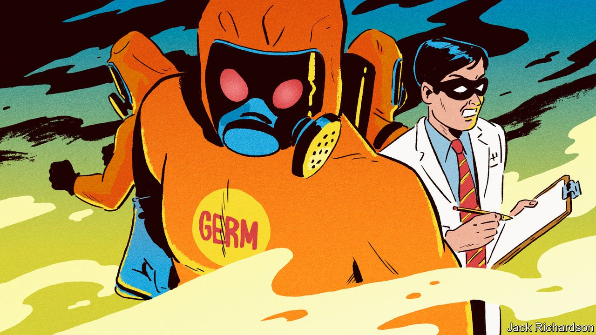

###### Combating diseases

# Bill Gates explains “How to Prevent the Next Pandemic” 

##### His proposals for nipping infections in the bud are worth exploring 

 

> May 7th 2022 

How to Prevent the Next Pandemic. By Bill Gates. Knopf; 304 pages; $28. Allen Lane; £25

FIRST, THE climate. Next, plagues. Bill Gates’s career-switch from entrepreneur and philanthropist to  is developing nicely. It is just over a year since he published “”. Now he sets out to explain “”.


Both books consider what might be described as human-created natural disasters. Some disasters—hurricanes, earthquakes, tsunamis—are purely natural. The best people can do when dealing with these is to anticipate them through things like warning systems, planning codes and reinforced buildings. Others, such as war, have human causes. They may sometimes have a natural trigger, such as a drought that sets populations on the move. But human beings inflict the damage.

Climate change and epidemics are halfway between these extremes. They are caused by people interacting with nature—in one case by altering the atmosphere’s chemical make-up, in the other through actions ranging from inadequate disposal of sewage to international jet travel and sexual activity. As Larry Brilliant, one of the epidemiologists who helped to eradicate smallpox, observes, “Outbreaks are inevitable [the nature part of the equation] but pandemics are optional [the human part].” And that provides an opening for the sort of techno-optimistic approach that Mr Gates loves.

One pandemic that might have been optional had it been spotted early enough— AIDS—has been in his cross-hairs for years, as part of the  he runs jointly with his ex-wife Melinda French Gates. , most of them since it came to the attention of medical science in 1981. Yet subsequent analysis has shown it had been spreading in Africa for decades. A better early-warning system could have picked it up in the 1950s, rather than the 1980s, allowing it to be tackled much earlier.

Sexually transmitted infections, though, spread slowly. Airborne ones spread fast—particularly in an era of mass international travel. Early detection is vital, and is the first item on Mr Gates’s list of things to accomplish. Others include helping people protect themselves; finding new treatments; and developing vaccines. And practice drills: he is big on the idea that, just as military forces drill and earthquake-response teams drill, so should those tasked with combating pandemics.

But who should those people be? That is the nub of the book. Armed forces and civil-defence teams are national responsibilities. But pathogens know no borders, and governments, in any case, are curiously uninterested in contingency planning for new diseases. While covid-19 remains fresh in people’s minds, Mr Gates sees an opportunity to correct this.

He suggests creating a global “fire brigade” of 3,000 experts scattered around the world, recruited for skills ranging from epidemiology and genetics, through drug and vaccine development and computer modelling, to diplomacy. This outfit, which would probably work under the auspices of the World Health Organisation, would remain on permanent standby, ready to respond to any detected outbreak.

Mr Gates tentatively proposes that it be called GERM (Global Epidemic Response and Mobilisation). The PR department might not like the name, but the idea is worth exploring. He estimates GERM itself would cost about $1bn a year. While waiting for the call, its staff would be employed in beefing up the world’s anti-pandemic infrastructure—this is where the diplomacy would come in—by chivvying governments into the necessary spending on detecting, monitoring and suppressing potential outbreaks. And in running drills.

On the technological side, his shopping list includes designing and agreeing on protocols for the rapid mass-testing of drugs that might work against a particular pathogen if an outbreak did happen. (Britain’s RECOVERY trial, which was ready to go within six weeks of covid-19 being identified, and eventually included 40,000 participants at 185 sites, comes in for particular praise here.) Mr Gates also wants to improve both vaccine manufacturing and distribution, and to improve vaccines themselves, particularly by eliminating cold chains.

Most existing vaccines are temperature-sensitive, and must be passed quickly from one refrigerator to another en route to the clinics where they will be used. Mr Gates recommends research into the development of heat-tolerant vaccines. For pathogens that spread through the air, he favours a cutting-edge approach to prevention: nasal sprays containing drugs that bind to the cell-surface proteins which viruses use to gain entry, thus denying them the means to get into their target cells.

And he envisages new, broad-spectrum jabs against entire classes of viruses, such as influenza. Techno-optimist that he is, he suggests such universal vaccines could not only pre-empt illnesses of the future, but annihilate those of the present. In other words, no more flu. Ever.

That does sound pretty optimistic, especially given the difficulty of eliminating even single viruses from the planet—something that has been achieved only for smallpox and for a cattle disease called rinderpest, and has notably not happened for polio, which still lingers in a few places despite a decades-long campaign to get rid of it. But, as Arthur C. Clarke put it in his second law of science, “The only way of discovering the limits of the possible is to venture past them into the impossible.”

Whether anything like GERM will ever come to pass, as the world’s attention shifts from the crisis of covid-19 to the catastrophe in Ukraine, remains to be seen. But if this book stimulates even a little limit-pushing of the sort Mr Gates suggests, it will have served its purpose well. ■

Dig deeper

All our stories relating to the pandemic can be found on our . You can also find trackers showing ,  and the virus’s spread across .

