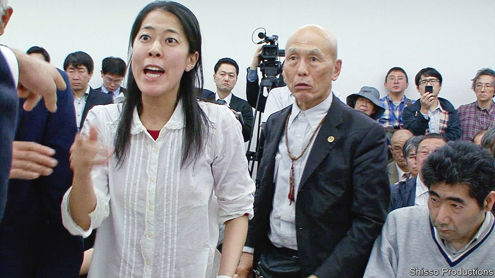

###### A campaigning Japanese film-maker

# Hara Kazuo’s documentaries speak for the downtrodden 

##### His career has tracked the development of Japanese society 

 

> May 7th 2022 

MINAMATA WAS a sleepy little town on Japan’s western island of Kyushu. But in the early 1950s eerie things began happening there. Birds flew in circles and plopped into the sea. Cats “danced”, as locals put it, as if in agony. Soon people, too, were losing their senses; some ended up paralysed and bedridden.

The town had fallen victim to one of the worst pollution scandals of Japan’s post-war boom. A neurological disorder was named after it: the Minamata disease. Chisso Corporation, a chemical company, had released wastewater containing methylmercury into the bay; the government failed to stop it. A Hollywood film of 2021, starring Johnny Depp as a photojournalist who visited in the 1970s, revived memories of the episode. But “Minamata Mandala”, a six-hour documentary also released last year, told the story best. “I realised the situation was far from resolved,” says Hara Kazuo, who spent 15 years shooting and five years editing the film. “I knew somebody had to do something about it.”


Unfamiliar as his name may be in the West, over five decades the 76-year-old film-maker has left an indelible mark on the documentary form. His best-known film is “The Emperor’s Naked Army Marches On” (1987); it features Okuzaki Kenzo, an anti-war anarchist who once pelted the emperor with pachinko balls. Mr Hara’s interventionist style—in which he abandons the pretence of objectivity and enters the scene—influenced Michael Moore. After watching “Extreme Private Eros: Love Song 1974”, Mr Hara’s provocative portrait of a former girlfriend, Martin Scorsese wrote to him: “No one has ever made a film like that. No one has ever seen a film like that.”

His themes and techniques have tracked the development of Japanese society—but his mission has always been to tell silenced and marginalised stories. His aim with “Minamata Mandala” was to “change the air” around the scandal (lawsuits demanding that the state should recognise the illness and compensate victims are still ongoing). Its daunting 372-minute length is an “approximation of the temporality of the patients”, who endure year after year of pain and neglect, reckons Aaron Gerow, a historian of  at Yale University.

Mr Hara’s urge to challenge oppression stems from his childhood. He was born out of wedlock at the end of the second world war; his impoverished mother toiled in the nocturnal entertainment industry. As a young man he witnessed the student uprisings that swept Japan during the soul-searching of the late 1960s. Distant revolutionaries such as Che Guevara and Fidel Castro inspired him, too. “Most Japanese only know how to obey their superiors, but such movements taught me how to pick a fight with authorities,” he says. The camera was his weapon.

As Mr Gerow notes, the director spotlights emotions, and basic human experiences such as love and sex, to illuminate the effects of power. This interest in the private realm sets him apart from earlier Japanese documentarians, who focused more on contexts and environments. Anger is “sacred” for Mr Hara, says his producer Shimano Chihiro. In a society that values good manners and orderliness, it is “an emotion of the marginalised class”, Ms Shimano observes. “Minamata Mandala” evokes a broad spectrum of feelings. At times it is a courtroom drama, at others a romantic comedy, as Mr Hara explores the love lives of the victims.

For a while, ideas—or Japanese society—seemed to betray him. From the mid-1990s he struggled to find subjects, which led to long gaps in his filmography. In his earlier works the protagonists were iconoclasts like the pachinko-hurling Okuzaki. But as Mr Hara grew older he found it hard to identify anyone in Japan who was even remotely as daring. “I thought my career was doomed,” he says. While prosperity had made Japanese lives more comfortable, complacency and conformism had set in. “It’s a bit hard to breathe in today’s society,” says Mr Hara’s wife and collaborator Kobayashi Sachiko.

Yet he made a glorious comeback in 2017 with “Sennan Asbestos Disaster”, which chronicled the battle of asbestos victims for compensation. This time his apolitical subjects learned the art of rebellion under his influence. “It’s interesting to cause a ripple effect on reality by intervening in people’s lives,” he says. There were still stories for him to tell, and new ways to tell them. The collaborative style of that film paved the way for Mr Hara to portray subtler forms of activism. Making “Minamata Mandala”, he saw how everyday scenes might resonate with audiences.

He also started to see himself in his subjects. Like them, he is proof that anybody can cause the right kind of trouble and challenge entrenched world-views. “I’m an ordinary man from the bottom rungs of society who obtained the means to probe the meaning of life through documentary,” he says. “I feel as if I came full circle.”

