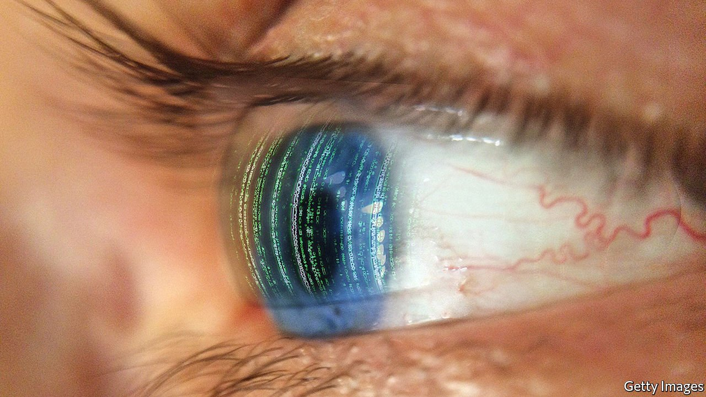

###### Speculative fiction

# In “The Candy House” Jennifer Egan takes on tech 

##### The author of “A Visit from the Goon Squad” spins another whirling yarn 

 

> May 7th 2022 

The Candy House. By Jennifer Egan. Scribner; 323 pages; $28. Little, Brown; £20

THE TITLE of Jennifer Egan’s new novel refers to the witch’s cottage which, enticing yet full of danger, lures in Hansel and Gretel. “Never trust a candy house!” a character observes early in the book, as competition from the file-sharing platform Napster destroys her father’s music business. Such technology is “a Faustian bargain”, Melora Kline goes on: “like letting a stranger rummage through your house—or your brain!”


Rummaging through the brain—and uploading it to a global collective consciousness—may be the next step in mankind’s surrender to technology, Ms Egan suggests in her clever and disturbing new book. Like “A Visit from the Goon Squad”, for which she won a Pulitzer prize in 2011, this “sibling novel” is an interlocking puzzle of stand-alone tales. “Goon Squad” took on the subject of time; “The Candy House” is about what humans lose in offering up their private lives to algorithms that mine them for profit. Yet for all the seriousness of its theme, it is hugely entertaining. As dazzlingly inventive and formally ambitious as its predecessor, it slips down as pleasurably as—well, candy.

The novel is a kaleidoscope of nearly two dozen characters and perspectives (readers may find they need a list to keep up). Yet Ms Egan spins a subtle web that connects them all—a chain that is completed, like many of the best fictions, in the reader’s own mind. The landscape that develops is uncomfortably similar to the current digital realm. Bix Bouton, a “tech demigod on a first-name basis with the world”, has invented a program called “Own Your Unconscious” that allows users to “externalise” their memories and feelings into software. He bases this innovation partly on the work of an anthropologist investigating trust networks in a remote Brazilian tribe.

In this entirely mediated future there are “counters” who quantify individuals’ online activity, and “eluders” who choose to secede from digital life, leaving behind dummy identities. Before long, Bouton’s company offers users the chance to access other peoples’ memories in exchange for uploading their own; meanwhile a non-profit outfit has emerged to help the refuseniks escape. Pinballing between tales told in tweets, emails, maths formulas and her own liquid prose, Ms Egan questions the cost of trading away authentic selves for something that appears to be shinier and more exciting.

For all its fluency in the languages of gaming, addiction and tech, “The Candy House” is a social novel, a kind of “Middlemarch” for the 21st century with an aptly whirling form. The characters’ stories are not wrapped up neatly; there are reversals and redemptions and, above all, an assertion that imagination can still trump technology. In the closing scene, Bouton’s son Gregory, a writer of fiction, realises that he is surrounded by “a galaxy of human lives hurtling toward his curiosity”. He can feel the collective, he marvels, “without any machinery at all”. ■

