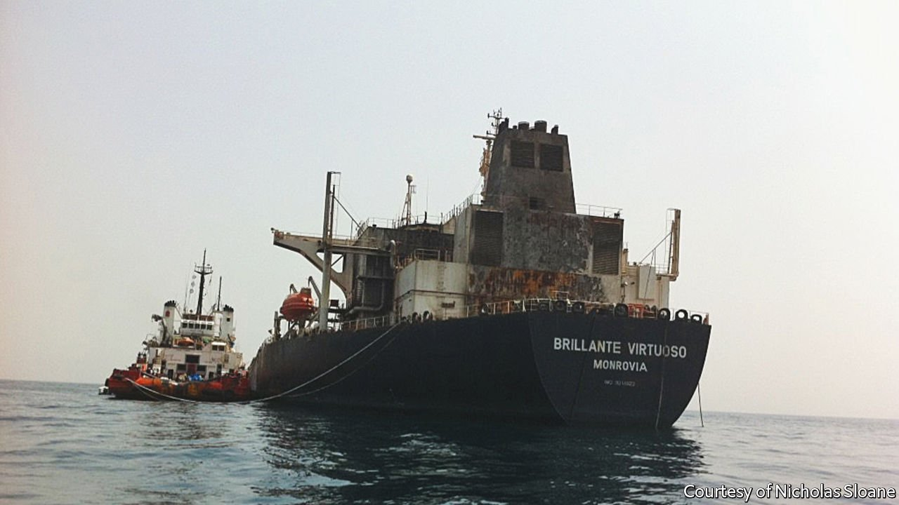

###### Shipping shenanigans

# What really happened when pirates attacked the Brillante Virtuoso? 

##### “Dead in the Water” tells a startling tale of fraud and impunity at sea 

 

> May 7th 2022 

Dead in the Water. By Matthew Campbell and Kit Chellel. Portfolio; 288 pages; $27. Atlantic Books; £18.99

THE GLOBAL shipping network is one of capitalism’s most impressive achievements. Commercial vessels carry over four-fifths of world trade in physical merchandise, much of it lugged around in the more than 16,000 container ships and oil tankers in service. Yet as ever-more ports have been moved away from cities, shipping has become one of the least visible engines of the modern economy.


It can also be among the shadiest, argue Matthew Campbell and Kit Chellel, two journalists from Bloomberg. Based on more than four years of reporting, their tale of the fate of the Brillante Virtuoso exposes the dark, barnacle-encrusted goings-on beneath the industry’s waterline. They tell a remarkable story about an unremarkable ship, “fought over, picked apart in court, and investigated by police, naval forces, private detectives and experts who make their living boarding ships to look for nearly invisible clues”. Books about merchant shipping are rarely so gripping.

The central event is the boarding of the Brillante, an ageing oil tanker, by pirates claiming to represent “the authorities”, as the ship crosses the Gulf of Aden in July 2011. The interlopers set off an explosion that causes a devastating fire, then flee.

David Mockett, a Yemen-based maritime surveyor working for the Lloyd’s of London insurance market, is sent to inspect the badly damaged vessel, but is left with more questions than answers. Why was the crew so quick to let the pirates on board? And why did the marauders start a fire and disappear rather than seize the ship and demand a ransom?

Suspecting an insurance scam, Mockett begins to dig deeper. But within weeks he is killed by a car bomb. Two British ex- detectives hired by the insurers to take up the investigation encounter several obstacles. One is a thicket of corporate layers, common in shipping, which makes it hard to identify the Brillante’s owner. Shell companies and flags of convenience allow shipowners to take “all of the profits, little of the accountability”, say the authors.

Another problem is the investigators’ own employers. Lloyd’s, the main market for insuring large commercial risks, has a history of paying out (at least partially) on claims by shipowners suspected of scuttling their own vessels, rather than enduring long, expensive inquiries and litigation. Another reason very few “accidents” are fully investigated is that insurers worry this will lead big shipowners to take their business elsewhere. Better to cough up, say, half the ship’s value and move on.

So egregious is this case, however, that after much toing and froing, the investigators are allowed to keep digging. They identify Marios “Super Mario” Iliopoulos, a car-racing enthusiast and owner of a Greek ferry service, as the Brillante’s ultimate owner. Whistleblowers confirm that the attack was an insurance fraud; one needs rescuing when he discovers that a group of bulky-looking men are searching for his house. A Greek lawyer representing the insurers receives death threats and is beaten up near his office in Piraeus.

In October 2019, more than eight years after the Brillante was set ablaze, the High Court in London eventually ruled that the attack had been faked and that the “orchestrator” of the audacious fraud was Mr Iliopoulos (who has always denied it). But it was an odd sort of victory for the underwriters. Mr Iliopoulos was found to have made a false insurance claim for $77m, but that did not cost him a penny since he was not party to the case—which was between the insurers and one of his lenders, Piraeus Bank. The bank, which had financed the purchase of the Brillante, had long since written off the loan. Two months after Justice Nigel Teare handed down his 136-page judgment, one of Mr Iliopoulos’s ferries won “Ship of the Year” at the Lloyd’s List Greek Shipping Awards. He accepted the prize in person, at a ceremony attended by industry bigwigs and Greek politicians.

The private investigators who helped uncover the scam arguably came off worse than its alleged perpetrator. One was even forced to defend a criminal complaint after an associate of Mr Iliopoulos alleged the sleuth had illegally tried to access his private information. The insurers withdrew an offer to pay the investigator’s legal bill, leaving him heavily out of pocket. Mockett’s widow got a rum deal, too. She asked for compensation from the insurers, who, she had been told, had spent $28m on their own legal fees, but received nothing, according to the authors.

The sobering lesson of the Brillante saga, they conclude, is that maritime fraud is profitable—and even if those behind it are unlucky enough to get caught, their chances of ending up in prison, or even out of pocket, are slim. The story illustrates how the shipping industry “has the unique attribute of being utterly integrated with the world economy while existing apart from it, benefiting from its infrastructure while ignoring many of its rules.” ■

