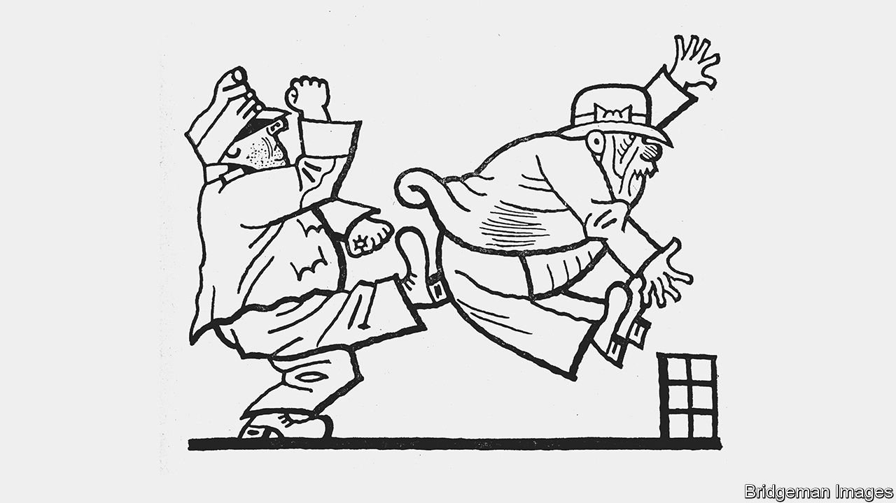

###### Home Entertainment

# “The Good Soldier Svejk” and the idiocy of war 

##### Jaroslav Hasek’s satire makes a mockery of bellicose authority 

 

> May 7th 2022 

IT IS WITH pride that Josef Svejk declares to his superior officer: “I dutifully report, Colonel Sir, that I am an idiot.” He has already been kicked out of the Austro-Hungarian army once for being an imbecile. Since then he has scraped a living in Prague selling stolen dogs. On hearing of the assassination of Franz Ferdinand, Svejk initially confuses the archduke with another Ferdinand who cleans dog mess off the streets. The war that follows sees Svejk called up to serve the empire again.

“The Fateful Adventures of the Good Soldier Svejk During the World War” (known as “The Good Soldier Svejk”) follows the self-proclaimed fool’s circuitous journey to the front. Jaroslav Hasek published three volumes of his anti-war satire between 1921 and 1923; he was working on a fourth when he died.


Svejk is a picaro who drifts between places and masters. He follows his orders to the letter. Told to attend to every desire of a lieutenant’s mistress, Svejk does as she wishes and sleeps with her. Instructed to find a dog for the lieutenant, he steals one from a colonel—who sends the whole battalion to the front as punishment.

Eventually Svejk is thrown off a train heading to the eastern front in the Austro-Hungarian province of Galicia, so decides to walk. His own side takes him for a Russian deserter and he narrowly escapes execution. He rejoins his unit, and here— before he sees combat—the novel stops.

Svejk is often compared to Yossarian, the American captain in Joseph Heller’s “Catch-22” whose aim is to survive the second world war at all costs. Heller played down suggestions that he took inspiration from Hasek, describing his story as “just a funny book”. But if that were accurate, Svejk would be just an idiot. In fact he is a master of subversion, a little man who keeps himself out of the regime’s war simply by following orders.

Hasek’s life was almost as chaotic as his character’s. He too was sent to the eastern front; later he joined the Red Army and hobnobbed with Trotsky, eventually severing his communist links. Many writers have tried to finish his saga (Bertold Brecht wrote a play in which Svejk crosses paths with Adolf Hitler). But none has captured the Czech imagination as successfully as Hasek, helped by Josef Lada’s Tintin-esque illustrations in early editions (see picture).

“To svejk” has entered the Czech vocabulary, meaning to undermine authority through stupidity. In 1968, when the Soviet Union installed Gustav Husak as Czechoslovakia’s leader after the Prague Spring, he urged people to “Stop svejking”. (The Soviets, missing the point, lauded Hasek’s work.) Svejk’s buffoonery has left its mark across Europe. From Athens to Warsaw, dozens of imitations of “U Kalicha” (At The Chalice), Svejk’s local, serve steins of Czech lager. Ingrida Simonyte, Lithuania’s prime minister, quotes Svejk in her speeches.

Today much of what was once Galicia is in Ukraine. The Russian soldiers now waging a senseless war in that country could do worse than read “The Good Soldier Svejk”. With luck, its send-up of swaggering authority might inspire them to try a bit of svejking themselves. ■

