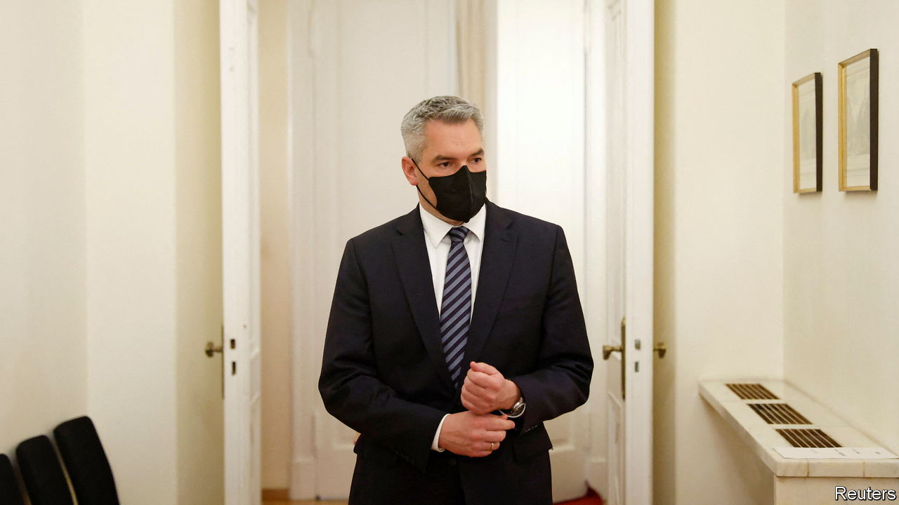

###### After the honeymoon

# Austria is rethinking its cosy ties with Russia 

##### Economic, cultural and diplomatic links date back to the cold war 

 

> May 7th 2022 

“DESPITE BEING a neutral country, Austria positioned itself very clearly,” says Karl Nehammer, Austria’s chancellor. Sitting in his offices at Vienna’s baroque Ballhausplatz, he says that Austria’s immediate backing of EU sanctions against Russia surprised many. Austria gave €60m ($64m) to NGOs to help Ukraine and donated helmets, protective vests and fuel. The small country has taken in 66,000 Ukrainian refugees. Mr Nehammer sees his visit to Vladimir Putin on April 11th to appeal for a ceasefire as part of that support.

Others thought the visit showed ambivalence. Indeed, Mr Nehammer’s backing of Ukraine was not assured. Austria, which became neutral during the cold war at Soviet insistence, has been notably friendly to the Kremlin in recent decades. Eastern Europeans refer to it as Russia’s Trojan horse in western Europe. After Mr Putin annexed Crimea in 2014, Austria was the first Western country to welcome him for a visit. The far-right Austrian Freedom Party (FPö) frequently criticised the EU’s sanctions against Russia and praised the country as a bastion of cultural conservatism.


The Austro-Russian love affair peaked during the first government of Sebastian Kurz, a coalition between his öVP and the FPö from 2017 to 2019. Karin Kneissl, then Mr Kurz’s foreign minister, had Mr Putin to her wedding; images of her curtsying to him after they danced went viral. In 2018 Mr Putin and Mr Kurz met four times.

Mr Kurz’s government fell in 2019, after a secretly filmed video showed Heinz-Christian Strache, then vice chancellor and leader of the FPö, seeming to accept an offer of financing from a woman pretending to be the niece of a Russian oligarch. (The meeting took place at a louche drinking party in Ibiza; the woman offered to invest €250m in Austria and buy newspapers to support the FPö.) Mr Kurz returned to power in 2020 with a coalition government that included the Greens and a foreign minister, Alexander Schallenberg, who is a committed Atlanticist. The flirtation with Mr Putin started to cool. “Austria vastly overestimated the geopolitical role it could play as a bridge-builder between Russia and the West,” says Gerhard Mangott of Innsbruck University.

Still, economic relations are substantial. Austria gets 80% of its natural gas from Russia. One-quarter of all gas deliveries from Russia to the EU flow through a hub in Baumgarten, in lower Austria. Russia is the country’s number-two foreign investor after Germany, with investments of €21.4bn in 2020. Raiffeisenbank International, Austria’s second-biggest bank, made 35% of its profits in 2021 in Russia, where it employs 9,300 workers.

Cultural ties are close, too. Russians play key roles in Austrian cultural institutions. Ekaterina Degot runs Steirischer Herbst, a contemporary-art festival in Styria; Anna Netrebko, an opera singer, received Austrian citizenship in 2006. She is still scheduled to sing at Vienna’s state opera, whereas other houses, such as New York’s Metropolitan, cancelled her performances. Austrian interest in Russian high and popular culture is tremendous. “We are fascinated by a culture that seems so familiar and still remains so foreign,” says Simon Mraz, a diplomat who for 12 years ran Austria’s cultural centre in Moscow.

Mr Nehammer’s visit to Moscow left him deeply pessimistic. Mr Putin, he says, has completely adopted the logic of war. The conflict will permanently alter relations with Russia. Austria has embargoed Russian oil and is working to diversify its gas supplies. Raiffeisenbank is considering the possibility of pulling out of Russia. Strabag, Austria’s biggest construction company, forced Oleg Deripaska, a Russian oligarch who owns 28% of its shares, to leave its board. But opera and ballet fans hope the artistic relationship will survive—or be revived, after the war. ■

Read more of our recent coverage of the 

