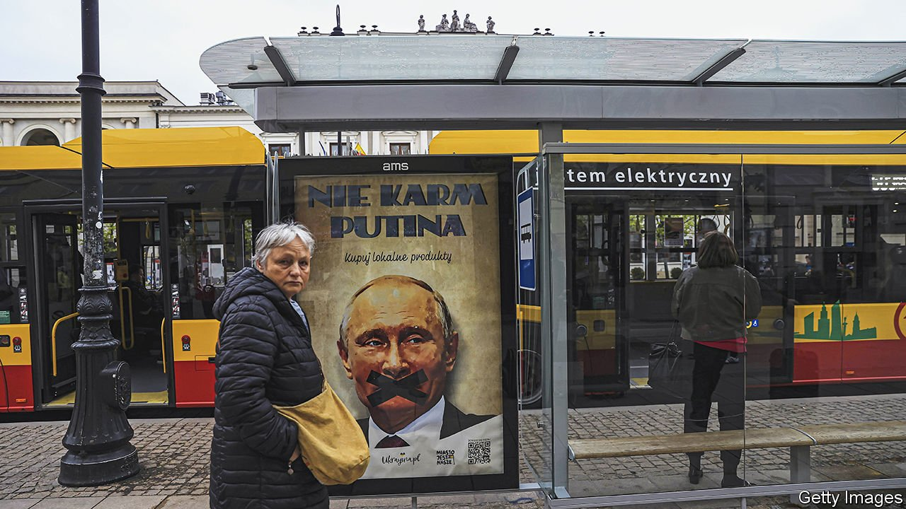
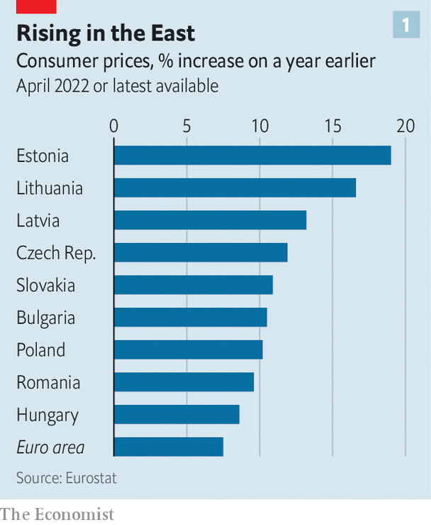
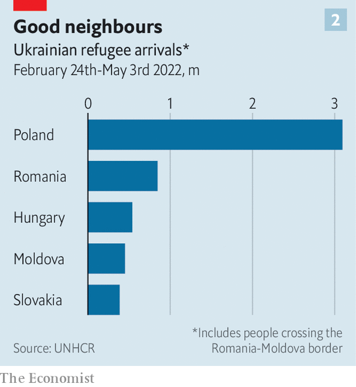

###### Bearing the brunt

# Europe’s hard-hit east is pushing the toughest response in Ukraine 

##### Eastern European economies will see the effects of the war for decades 

 

> May 7th 2022 

WHEN RUSSIA invaded Ukraine, many eastern European countries responded with hawkish resolve, fearing they could be next. Their governments pushed for the EU to cripple Russia’s economy and dug deep into their own pockets () to send Ukraine weapons and aid. Countries in the EU’s east have taken in most of the 5.6m refugees who have fled the war. But  does not come cheap, and the  is starting to show.

Trade was the first victim. Russia has been a big export market for some economies in the region. Trade with Russia accounted for 6% of GDP in Latvia and Lithuania in 2021 and 1.5% in Poland and Slovakia. In 2021 Russia received roughly a tenth of non- EU exports from Poland and the Baltic states. Most such links are probably severed for good, but they see that as a price worth paying. “It is Poland’s key political interest that the West does not return to doing business with Russia,” said Piotr Arak, head of the Polish Economic Institute, a government think-tank in Warsaw.


Direct trade is only part of the story. Eastern EU states have become integrated into western supply chains. Their economies, especially those of the Czech Republic, Hungary and Slovakia, are heavily oriented towards exports to Germany. So a hit to German industry, such as a cut-off of Russian gas, would badly hurt its suppliers in the east.

Energy imports are especially thorny. Slovakia and Hungary, which got 96% and 58% of their oil from Russia last year, say any EU oil embargo should be phased in gradually. Other countries are better prepared. The Baltic states ended Russian gas imports in April and now rely on liquefied natural gas (LNG) imported via ships. Poland has embargoed Russian coal and, like most countries, rejected Russia’s demand to pay for gas in roubles. In response Gazprom, which supplies 40% of the country’s gas,  last week. But Poland, too, has an alternative gas-import plan through its own LNG terminal and new pipelines to the gas grids of Norway and Lithuania.

Shunning Russian energy means higher prices. That will be especially painful in Europe’s poorer east.  in eastern Europe before the war; in April it reached double digits in many countries. In some, consumer energy bills are fixed by regulation, delaying the pain. In Slovakia, for instance, prices will only be updated in January. But “the prospect of a 100% increase in household gas prices has not sunk in yet,” says Michal Horvath, the central bank’s chief economist.

In Poland inflation hit 12.3% in April, a headache for the ruling party, which faces elections next year. Government largesse is partly at fault for cost-of-living increases, and Mr Arak thinks voters will blame it: “In communist times the government would introduce higher prices, often sparking mass protests. For the majority of Poles it remains clear that the state is responsible for maintaining price levels.” To soften the blow, the government has cut value-added tax on food, gas, fuel and fertiliser. It dubs an upcoming economic package an “anti-Putin shield”.

Central banks will have to act, too, notably by raising interest rates. But that will have unpleasant consequences. In Poland, where about 90% of loans to households and businesses have variable rates, mortgage-holders are heavily exposed. Banks have already tightened credit standards considerably. Along with inflation, rocketing house prices and sagging business confidence, that could spell a “perfect storm”, says Adam Czerniak, head of research at Polityka Insight, a think-tank in Warsaw. Higher interest rates and weakening economies mean that rising government debt will become more expensive to service, especially in countries such as Hungary where debt is already high.

 


Spending on refugees will further spur inflation. Take housing. In Warsaw rents have jumped by more than 30% since the end of February. Strains on public services are similar. Refugees have  by almost 8% since the war in Ukraine started in late February. That puts pressure on  and , which were already in poor shape. This will be partially offset, however, by the newcomers joining the local labour forces. In Slovakia and Hungary, the dedication of NGOs and private citizens has compensated for a lack of public services for refugees.

The war’s economic costs to eastern Europe look formidable. But that seems not to have softened countries’ resolve. The economic hit is seen as manageable. Poland’s economy, which remains strong, had not seen a recession in almost three decades until the covid-19 pandemic, notes Wojciech Kopczuk of Columbia University. The Baltic countries suffered much worse during the financial crisis, adds Morten Hansen of the Stockholm School of Economics in Riga. Citizens absorbed that suffering because it was needed to join the euro, part of the countries’ strategic drive to integrate into the West. As in the current crisis, they were willing to undergo economic pain to safeguard their independence.

 


The war and its aftermath will have some economic benefits for eastern Europe. Bulgaria aims to become a regional energy hub. Poland in particular stands to gain from  and its increasing integration into the EU. “No Western country has as close intergovernmental ties with Ukraine as Poland,” says Oktawian Zajac of the Warsaw office of the Boston Consulting Group. The ties that Ukrainian migrants and refugees are forming will also bring economic benefits down the line, argues Mr Kopczuk.

The responses of central and eastern European states to the Ukraine crisis “will define the region for decades to come,” says Sona Muzikarova of Globsec, a think-tank in Bratislava. Undeterred by the economic pain of the war, they are showing by example that Russian aggression must be firmly resisted. ■

Read more of our recent coverage of the 

