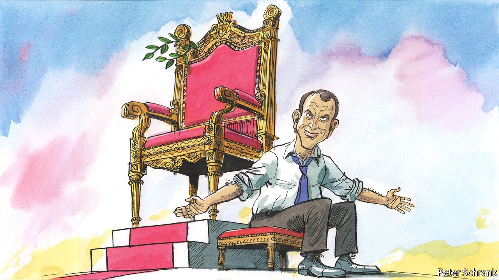

###### Charlemagne

# France’s re-elected President Emmanuel Macron wants to govern differently 

##### This will mean curbing his own instincts 

 

> May 7th 2022 

CLASPING HANDS and squeezing shoulders, Emmanuel Macron lingered for hours amid a crowd of well-wishers in a little market town at the foot of the Pyrenees, just days after he was re-elected. At the end of a divisive campaign, the French president’s trip was designed as a show of healing and listening. The technocratic slayer of populism could still connect with the people, the visit implied, and the second-term president would now listen to them more, too. It was time, Mr Macron declared, for reconciliation, and a “new method” of consultative government: “We can’t resolve everything from là-haut (on high).”

From the leader who clambered up to grand heights to begin his presidency in 2017, this marks something of a turnaround. The centrist, it seems, has taken the full measure of what is at stake during what is probably his final term. (The constitution allows only two consecutive ones.) For Mr Macron’s challenge is typical of those facing liberal democrats across Europe as they seek to hold the centre against the forces of populism. And France, the euro zone’s second-biggest economy, is a test case that matters. By 2027, if Mr Macron holds on to his majority at parliamentary elections next month, the then 49-year-old may well leave behind him a decade of stable, competent government at the heart of Europe. In France, a country outsiders like to think is always on the brink of collapse, this would be quite a result.


Yet France also emerges from this election fractured and fragile. Mr Macron is politically triumphant. But as he recognised, he owes his victory in part to those who wanted to keep out his opponent, the populist-nationalist Marine Le Pen. Her campaign tapped into, and stirred up, the humiliation and anger that many French voters feel. If Mr Macron cannot find a way to address political disenchantment, and entrench the democratic centre, in five years’ time the young political retiree may hand over a France readier than ever to put a radical populist in power.

Nobody charges Mr Macron with lacking competence, seriousness, intellect or imagination. He has some work to do to improve the sharing of wealth, although the record is not bad. To live up to his government’s post-partisan billing, he needs to rebalance it towards the greens and the left. But the main complaint is about Mr Macron’s solitary exercise of power, and the impression he can give of disdaining the less able or lucky. How might a Macron presidency 2.0 listen more and dictate less?

One challenge will be to soften the style that accompanies the philosophy. Mr Macron’s political thinking is centred on the concept of “emancipation”: creating fairer opportunities for individuals to improve their lives, while maintaining a strong safety-net for those who stumble. He has invested in better early education and nutrition in poor areas, and vastly expanded apprenticeship schemes. Such projects are laudable and overdue. But they take time to show results, and will leave some behind. The impression of disrespect for those who still struggle undermines the genuine investment in making sure they do not.

Another option to alleviate the feeling of voicelessness would be to give people more of a say in between elections. Mr Macron has talked about setting up a citizens’ assembly to discuss assisted dying, like the one Ireland used to discuss whether and how to legalise abortion. (He set up a similar one on climate change after the gilets jaunes protests, with mixed results.) He could encourage more local experimentation in the running of schools, say, in defiance of the country’s Jacobin reflexes. He might also seek to make parliament more representative. Ms Le Pen won 41.5% of the vote, her best total ever; yet in the National Assembly her party holds just seven seats. Mr Macron tried in 2019 to introduce a dose of proportional representation, but was blocked by the Republican-controlled Senate. A cross-party commission might help to reach a consensus this time round.

Mr Macron will also have to work with the country’s testy unions. He wants to raise the pension age from 62 years to 64 or 65, and get teachers to do more for better pay. But he cannot simply impose such reforms. Michel Rocard, a Socialist ex-prime minister and one-time mentor to the young Mr Macron, argued that the decline in France of both the Catholic church and the Communist Party, which once lent structure and purpose to society, rendered institutions such as unions more important, not less. They may have fewer members these days, but they still have clout. Talks will be tough. Even moderate leaders reject Mr Macron’s pension plan. He will need unusual finesse if he is to consult more while still fulfilling the pledges for which he was elected.

Au revoir là-haut

Perhaps the greatest challenge, though, will be to Mr Macron himself. By constitutional right, he has made full use of the powers of the presidency under France’s Fifth Republic. By temperament, he keeps an eye on everything. This is a president who devours dossiers, pores over public policy and studies subjects independently to fill in the gaps carelessly left by others. Even his admirers say Mr Macron is not always an easy boss. Perhaps this is why it has taken him so long to name a new prime minister, a post that Rocard once called “hell”. The re-elected president will have to wrestle with that instinct if he is to fulfil his promise to govern differently.

The test of Macron 2.0 is in part the same one that faces every European leader: how to make the economy fairer, greener and more competitive at a time of war, inflation and soaring energy prices. For Mr Macron it is also whether he can strike the right balance between ensuring policy coherence and efficiency on the one hand, and avoiding dictating and lecturing on the other. Nobody, however talented, can do everything alone or get everything right. And if delegation does not come easily to Mr Macron, there is a reason. As he reminds anybody who cares to ask, had he listened to others he would not be where he is today. ■

Read more from Charlemagne, our columnist on European politics: (Apr 30th)

 (Apr 23rd) (Apr 16th)

For more coverage of the French election, visit our dedicated 

