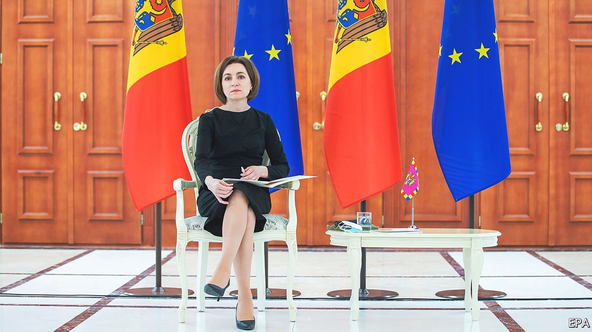
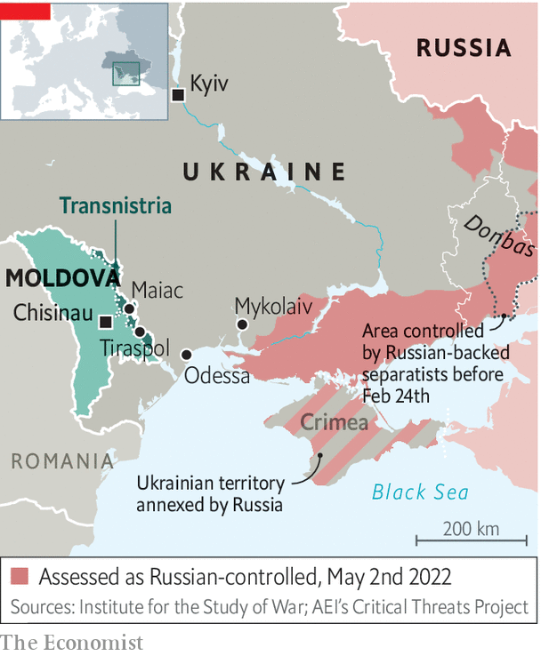

###### The next target?

# Moldova is trying to stay out of Russia’s war with Ukraine 

##### An interview with Maia Sandu, the country’s pro-Western president 

 

> May 3rd 2022 

MAIA SANDU, Moldova’s slight, soft-spoken, pro-European president, seems a bit out of place in her country’s vast presidential palace. Originally the home of Moldova’s Supreme Soviet, it was built in the waning days of the Soviet Union to advertise the government’s authority in the second smallest of its 15 constituent republics. When the union collapsed and Moldova became independent, Russia backed a separatist rebellion in Transnistria, a mostly Russian-speaking region; up to a thousand people were killed. Russian troops remain (illegally) in the breakaway statelet, over which the Moldovan government has no control. Now Russia’s attempt to re-establish the Soviet order in Ukraine is threatening to spark , already one of Europe’s poorest countries. 

This, says Ms Sandu in an interview with The Economist, is the most dangerous moment in Moldova’s history since its birth in 1991-92. The most obvious threat is military. Russia has threatened to extend the war to Moldova’s eastern border with Ukraine. On April 22nd Rustam Minnekaev, a Russian general, declared that control over southern Ukraine would open up a route to Transnistria, where, he claimed, Russian-speakers were being oppressed. That set alarm bells ringing in Chisinau, Moldova’s capital. “These were worrying words,” says Ms Sandu, “after we’ve seen what is happening in Ukraine.”

 


The worry deepened three days later when an explosion damaged the Russian-controlled state security ministry in Tiraspol, the Transnistrian separatists’ self-proclaimed capital. The day after that, two more explosions wrecked antennas used to transmit Russian radio in the nearby town of Maiac (see map). No one has claimed responsibility for either event, but Russia has a history of mounting “false-flag” operations that can be used to justify military assaults. Volodymyr Zelensky, Ukraine’s president, declared that the explosions were the work of Moscow. Ukrainian military intelligence, operating in Transnistria, says it has uncovered large stocks of leaflets urging Russian-speakers there to rise up.


Moldova is peculiarly vulnerable. Unlike Ukraine or Georgia, it has never applied to join NATO. Membership of the alliance, to which the former Soviet republics of Estonia, Latvia and Lithuania already belong, might deter Russia. But trying to join now would be seen as provocative. “The moment we ask, the bombs could start to fall,” says a Moldovan official. Informal warnings “not to overdo things” have been arriving from Russia since the summer, and in recent weeks the language has become sharper, says another official. Moldova has neutrality written into its constitution of 1994 for precisely that reason. As things stand, there is little NATO can do little to stop Russia from dragging Moldova into the conflict should it choose to. “We are trying to do our best to keep the country out of the war. But neutrality doesn’t provide 100% [protection],” says Ms Sandu.

Nor can Moldova do much to protect itself. Its tiny army has no combat planes or helicopters; its only tanks are antiques on display as memorials of the second world war. Happily, a full-scale invasion does not seem imminent. To reinforce the small garrison in Transnistria Russian forces would need to advance almost 200km westwards across Ukraine from the current front lines. Other dangers are that the perhaps 1,500 Russian soldiers (most of them in fact Transnistrians with Russian passports) stationed in the breakaway statelet could cause trouble in the rest of Moldova, or attack Ukraine from the west. Both would be hard for a poorly equipped force, but there are concerns that May 9th, when Vladimir Putin is to make his “Victory Day” speech in Moscow, may be a trigger point.

Advancing on Moldova from the east is a tall order. Despite repeated offensives Russia has not managed to take Mykolaiv, a city on the western edge of the Ukrainian territory it currently controls. Even if it managed that, it would need either to bypass or to take Odessa, a big port city. Odessa is so well defended that life there is returning almost to normal, apart from a night-time curfew and the occasional rocket. Bypassing Odessa would expose Russian units to the risk of being cut off.

But invasion is not the biggest challenge on President Sandu’s mind. A more immediate threat is Russian-engineered social and economic strife that could plunge Moldova into chaos. Ms Sandu is a former World Bank adviser and a dedicated and . Her election in 2020 was a forceful rebuke of the Kremlin’s kleptocratic model of governance. The man she defeated, Igor Dodon, was strongly anti-Western and pro-Russian, and one year earlier had fired Ms Sandu as prime minister for her forceful attempts to tackle corruption. He now leads the main opposition bloc in parliament.

Russia has a chokehold on Moldova in two ways. First, it supplies almost all of the gas that Moldova relies on to keep its people warm and its modest industries functioning. Gas prices have risen by 380% in less than ten months, according to the president. The main pipelines into Moldova pass through Transnistria,, adding another pressure point

Second, and yet more seriously, roughly 80% of Moldova’s electricity comes from generators in Transnistria, also powered by Russian gas. The power company, which is Russian-owned, has greatly increased its prices and refused to give Moldova long-term contracts, forcing the government to negotiate for power on a rolling basis. The country’s lights would have gone out on May 1st had the government not managed to secure a contract, for a single month, from Transnistria.

Higher energy prices are causing huge problems in such a poor country. The government has tried to cushion the blow with subsidies for the neediest. But it risks going bust as a result. Ms Sandu’s government has appealed to the EU for emergency assistance of €300m ($315m) to tide it over until the end of the year. That is not much for the EU, but it has not yet been forthcoming. Moldova will enjoy more energy security once new power lines to Romania are built, but that is a couple of years away. Russian-leaning governments in the past did nothing to reduce their country’s energy dependence on Moscow.

The pro-Russian opposition intends to make use of the crisis. “Russian political forces in Moldova have been already talking about massive protests and have been calling for the government to step down and to have snap parliamentary elections, so they can blame [economic hardship and high energy prices] on the government,” Ms Sandu says. Forcing a snap election will be hard if the government resists it. But big protests could force the state to take unpleasant measures to preserve public order, she fears.

As well as money, Ms Sandu is appealing to the EU to show political solidarity, even if direct military support from NATO is not currently an option. A week after Russia invaded Ukraine on February 24th Moldova applied to join the EU, having held back in the past as part of its efforts to stay neutral. The government promptly answered the list of 366 questions it was sent, Ms Sandu says, only to be hit with another questionnaire, this one with 2,000 queries. Its tiny civil service is wading through it.

Actual membership would take many years, as the government well knows. But merely being recognised as a candidate would send a signal to Moldovans, to the EU and to Russia that the country belongs in the West. The window might not stay open for long. “The EU is the place which can provide safety and help save us as a democratic country,” says Ms Sandu.

Even candidacy has its risks. Ukraine’s drive for an association agreement with the EU (a lesser category than full membership) was one of the triggers for Russia’s annexation of Crimea and occupation of the eastern Donbas region in 2014. But Russian aggression is forcing Moldova, like others, to get off the fence.■

Read more of our recent coverage of the 

