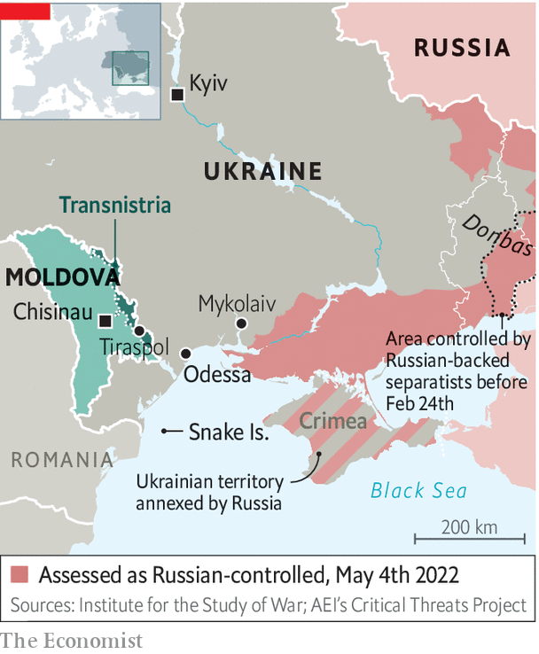

###### How things are done in Odessa

# Odessa strives for normality despite Russia’s war 

##### A city famed for storytelling tells a new tale of resilience 

 

> May 7th 2022 

THE SUN is shining, the fountains are playing and Odessans are enjoying simple pleasures—most of all that of seeing their city come back to life. Primorsky (“Seaside”) Boulevard is still cordoned off, and the statue of the Duc de Richelieu, the city’s early-19th-century governor, is covered in sandbags. But the tank traps have been moved to the outskirts, where the lines of defence now lie.

The actual fighting has moved to Mykolaiv, some 130km away. Russian shelling left that city’s residents without water, so Odessans are sending them bottled water and food. In Odessa the main threat now comes from the occasional Russian missile. Even when air-raid sirens wail, people carry on with their lives.


In the morning they flock to Privoz, Odessa’s biggest market and the source of much folklore. The fish rows are emptier than usual, as mines have barred fishing in the Black Sea, and tomatoes are twice as expensive as before the war, but nobody is complaining. In the evening, in the city gardens, a local crooner sings romantic songs in Ukrainian to people on benches and in cafés. As 10pm approaches, the streets empty and men with guns come out to enforce the curfew.

 


Odessa, a cosmopolitan port city of traders, adventurers, writers, gangsters and romantics, of multiple ethnicities, languages and cultures, is known for storytelling. And the story it tells today is of life winning over war. Odessans are proud that the most popular meme of this war was coined off their coast, on Snake Island, where Ukrainian border guards told a Russian warship “Go fuck yourself.” They are even prouder that on April 14th their army sank the Moskva, Russia’s Black Sea flagship. Four days later they queued to buy new postage stamps marking the meme.

Since then there have been no Russian ships on the horizon. At Arcadia beach, people are jogging and cafés are reopening. But the beaches are still mined, and only the bravest venture into the water. More important, Odessa’s economic heart, the port which carries Ukraine’s grain to the world, is blockaded.

Russia still yearns to conquer Odessa, once a jewel of the Russian empire. But according to Gennadiy Trukhanov, the city’s mayor, they want it “intact and beautiful”, so they are unlikely to bomb its historic centre. Their plan is to cut it off from the rest of Ukraine by advancing from Mykolaiv to Transnistria, a pro-Russian separatist region of .

Russia once hoped Odessa would greet its soldiers with flowers, counting perhaps on Mr Trukhanov’s many ties to Russia. A former Soviet officer, he was one of the first to warn that Russia might invade, and prepared by revamping bomb shelters. Russian is the lingua franca in this city of 130 nationalities, but that does not make it pro-Russian, Mr Trukhanov says. He is disgusted by the Russian army’s behaviour: “These are not military warriors, they are murderers, driven only by fear of what will happen to them if they don’t follow orders—and by money.”

Mr Trukhanov’s anger is all the greater because he considers the war a personal betrayal. So do most Odessans, for whom Russia’s language, history and culture are a part of their city. “Russian soldiers and officers must see that this is not a military operation, but a cynical, murderous, occupational war of punishment, with all the signs of fascism and Nazism.”

Where Russia hoped Odessa might be a weak link in Ukraine’s defence, it has proved a bastion, an emblem of a nation that draws its strength from diversity, free enterprise and freedom. While soldiers dig trenches and fortify defences, the city is stockpiling enough food, water and medicine for two months. Mr Trukhanov is asking the army to de-mine some of the beaches so that people can swim in the summer.

It is not just his Soviet military background that equips him for the job. In the 1990s Italian police named Mr Trukhanov as a major player in the Odessan mafia, responsible for training gang members in “hand-to-hand combat and sniper shooting with high-precision weapons”. In 2021 he was charged with organised crime in Ukraine, but avoided arrest with a $1.1m bail payment. He makes little distinction between his own businesses and those of the city. (Mr Trukhanov denies all such allegations.) But what seemed an obvious conflict of interest before the war became one of the city’s strengths in defending it against the invasion. Old vendettas have been set aside, at least for the moment.

Nika Vikhniansky, a furniture businessman who opposed Mr Trukhanov in elections, is now working side by side with him managing volunteers and co-ordinating humanitarian aid. “The city council told us we were far more efficient than they are,” he explains. Mr Vikhniansky’s grandfather was a tank driver who fought the Nazis during the second world war. “Then they were killing us as Jews,” he says. “Now they are killing us as Ukrainians.” ■

Read more of our recent coverage of the 

