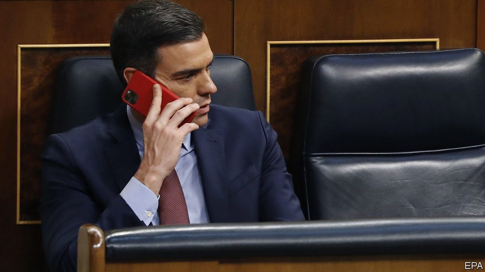

###### Bugging out

# Spyware in Spain targeted the prime minister and his enemies 

##### Pedro Sánchez and Catalan separatists were both hit by Pegasus 

 

> May 7th 2022 

 After this article was published, Spain's CNI confirmed that it had wiretapped Catalan leaders, though it gave the number at 18, not over 60 as claimed by the Citizen Lab.

RESIDENTS OF SPAIN’S capital were expecting a quiet day off on May 2nd, a holiday commemorating Madrid’s uprising against Napoleon in 1808. They got a newsy one. For weeks the headlines had been consumed with a scandal known as CatalanGate. In April the New Yorker magazine and the Citizen Lab, an NGO at the University of Toronto, revealed that the phones of at least 67 people, nearly all associated with the Catalan separatist movement, had been infected with spyware, mainly a programme called Pegasus. They included Catalonia’s four most recent regional presidents. (Two others were Basque separatists.)

Then on May 2nd, in a hasty press conference, government officials announced that the phones of Pedro Sánchez, the prime minister, and Margarita Robles, the defence minister, had also been infected with Pegasus in May and June of 2021. Mr Sánchez is the first national leader confirmed to have been a . His phone was attacked twice, and in the first, larger leak transmitted around 2.6 gigabytes of data. Ms Robles’s sent a smaller amount. In both cases the infected devices were government-issued, and periodically screened for security threats—unsuccessfully, it seems. A day later it turned out that Arancha González Laya, a former foreign minister, had been bugged too.


The officials declined to speculate who may have been responsible.  is made by NSO, an Israeli company, which . The spyware gives its users virtually complete access to the infected phone, including the camera and microphone as well as messages and files. Infection can come via a link purporting to be from a trusted source, but some phones have been infected even with “zero-click” attacks that require nothing of the phone’s user.

CatalanGate’s first stage made the Spanish government look bad. Pere Aragonès, Catalonia’s president, was infected twice, and the attackers seemed to know what his political concerns were. In late 2019 and early 2020 his ERC, a separatist party, was dealing with Mr Sánchez over the vote to install Mr Sánchez’s minority government. The second infection came via a contaminated link to an article in a Barcelona-based newspaper about Mr Sánchez’s negotiating position. The ERC abstained in the investiture vote, allowing the government to take its seats. Mr Aragonès has since taken part in a dialogue with the government, trying to cool tempers and move on from the crisis in 2017 over an unconstitutional independence referendum.

Mr Aragones and other Catalan nationalists now feel betrayed, and are demanding answers. Those snooped on included not only politicians but outside activists, separatist-friendly journalists and even spouses and parents. Attacks were timed around internal meetings of the Catalan nationalist parties. Many suspect the CNI, Spain’s foreign and domestic intelligence service, which like most spy agencies has a policy of neither confirming nor denying reports about its work.

The Citizen Lab said the Spanish case was the widest known use of Pegasus, but its victims elsewhere are legion. Last year a group of journalistic outfits and Amnesty International, an NGO, released a huge trove of likely Pegasus targets based on analysis of phone data traffic, though in many cases they could not be sure whose phones had been infected. They included Boris Johnson, Britain’s prime minister, and other world leaders. Family members of Jamal Khashoggi, a critic of the Saudi royal family who was murdered in the Saudi consulate in Istanbul in October 2018, were targeted too.

A spokesman for NSO said the company had seen no details of the Spanish allegations, but that “the use of cyber tools in order to monitor politicians, dissidents, activists and journalists is a severe misuse” of its software. NSO says it will co-operate with governments’ investigations of misuse. The company’s website says its tools are used to help governments fight “terrorism and crime”. Amnesty says otherwise, claiming last year that over 180 , as well as the politicians.

No one knows who infected the Spanish ministers’ phones, but NSO is known to sell to western-allied autocracies. Morocco and Spain were in a diplomatic row at the time, but there is no evidence that the Moroccan government was the perpetrator. For his part, Morocco’s king appeared on Amnesty’s list of possible Pegasus targets last year.

Until last week, Ms Robles was defending the CNI. In a fiery statement in Congress, she asked: “What is a state, a government, supposed to do, when someone violates the constitution, declares independence?”—as the Catalan separatists had. The law governing the CNI, after all, names “territorial integrity” as one of its missions. The government’s position seemed to be that states were entitled to tap domestic politicians’ phones under the rubric of national-security laws.

That was before Ms Robles’s own phone was found bugged. A spokeswoman for the Catalan government said wryly that “now there is an urgency that there wasn’t before.”■

