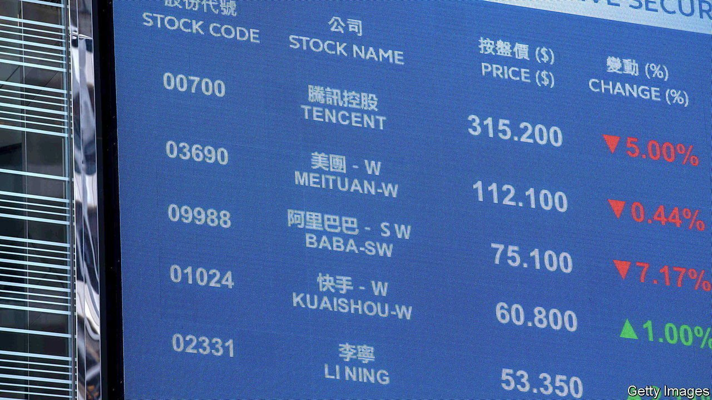
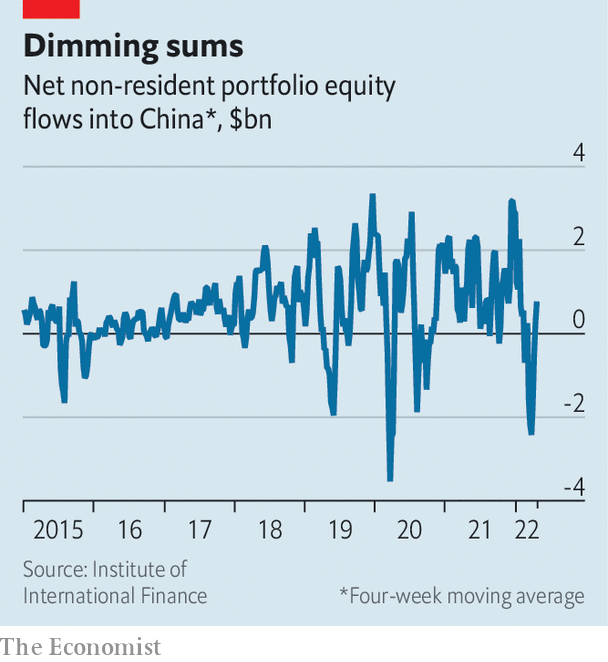

###### Flee market

# China’s erratic policies are terrifying investors 

##### The folly of zero covid has turned former evangelists into fierce critics 

 

> May 7th 2022 

ON MAY 3RD investors in Chinese stocks woke up to the news that Jack Ma, the co-founder of e-commerce giant Alibaba, had been arrested on national-security charges. Or so many of them thought. State media were reporting that a tech worker with the surname Ma had been detained in the city of Hangzhou. The description seemed to fit that of the billionaire tech magnate, whose companies are based in Hangzhou and have been subject to a regulatory onslaught over the past year. The speculation, it rapidly turned out, was wrong (Ma is a common family name in China). But not before Alibaba shares dipped 9%, temporarily wiping out more than $25bn in the firm’s market value.

The incident shows how fragile market sentiment has become in China. Beijing’s unpredictable, often-shocking policy swerves in recent years have made it all the more conceivable that the country’s most prominent entrepreneur could suddenly be accused of attempting to “split the country and subvert the state”. President Xi Jinping’s increasingly ideological campaign to rid China of the Omicron variant of covid-19 is threatening to throttle economic growth this year. His unwavering support for Russia, even as Vladimir Putin commits war crimes in Ukraine, has further fuelled the perception that the country’s leaders, once known for their pragmatism, are faltering.


The shift has been punctuated by gloomy comments from prominent experts who until very recently remained upbeat on China. Stephen Roach, the former Asia chairman of Morgan Stanley, a bank, has long defended Chinese policy. But in a recent article in Project Syndicate, an online publication, he said “the China cushion”, the economic might that helped power the world through the global financial crisis in 2008, had “deflated”. Shan Weijian, the chief executive of PAG, a Hong Kong-based private-equity firm, recently told investors the Chinese economy “at this moment is in the worst shape in the past 30 years”, the Financial Times reported.

Some use harsher language—and are getting punished for it. Joerg Wuttke, the head of the European chamber of commerce in China, last week suggested in an interview with a Swiss website that China’s zero-covid strategy has put many decision-makers in “self-destruction mode”. Hong Hao, an outspoken analyst at Bank of Communications, a state lender, recently had a Chinese social media account frozen after he published a negative outlook on the economy. He has now left the bank.

Much of the darkening sentiment has been focused on Mr Xi’s covid strategy. Closing down Shanghai, China’s business and financial hub, seemed unimaginable only a few months ago. But the city of 25m has undergone a strict lockdown since April 1st. Flare-ups of covid in Beijing and other cities have prompted targeted lockdowns. A regime of testing for the virus is quickly becoming part of everyday life.

The costs of controlling the spread of Omicron are becoming apparent. Factory activity has suffered dearly and strains on shipping and logistics are rippling through global supply chains. The central government has mandated that it must hit its GDP growth target of 5.5% but many analysts have downgraded their outlook for economic activity in the country this year. Some economists believe real growth in China in 2022 will only reach 2% (even if official statistics say otherwise).

 


Markets have reflected the gloomy sentiment. The Shanghai Composite Index is down by about 7% in a month. It dipped below 3,000 points in late April, a threshold it had not gone under since July 2020. Investors have dumped yuan-denominated securities at a record pace (see chart).

The state is fighting back against plummeting confidence. At a meeting on April 29th the Politburo, a top decision-making body, pledged to increase investment in infrastructure this year in order to boost growth. Leaders also said they would normalise regulation and support the development of internet-consumer companies, such as Alibaba and Tencent. The statement marks the first strong sign of central support for such groups since the start of a regulatory crackdown that began in 2020.

Politburo memos are usually released after Chinese markets close. This one dropped while stocks were still trading, leading to a surge in share prices for some tech groups. This was probably done intentionally in the hope of a positive market response amid a sea of doom, gloom and mounting panic. ■


