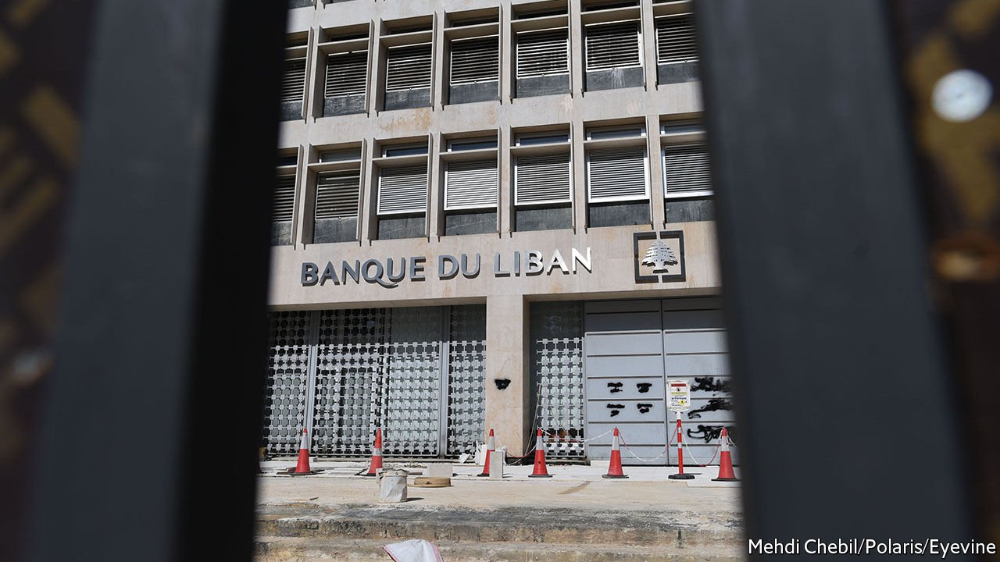

###### Zombie defence

# Desperate Lebanese depositors are taking their banks to court 

##### Few have been successful, and parliament may ensure lenders dodge accountability 

 

> May 7th 2022 

THIS WAS not how Rebecca Ego planned to use her law degree. In 2020 she was accepted into a master’s programme in America. It would cost $20,000 after scholarships, a sum she had in the bank. In Lebanon, though, getting money out of the bank is almost impossible: lenders have imposed harsh, arbitrary capital controls amid a financial crisis. Ms Ego was told she could not withdraw her funds.

Like hundreds of Lebanese, she sued her bank for breach of contract. The case has languished for two years. One of her banks subsequently shut her account, cashing out her savings in a cheque no other bank will accept. “There’s no legal basis for any of this,” she says. “But there’s no judge who will say that.”


For almost three years, Lebanon’s banks have been zombies. The crisis dates to 1997, when the central bank, the Banque du Liban, pegged the pound at 1,500 to the dollar. It sustained the peg by borrowing dollars from commercial banks at double-digit interest rates, a state-run Ponzi scheme that unravelled in 2019.

Lebanon defaulted the following year. Losses in the financial sector are estimated at $68bn (130% of pre-crisis GDP). Earlier this year the pound sank as low as 34,000 on the parallel market, a 96% depreciation.

On April 7th the IMF reached a deal with Lebanon, which could include a $3bn loan. Before the fund’s board votes on the package, though, it wants the Lebanese government to take steps to restructure the financial sector, such as by passing a law strengthening capital controls. Parliament has dithered on the matter for two years. A vote planned for April 20th was postponed. With parliamentary elections set for May 15th, it is unclear when it might happen.

The vacuum has left banks to impose their own rules. Most depositors can access only small sums in pounds. Withdrawals from dollar accounts use unfavourable rates.

Local courts offer little relief. The Depositors Union, which represents thousands of savers, reckons there have been more than 300 lawsuits against banks to date. Only a handful have been resolved.

Foreign judges have been more expeditious. In December a French court ordered Saradar Bank to pay $2.8m to a customer in Paris. In February a court in London handed down a similar judgment in favour of a Lebanese-British businessman. Bank Audi, one of the lenders ordered to transfer him money, warned that the ruling would lead to “unequal treatment” of depositors.

To show its commitment to fairness, Bank Audi has shut dozens of accounts held by British citizens or residents. So has at least one other lender. Depositors say they were offered a chance to reopen their accounts if they signed a contract that waived their right to sue and stipulated they could not make transfers abroad. Otherwise, their balances would be paid out in a cheque, all but useless in a country with a defunct banking system.

A few have tried more desperate measures. In January the owner of a café in the eastern Bekaa valley doused his bank’s lobby in petrol and demanded $50,000 from his account. He got his money (his sister says he signed a receipt). Some Lebanese cheered his boldness. Others saw a symptom of everything that ails their country, where force trumps the rule of law.

The lawsuits may soon have little effect: the capital-controls law would void them. “It’s like an amnesty for bankers,” says Fouad Debs of the Depositors Union.

The government has proposed guaranteeing accounts under $100,000, though depositors may have to wait up to eight years to withdraw their full savings. Larger balances would receive a haircut.

Even if Lebanon’s banks escape a legal reckoning, their industry seems wrecked for a generation. Lebanon has become a cash economy. Many businesses no longer accept card payments. The sprawling diaspora, which once poured billions into Lebanese lenders, will probably keep its money abroad. “If we don’t see banks pay the price for what happened,” says Ms Ego, “we can never trust them again.” ■


