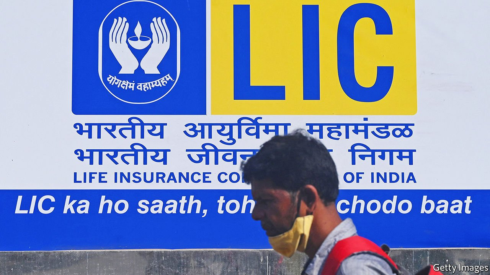

###### Selling off the piggy bank

# India begins the privatisation of its huge life-insurance company 

##### But is the country’s largest-ever IPO a dud? 

 

> May 7th 2022 

IN 1956, AS part of its experiment with embracing socialism, India created the Life Insurance Company of India (LIC) by nationalising and lumping together 245 firms. The experiment took a while to conclude. In 2000 India allowed private firms to sell life insurance again. Two decades later it is selling a 3.5% sliver of LIC on the public market, a first step in what is intended to be a full privatisation. Orders will be taken from investors between May 4th and May 9th. Trading is due to commence on May 17th.

The scale of LIC is such that the sale of even this trivial stake will bring in $2.7bn, making it the fifth-largest public offering of the year globally and the largest in India’s history. One of the reasons stated by the company for such a small percentage being sold is that selling more might crowd out investment in other private and public firms in the country’s capital-constrained market. Out of similar concerns, market regulators are already considering waiving a provision that currently requires the dominant shareholder of a listed firm to reduce its ownership stake below 75% within five years.


Once listed, LIC will have a market valuation of around $80bn, making it the fifth-most-valuable life insurer in the world. Yet more striking is how thoroughly LIC dominates the Indian market. Its utter supremacy has no equivalent in any other major country: LIC has a staggering 286m policies in force and collects 64% of all of India’s written premiums (the share of the largest insurer in Britain is 23%; in China it is 21%). The firm has $507bn in assets under management, triple the amount of its 23 private competitors combined.

Although such dominance gives the firm and its products unmatched scale—a big advantage in an industry that runs on trust—the 659-page listing prospectus makes it clear that there are cracks in LIC’s armour. Premiums have been growing by 9% annually over the past five years, a good performance but one that pales in comparison to its Indian competitors, many of which have been growing at twice that rate.

And government ties may come with costs. Investors have long suspected that LIC is often required to invest at least some of its river of premiums in the interests of the state rather than in the pursuit of profits, quietly seeding problems. Included in the prospectus’s 47 pages of risk factors are LIC’s large investment in IL&amp;FS, a government-supported infrastructure-investment fund that went spectacularly bust in 2018, and its majority stake in another formerly government-controlled entity, IDBI Bank, which it bought as its contribution to a 2019 bail-out. Also featured are equity investments purchased over the years for 8.8bn rupees ($115m), currently valued at 2bn, and debt investments of 113bn rupees, 54bn of which are classified as non-performing assets.

A public listing, and the transparency that must accompany it, may alter this approach. But concerns about hidden problems and continued interference by the government are worrying investors, which helps to explain why the offering is being priced so low. Until recently there had been expectations that LIC would be valued at three times its “Indian Embedded Value”, an approach based on the present value of future profits derived from expected premiums, like most other Indian private insurance firms. Instead LIC shares are likely to be sold at only 1.1 times, suggesting buyers have serious reservations.

Still, in time, the most salient detail about the listing may have nothing to do with price and size and everything to do with the fact that it happened at all. When the newly reelected administration of Narendra Modi first proposed a public sale of a stake in LIC, in early 2020, it was derided as an empty political promise. Highly publicised efforts to flog other state-controlled assets, most notably Air India, had flopped multiple times. In October of that year, however, Air India was finally sold—to Tata Group, from which it had been seized in 1953. LIC’s return to the markets after almost as long a gap is not without snags. But it suggests a cycle may have genuinely, if not entirely, come to an end. ■


