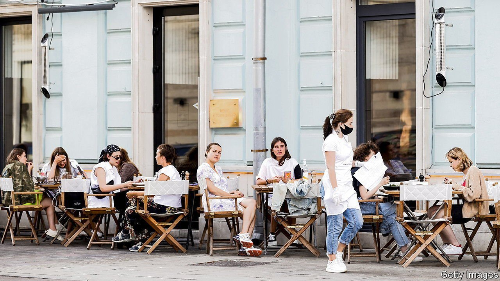
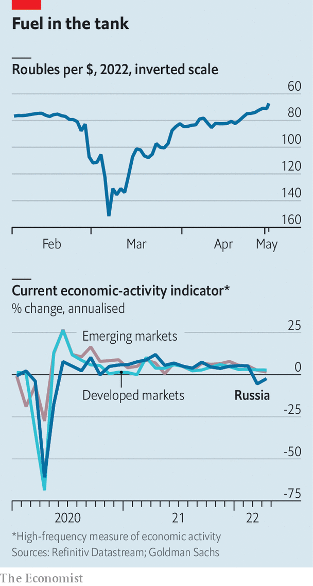

###### ‘Tis but a flesh wound

# Russia’s economy is back on its feet 

##### There's a reason for its resilience 

 

> May 7th 2022 

IN EARLY APRIL we pointed to preliminary evidence that the Russian economy was , even as Western countries introduced . Recent data further support this view. Helped along by capital controls and high interest rates, the rouble is now as valuable as it was before  in late February (see top chart). Russia appears to be keeping up with payments of its foreign-currency bonds.

The real economy is surprisingly resilient too. True, Russian consumer prices have risen by more than 10% since the beginning of the year, as the rouble’s initial depreciation made imports more expensive and many Western companies , reducing supply. The number of firms late on their wage payments seems to be growing.


 


But “real-time” measures of Russian economic activity are largely holding up. Total electricity consumption has fallen only a smidge. After a lull in March, Russians seem to be spending fairly freely on cafés, bars and restaurants, according to a spending tracker run by Sberbank, Russia’s largest bank. On April 29th the central bank lowered its key interest rate from 17% to 14%, a sign that a financial panic which began in February has eased slightly. The Russian economy is undoubtedly shrinking (see bottom chart), but some economists’ predictions of a GDP decline of up to 15% this year are starting to look pessimistic.

Even before the invasion Russia was a , limiting sanctions’ bite. But the biggest reason for the economy’s resilience relates to fossil fuels. Since the invasion Russia has exported at least $65bn-worth of fossil fuels via shipments and pipelines, suggests the Centre for Research on Energy and Clean Air, a think-tank in Finland. In the first quarter of 2022 the government’s revenues from hydrocarbons rose by over 80% year on year. On May 4th the European Commission proposed a ban on imports of all Russian oil that would come into full force by the end of the year. Until then, expect the Russian economy to continue to trundle along.


