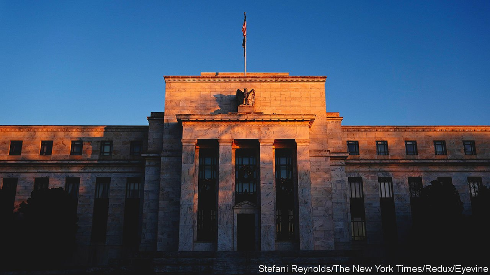
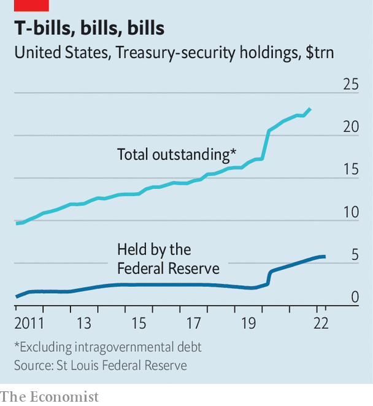

###### Braced for impact

# The Fed’s balance-sheet is about to shrink. Wall Street is not ready 

##### Could the giant market for Treasury bonds seize up? 

 

> May 7th 2022 

CONSIDER THE life of a Treasury bill or bond. Typically once or twice a week, a batch of fresh Treasuries are born. Their first home is usually, briefly, an investment bank's dealing desk. Those dealers might hold on to a few for themselves, but generally they distribute the bulk to more permanent owners, like the bond portfolios of a mutual fund, a foreign government or a company or the Federal Reserve. A certain slice will swap hands repeatedly—some $700bn or so are traded each business day—but many will stay put for their lifetimes. Their deaths are predetermined: they come of age, or “mature”, as little as one month or as long as 30 years after their birth, at which point they are settled and cease to exist.

The Fed is the single largest holder of Treasuries—its balance-sheet is where many of those securities have found their permanent home. Thanks to bond-buying schemes put in place to ease monetary conditions during the pandemic, the Fed now holds some $5.8trn-worth of Treasuries, a quarter of the $23.2trn-worth the government has issued (see chart—it also holds $2.7trn-worth of mortgage-backed securities). On May 4th, however, Jerome Powell, the chairman of the Fed, said it would start shrinking this giant portfolio, a process known as “quantitative tightening” (QT), in June. The reversal could spark a repeat of the temporary, yet troubling breakdowns that the world’s most important financial market has suffered in recent years—on a bigger scale.


According to the policy statement released on May 4th, the Fed will reduce its balance-sheet not by actively making sales, but by letting bonds that have reached the end of their lives mature without buying a new bill or bond to replace them. By September, if all has gone to plan, the Fed’s portfolio will be shrinking by $95bn a month, split between $60bn of Treasuries and $35bn of mortgage-backed bonds. At that pace the Fed’s balance-sheet will shrivel by more than $1trn over the next year. That is “quite the clip”, says Darrell Duffie of Stanford University.

 


There are two reasons why investors and policymakers are watching QT closely. The first is its potentially vast impact on monetary policy. Estimates of the effect of bond-buying on the cost of money vary—but any downward pressure on interest rates exerted as the Fed bought up Treasuries is likely to be reversed as its holdings start to ebb. Two-year Treasury yields have already climbed from 0.8% in January 2022 to 2.7% as investors have come to expect quicker balance-sheet shrinking and faster rate increases. On May 4th Mr Powell announced a 50-basis-point rate rise, the first increase of that size since 2000, and signalled more would be “on the table at the next couple of meetings”.

It is also possible that QT will cause the Treasury market to malfunction—the second reason for concern. Its smooth running matters well beyond America: Treasury rates are a crucial benchmark for pricing virtually all other financial assets globally. And recent history is not encouraging. A series of episodes—including the “flash rally” of 2014; stress in the repo market (a key money market where Treasuries can be swapped for cash) in September 2019; and the covid-19 shock of March 2020, in which the Treasury market in effect ceased to function for periods of time—have created serious doubts about how robust the Treasury market is.

Each of the episodes had slightly different causes. Regardless of the robustness of the Treasury market, there was little that would have stopped the extreme nature of the covid-19 shock from rocking it. The repo crisis was in part the result of some perverse incentives caused by post-crisis regulation that deterred banks from holding Treasuries. But both were exacerbated by a deeper issue, says Randal Quarles, a former vice-chair for supervision at the Fed, which is that the Treasury market “has grown out of its waist size”.

A combination of financial-crisis stimulus, fiscal deficits under President Trump and pandemic-era splurge have caused the Treasury market to grow nearly five-fold since 2007. At the same time fresh regulation imposed on investment banks, which are the main conduits in Treasury markets, such as the introduction of the supplemental-leverage ratio, which measures the total size of bank assets relative to the amount of capital they hold, has restricted their ability to facilitate Treasury-market activity. The rule is not very friendly to low-risk activities, such as holding Treasuries. A report released last year by the Group of Thirty, an economics advisory body, warned that “the aggregate amount of capital allocated to market-making by bank-affiliated dealers has not kept pace” with its lightning growth.

To combat issues that have cropped up in the past the Fed has taken measures to increase liquidity, such as opening up a “standing facility” for selected intermediaries to swap Treasuries for cash. But few think that this is a panacea for dysfunction. Mr Duffie favours replacing the current market structure, which relies on broker-dealers, with a central-clearing system. This would make it easier for market participants to interact directly—for one mutual fund, say, to sell to another without relying on a bank to intermediate the transaction. But the fix would be no match for “the scale of the problem”, says Mr Quarles. A more urgent task, he argues, is to loosen the regulatory shackles hampering investment banks from supporting the market. That is unlikely to happen soon: there is little appetite in Washington for weakening bank regulation.

In the absence of an obvious fix, the unknowable fallout from the Fed’s pull-out is adding to the uncertainty created by rising rates, stagflation and geopolitical ructions. Liquidity in the Treasury market is already thinning: the “yield error” captured by the Bloomberg Treasury liquidity index, which measures the difference between the yield a Treasury is traded at and a measure of fair value, is 12% higher than it was in January. It has more than doubled since August 2021. The growing possibility of renewed dysfunction could deter investors from dealing further, making it yet likelier that the market seizes up. The once-placid life of Treasury bills and bonds could get more chaotic for a while. ■


