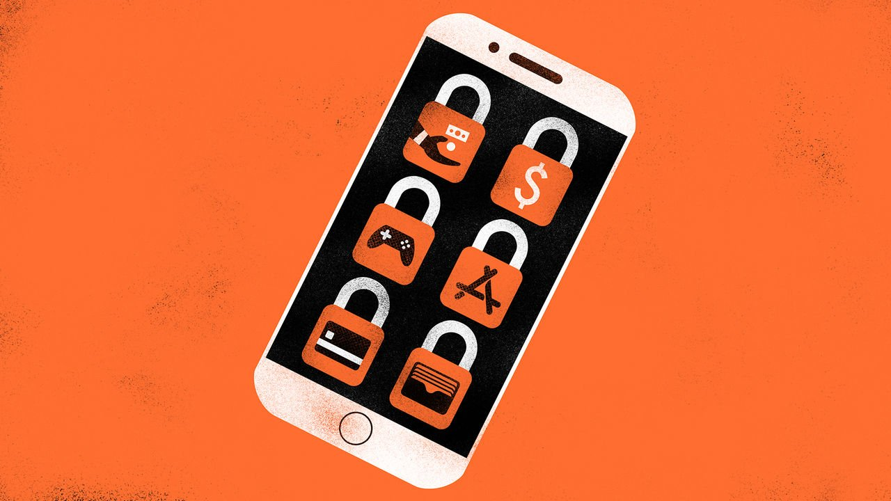

###### Mr Cook, tear down this wall

# Watchdogs take a swipe at Apple Pay 

##### Why complaints about Apple’s walled garden are multiplying 

 

> May 7th 2022 

THERE IS NOT yet an app to keep track of the growing number of antitrust complaints against Apple. But perhaps there should be. On May 2nd the European Commission, the EU’s executive arm, added another to the pile. Following an investigation begun in 2020, it sent the smartphone-maker a “statement of objections”, saying that, in the , Apple is abusing its power in the market for smartphone payments.

At issue is Apple Pay, a contactless-payment service introduced in 2014. Apple Pay uses a specialised radio called a Near-Field Communication (NFC) chip to allow an iPhone to work like a contactless credit card. Users who have loaded their banking details onto their phones can wave them at contactless-payment terminals to pay for things. Apple collects a fee from the user’s bank for each transaction.


The service has : in 2020 Bernstein, a financial firm, estimated Apple Pay accounted for about 5% of global card transactions, and forecast that it might reach 10% by 2025. The problem, in the commission’s view, is that i OS, the operating system used by iPhones, allows only Apple’s own mobile-wallet software to make use of the NFC chip. That freezes out rivals who might want to build competing payment apps of their own. Android, a rival smartphone operating system maintained by Google, does allow third-party apps access to a phone’s NFC chip, meaning that Android users can choose contactless-capable smart wallets from firms such as Google, Samsung, PayPal and others.

The commission’s findings are only preliminary. But if a full investigation comes to the same conclusion, Apple would be in breach of European competition laws, and exposed—at least in theory—to fines of up to 10% of its worldwide turnover. The firm will have further chances to argue its corner before the commission issues a final decision, a process that could take many months.

The antitrust probe is the latest in a string of attacks on Apple’s business model by app developers, rival firms and governments. Apple runs the iPhone as a “walled garden”, in which the firm imposes tight controls on which apps are allowed to run on its devices, and on what those apps are allowed to do. Apple says its restrictions are there for the privacy and security of its users, an argument it has repeated in response to the commission’s allegations.

Others, though, allege less noble motives. In 2020 Epic Games, the maker of “Fortnite”, a popular video game, and “Unreal”, a software engine on which hundreds of other video games are built, sued Apple, claiming that its refusal to allow rival firms to process payments made from within apps was anticompetitive. (Epic had wanted to offer Fortnite players a rival, cheaper payment system.) After losing the initial case, Epic has appealed—this time with support from Microsoft, America’s Department of Justice and 35 individual states.

Similar complaints by Spotify, a music-streaming firm, helped prompt another EU antitrust investigation in 2020; a third is under way in Britain. Following a complaint from Match Group, an operator of dating sites, Dutch trustbusters found Apple’s in-app payments policies to be anticompetitive in October. They fined the firm €5m a week every week between January and March 28th (when it reached the €50m maximum fine, a cap the watchdogs have not yet raised).

Investigations and court cases, of course, are not foregone conclusions. But even if Apple wins some battles, it could still lose the war. On March 24th the EU agreed the text of the Digital Markets Act (DMA), a bumper piece of legislation designed to force big tech firms to open their platforms up to competition. One of its themes is to try to forbid companies from giving preferential treatment to their own apps and services. The DMA would require Apple to allow users to install apps from places other than Apple’s own App Store, and force it to allow rivals to provide in-app payment tools of their own. The walls are not looking as solid as they were. ■

For more expert analysis of the biggest stories in economics, business and markets, , our weekly newsletter.

