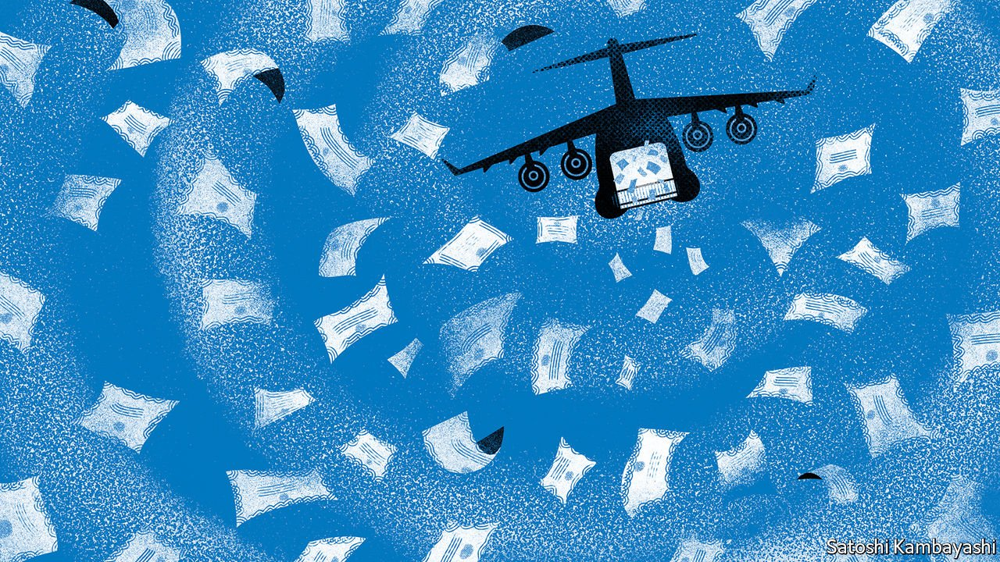

###### Buttonwood

# Who wins from carnage in the credit markets? 

##### The stakes are rising for bondpickers 

 

> May 7th 2022 

THE FIRST rule of investment, according to , is not to lose money. The second rule is not to forget the first. That is true for no one more than bond-fund managers, whose job is to shelter their clients’ money from volatility while eking out what returns they can. The bloodbath in bond markets so far this year—America’s have had their , and Europe’s their biggest-ever peak-to-trough plunge—ought to be the ultimate nightmare for such timorous investors. Instead many are sighing in relief.

After a brutal but brief crash when the world shut down in March 2020, and until the end of last year, rule number one was pretty easy to follow. Central banks were pumping $11trn of new funds into the markets via  and . Governments offered unprecedented fiscal support for businesses to stop them going bust.


The corollary was that the best thing for bond investors to do was to close their eyes and lend. Quibbling about trivia like the state of the borrower’s balance-sheet or capital discipline seemed like a quaint tradition. In general, high-risk, high-yield debt performed best. Yet the market’s foremost trait was “low dispersion”: a tendency for returns across sectors, issuers and credit-rating bands to be unusually similar.

There is plenty of money to be made in such a market, which a credit strategist at a Wall Street bank describes as “a rising tide lifting all boats”. But it is awkward for active fund managers, whose craft is to use financial nous to select particular bonds hoping they will beat the broader market. Measured by monthly returns between January and October 2021, for instance, around 95% of America’s corporate bonds performed better than Treasuries, with the lion’s share clustered together. That made it hard for prudent bondpickers to stand out.

Yet this state of affairs has started to reverse—and dispersion is back with a vengeance, the strategist says. The successful roll-out of covid-19 vaccinations last year had already “squeezed the excess juice” out of those few sectors, like travel and leisure, whose debt was not already at a high valuation, reducing its potential to appreciate further. Now headwinds, from inflation and snarled-up supply chains to recession risk and the withdrawal of easy money, are blowing against borrowers, clouding the outlook further.

These hindrances are so broad that few companies are able to avoid them. But firms differ widely in their ability to cope. Take inflation. Businesses with rock-solid brands and unassailable market shares, like Coca-Cola or Nestlé, have had little trouble increasing their prices to mitigate rising costs. Other companies—Netflix, for example—have suffered.

Such variation in pricing power spreads well beyond consumer-facing sectors: commodity producers in general are much better positioned to face down ballooning energy and metals prices than commodity purchasers. Those commodity producers that are less exposed to Chinese lockdowns—energy firms as opposed to miners, for instance—are better placed still. At the other end lie industries such as carmaking, vulnerable to both supply-chain snags and recession-induced damage to consumer sentiment.

This adds up to a minefield for investors, whatever their asset class. For bondpickers, divergence will be further fuelled by a withdrawal of liquidity from the market. On June 1st the Federal Reserve will begin winding down its $5.8trn portfolio of Treasuries; by September, it intends to be shrinking it by $60bn a month. That amounts to the disappearance of an annual buyer of 3% of publicly held Treasuries, whose yields are thus likely to rise. As a result corporate borrowers will have to work harder to convince investors to buy their debt rather than seek the safety of government paper. Such a buyers’ market means more scrutiny of debt issuers, and more variance in the yields they have to offer.

Active bond investors—or, at least, those who are any good—will benefit from this renewed emphasis on fundamentals. But they will not be the only ones. Financial markets derive their value to society from their ability to allocate capital to those best placed to make a return on it. A rising tide may lift all boats, but by diluting the incentive to discriminate between borrowers it reduces the efficiency of that allocation. A credit market that makes more of a distinction between winners and losers is one step towards restoring it.

Read more from Buttonwood, our columnist on financial markets:


