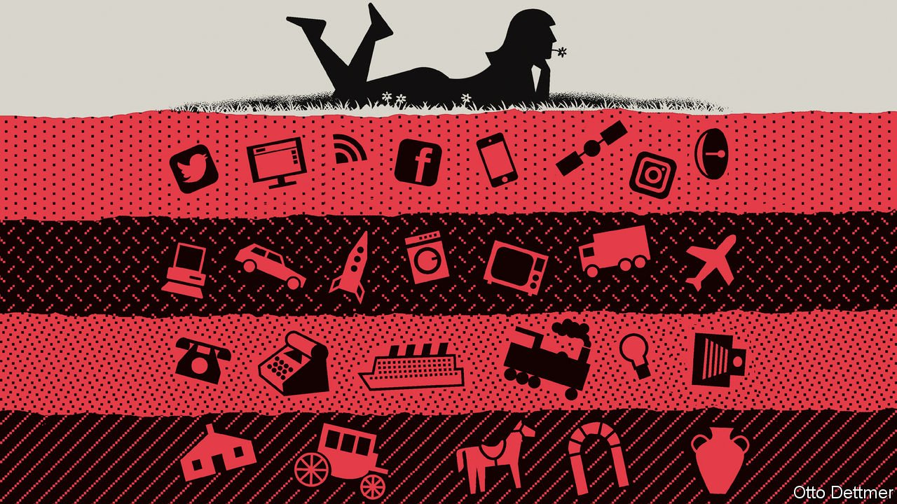

###### Free exchange

# Why long-term economic growth often disappoints 

##### A new paper suggests technological progress is overrated 

 

> May 7th 2022 

FROM THE point of view of the 1950s, America’s economic progress over the 70 years that followed has been a huge disappointment. Futurists foresaw a world of super-pills, space farms and cities encased in glass. Science and technology would engineer unending riches and everything consumers could ever want. Yet the  achieved during the Space Age, it turned out, soon ebbed: between 2000 and 2019 America’s real income per head grew by 1.2% a year on average, down from 2% between 1980 and 1999 and 2.5% in the 1950s. And instead of flying cars, , a venture capitalist, once jibed, “we got 140 characters”.

A new paper suggests such disappointment is not warranted—because it stems from an equally huge misunderstanding of how economic progress happens. Thomas Philippon, a professor of finance at New York University, argues the post-war experience was unusual. Looking at American data going back to 1890 and British data from 1600 to 1914 he finds that, when technological progress is properly understood, the world has been on broadly the same path for centuries. In the grand scheme of things, in other words, there has been no slowdown at all.


Most economists’ starting point for thinking about growth is Robert Solow’s 1956 paper, “A contribution to the theory of growth”. Mr Solow’s model for  relies on what he dubs the “production function”. It is a mathematical black box: on one side labour and capital go in; out the other come all the consumer goods and services that contribute to people’s standard of living. One way of growing is obvious: shove more labour and capital into the box. But that cannot deliver improvements for ever. Adding more labour means the output is divided between more workers. And capital wears out, so more investment is needed over time just to stay put.

Instead long-term growth can only come from improving the black box—the way in which labour and capital are combined. The fancy name economists give to this is total factor productivity (TFP), though they sometimes refer to it with more intuitive labels, such as technology or knowledge. You might think of it as a recipe. On one side lie labour and capital, the ingredients. On the other is the finished dish: economic output. TFP is an attempt to measure how effective the recipe is at combining the ingredients, which in turn depends on factors including the level of education on offer to the population, the quality of business management and the depth of scientific know-how.

Mr Solow assumed that the annual contribution of TFP to GDP would grow exponentially. This may have been for purely mathematical reasons: he wanted his model economy to grow at a fixed rate, of say 2% a year, which required ever larger gains as GDP got bigger to keep the pace of growth constant. Later economists, including Paul Romer (like Mr Solow, a Nobel prizewinner), have tried to work out the chemistry underpinning TFP’s presumed exponential growth. Their theories usually contend that some investment goes not into capital, but into research and development. And because knowledge can be freely copied, they observe, this investment has an increasing marginal product, meaning that each prior bit of research makes the next bit of research more effective. Knowledge thus cascades out, creating more knowledge as it does, akin to how a virus spreads in the early stage of an epidemic.

The problem, according to Mr Philippon, is that TFP does not actually grow exponentially. Using the most popular data sources for long-term growth, he compares predictions from two different models to observed trends in TFP. A linear pattern—which he calls “additive growth”—consistently fits better with how progress has actually unfolded. Contrary to existing theories, that suggests previous research does not make the next idea any easier to find. It also explains why, as Mr Philippon puts it, some economists keep predicting some future wave of innovation that just never comes.

This is not a counsel of despair. While the rate of growth in percentage terms may be slowing, Mr Philippon’s model predicts that the size of any increment is roughly constant. Societies do get richer—but just not as fast as generally thought.

Encouragingly, Mr Philippon also finds evidence of moments when the rate of TFP growth does temporarily accelerate and the annual increment gets higher. His paper plots one such moment in Britain between 1650 and 1700, and another around 1830, consistent with when historians date the first and second Industrial Revolutions. He also finds one in America around 1930, which he credits to the adoption of electrification. Such moments only seem to take place about every century or so. But they do help to explain Mr Solow’s mistake: it would have been easy for him, as he was living through one of these periods of acceleration, to fall for the illusion of exponential progress.

The ways of growth are inscrutable

Mr Philippon’s statistical analysis does not speak to TFP’s deeper conceptual problems. One is that capital is hard to value. There is usually a difference between its historical cost, suitably depreciated, and the discounted value of the profits it will eventually produce. Unlike labour, which can be quantified in hours, there is no non-monetary unit with which to value oil rigs and pharmaceutical patents alike. After Mr Solow’s 1956 paper came out, a group of economists at the University of Cambridge showed that its method for valuing capital was circular, a point Mr Solow’s followers conceded. But the model is still widely used regardless.

Similar problems bedevil TFP itself. Statistical techniques that try to measure the concept of “knowledge” typically bundle all the variation in growth that cannot be explained by changes in the workforce or investment into the black box. Hence TFP’s other, less flattering name—the “Solow residual”. Rather than a reliable metric of society’s level of knowledge, TFP so far seems to remain, in the words of a Solow critic, a “measure of our ignorance”. ■

Read more from Free Exchange, our column on economics: (Apr 30th)


