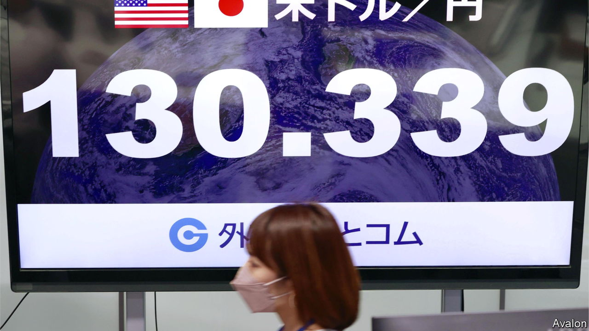
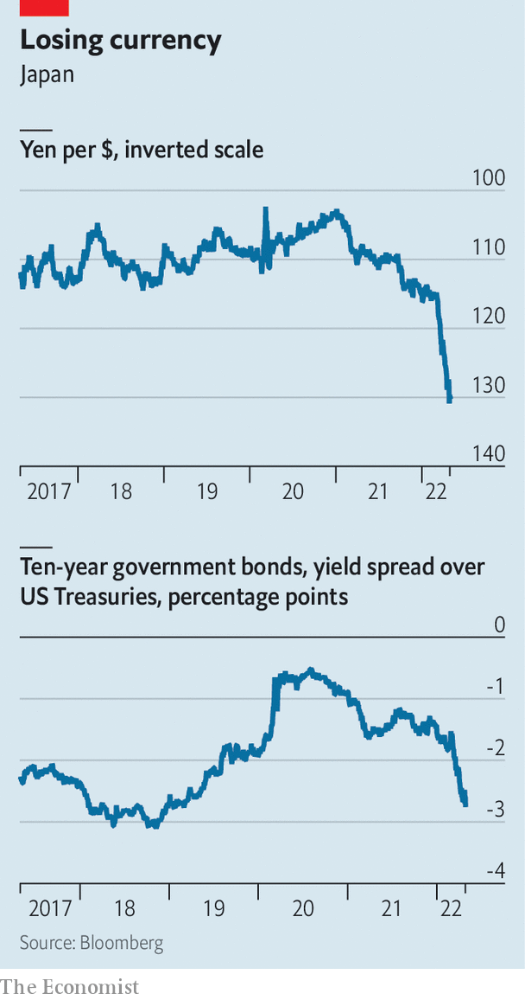

###### Land of the crashing yen

# Will an ever feebler currency save or sink Japan’s economy? 

##### The yen’s steepest fall in two decades will be hard to arrest 

 

> May 7th 2022 

T HE LAST time the Japanese yen dipped below 130 to the American dollar, in 2002, China’s economy was smaller than France’s, Vladimir Putin was meeting Western officials with a smile, and Eminem, a rapper, was atop the pop-music charts. The , first reached on April 28th and then every day since, has been precipitous: it stood at just 115 to the dollar at the start of this year. Japanese policymakers have begun to fret, leading markets to speculate about whether they will intervene to halt the fall. That would probably prove futile: deep forces are driving the yen’s depreciation.

The most important one is the widening gap in interest rates between Japan and America (see chart). While prices have risen sharply in America,  has remained below the Bank of Japan’s (BoJ) 2% target. And though inflation may touch that mark later this year, the BoJ reckons it is being fuelled by one-off increases in costs; idiosyncrasies of Japan’s labour market have meant limited wage growth. As a result, even as the Federal Reserve has begun tightening rates, the BoJ has maintained its ultra-loose stance. At a monetary-policy meeting last week, the BoJ reaffirmed that direction, pledging to keep buying ten-year bonds to help control the yield curve. With more money to be made holding American bonds than Japanese ones, investors have snubbed the latter, dampening demand for the yen.


 


Trade also plays a role in the yen’s woes. Japan’s current-account balance went into the red in December. Rising import costs (which the Ukraine crisis has made worse) have been the main culprit: fuel and raw materials make up roughly one-third of Japan’s import bill. In order to buy pricier foreign goods, importers have been forced to sell more yen. Japan’s borders have remained closed to inbound tourism due to the , further weakening Japan’s balance of payments.

Policymakers have traditionally seen a weak yen as a positive for Japan and its powerful export-focused industries. Some still do. They also now hope a bit of cost-push inflation may help to break Japan’s entrenched deflationary mindset and to force zombie firms out of the market. Yet the yen has sunk to such lows that concerns are mounting. Consumers are getting squeezed by rising import prices; the government announced another fiscal-stimulus package in April to ease the pain ahead of upper-house elections expected for July. Business sentiment has also turned, even in the manufacturing sectors, says Baba Naohiko of Goldman Sachs, an investment bank.

One reason is Japanese firms’ gradual but sustained efforts to mitigate the risks of currency appreciation by offshoring production. “The flip side,” Mr Baba says, “is that they can’t reap as many benefits from depreciation.” The stuff that is still exported from Japan tends to be high-value-added goods, which tend to be less responsive to changes in exchange rates. The pandemic and supply-chain snags have also hampered the export of some of these products, such as automobiles.

Some reckon the yen could continue falling, perhaps to 150 to the dollar, a level unseen even during the Asian financial crisis of 1997-98 (when it fell to 147 to the greenback). Inside the BoJ, some have argued for shortening the target of the yield-curve control policy from ten-year bonds to five-year ones, a form of soft tightening, but that seems unlikely in the remainder of the term of the current governor, Kuroda Haruhiko, which runs until April 2023. A turning point might come when Japan reopens to foreign tourists, as expected following the elections. Ultimately though, argues Jesper Koll of Monex Group, a financial-services firm, “the yen’s fall from grace will stop and reverse exactly when Japanese investors begin buying their mother markets.” ■

For more expert analysis of the biggest stories in economics, business and markets, , our weekly newsletter.

