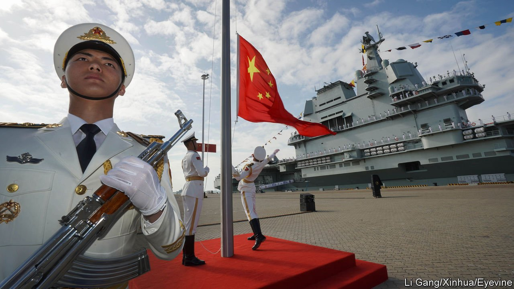

###### Cover your bases

# How the West should respond to China’s search for foreign outposts 

##### A Chinese deal with the Solomon Islands should be a wake-up call 

 

> May 7th 2022 

THE UNITED STATES maintains hundreds of military bases in at least 45 countries. Britain runs plenty of outposts overseas. French forces are stationed from Ivory Coast to New Caledonia. Even tiny Singapore has training camps abroad. But five years after it opened—to the alarm of Western officials—China’s naval base in Djibouti, on the Horn of Africa, remains its only military bastion beyond its borders.

China wants to change that. Over the past two decades it has amassed more ships than America’s navy has in total. Lately it has increased efforts to find foreign berths for them. It is thought to have approached at least five potential host countries. A deal with the , signed in April, has raised fears that China may establish a military foothold there. And it has deepened concerns that, one day, China will challenge American naval dominance in the Pacific.


China calls America “imperialist” for keeping foreign bases, while insisting that its own military expansion is peaceful, nothing to worry about and only natural for a rising power. It is surrounded by unfriendly island chains and narrow straits. Most of its trade in goods moves by sea. It is only prudent for China to seek friendly ports abroad, its officials say. It needs a navy equal to the task of defending its overseas investments, shipping routes and citizens who live or work abroad.

The neighbours are not convinced. China has built landing strips and missile batteries to assert its claims to disputed reefs in the South China Sea. It reserves the right to seize the democratic island of Taiwan by force. Its open ambition to control more territory than it currently does suggests a darker side to this maritime diplomacy. Its goal in Asia is a continent made up of individual countries that genuflect to the regional giant. It wants America out of its backyard, and .

The Solomons deal is a warning to America and its allies. China denies a naval base is in the works, but a leaked draft of the secret agreement envisages the deployment of Chinese troops and visits by Chinese ships. That could give China a military presence not just near important shipping routes, but between America and its Pacific allies, Australia and New Zealand.

How to respond? For a start, democracies should learn from China, which has spent years diligently wooing Pacific Island governments. America’s engagement, by contrast, waned after the cold war’s end, giving it the reputation of a fickle and high-handed partner. It closed its embassy on the Solomons in 1993. Australia’s national broadcaster stopped short-wave radio transmissions to the Pacific five years ago, despite their value to locals as a source of information. China Radio International now broadcasts on some of those same frequencies. China persuaded the Solomons and Kiribati to stop recognising Taiwan in 2019, reportedly in exchange for generous aid and aeroplanes.

America and its allies, who still enjoy more goodwill in the region than China, should offer Pacific Islanders a better, more transparent deal. Aid is not the problem—Australia is still the largest donor to the Solomons. Instead Western countries need to offer enhanced terms of trade, more open labour markets and technology and expertise, especially in areas that matter to Pacific states, such as climate change, education, environmental protection, health care, illegal fishing and internet connectivity.

America has promised to reopen its embassy and hold a strategic dialogue with the Solomons. Better still would be to create a new position, American ambassador to the Pacific, with a more direct line to the White House. That would help America, Australia and New Zealand co-ordinate their policies across the region, not just with each other, but with Japan, France and other like-minded democracies that have interests there.

America and its allies will not be able to stop China everywhere—nor should they try. A limited Chinese military presence abroad does not have to be a threat. In Djibouti Chinese soldiers have thus far co-existed with American, French, Italian and Japanese forces, all of which have their own bases in the country. Rather than play “global whack-a-mole”, as an American expert puts it, Western countries should treat this challenge like chess. That means anticipating Chinese moves, making blocking manoeuvres when necessary, and thinking in a strategic way. Just don’t treat countries like the Solomons as pawns. ■

