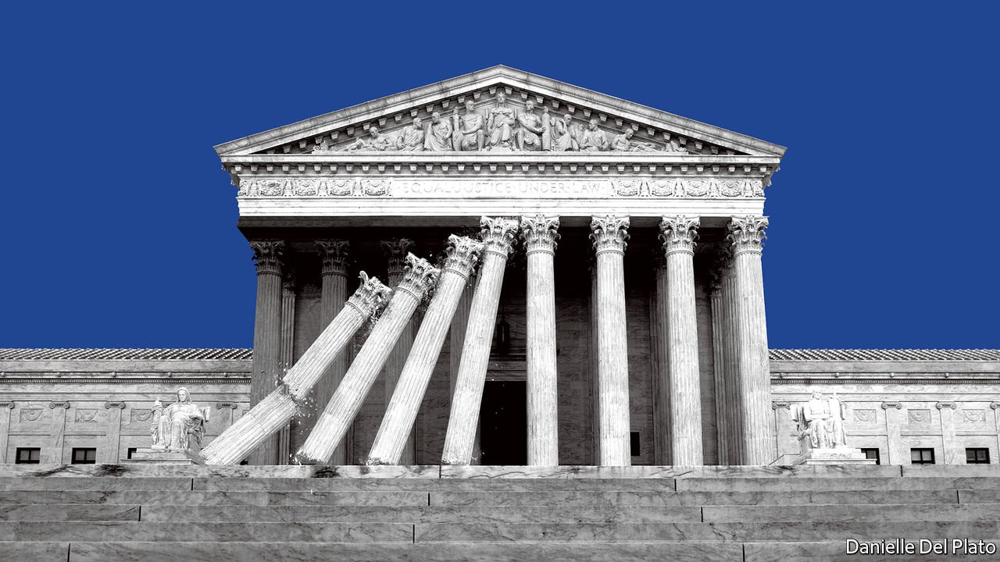

###### Governing America

# How to save the Supreme Court from itself 

##### To avoid breaking a precious institution, the nine justices need to restrain themselves 

 

> May 7th 2022 

HIPPOCRATES CONDEMNED abortion; Aristotle thought it less cruel than exposing unwanted infants to the elements. The West has been arguing about this hard moral problem for over 2,000 years. Most Western democracies have found a compromise between the liberal position, held by this newspaper, that the state should not control women’s bodies; and the most conservative position, that any abortion is murder. In Australia, Britain, Canada, France, Germany and Japan, legislatures have allowed abortion early in pregnancy and made it illegal later. Most Americans agree with that, but their country stands apart.

A  of a majority opinion from America’s Supreme Court obtained by Politico, a news organisation, suggests that the court will overturn Roe v Wade, the 50-year-old decision that makes abortion legal until the fetus becomes viable. If so, state law would take precedence. Most abortions look set to become illegal in half of states; some bans would include cases of rape or incest. Better-off women can take time off work and travel to legal clinics, so the burden would fall mainly on poorer women. Banning abortion would increase the number of pregnancy-related deaths, by over 20%, according to one study.


Perhaps the judges will change their mind or temper their arguments before the final opinion is issued. Even so, with a 6-3 conservative majority, not the 5-4 split that has held for the past half-century, the court is poised to reopen some of the most contentious questions in American public life. In this, it risks damaging itself and accelerating the division of the country into .

The outsize power wielded by the court in 2022 derives from a political system that struggles to strike compromises. Lining up a majority in the House, 60 votes in the Senate (to override a filibuster) and a presidential signature is too hard. It is easier for politicians to fundraise off controversy rather than solve problems. Time and again on the thorniest questions—carbon-dioxide emissions, gay marriage, guns, abortion—Congress has failed to reflect public opinion.

By their dereliction, legislators dump big decisions on the justices. As a result Supreme Court confirmations have become trials of strength where the Senate majority holds sway. Donald Trump, who ran on a promise to pick judges explicitly to overturn Roe, further dissolved the idea of judicial independence. All this politicking heaps intolerable pressure on the court.

Conservative Americans, who may not have liked Mr Trump but admire his judges, may retort: so what? Liberals, they argue, broke the court in the 1950s and 1960s, pursuing a programme they could not get past Congress. Roe was shoddily argued and a correction is long overdue. Even if most Americans favour a compromise between a libertarian view and the belief that life begins at conception, judges are supposed to rule on the law, they say, not bend to public opinion.

That is surely right. However, the solution to one activist court 70 years ago is not another activist court today. When the legislature cannot pass laws on the big questions of the age, the courts bear a special responsibility, lest justice itself is poisoned. The court must indeed feel that it can go against public opinion. But in whatever it does it should weigh tradition and precedent and exercise restraint. If the justices take it upon themselves to cut through legislative knots, using their power maximally, they will transform themselves into the lifelong members of an all-powerful unelected third chamber.

Three bad outcomes may follow. The justices might find their judgments ignored. An America where the rule of law was weakened would be less free and more dysfunctional. If the court loses its ability to be the decider of last resort, the role asked of it in the presidential election in 2000—and again in 2020—it could lose its ability to settle disputes peacefully.

Second, if in the name of conservatism the justices start tearing up precedents that have stood for half a century, there will be growing political pressure to remake the court. Packing it is a terrible idea, and currently a fringe position in the Democratic Party. But if the court swings hard to the right, every Democratic presidential candidate in 2024 will be asked what they would do to tame a body in which a third of the justices were nominated and confirmed by a president and senators who represented a minority of Americans. Such proposals could be at issue even while the court had to rule on the outcome of the vote.

Third, America’s divisions into red and blue camps would deepen. The United States is a federal system where states enjoy discretion to write many of their own laws. But unlike the European Union it is also a nation. If state laws became so divergent that nobody in California could own a gun and gay people in Texas could not marry, that would lead to a trampling of the rights of minorities in those states. The only solution would be to move. But an America where almost everyone in one state was Republican and almost everyone in a neighbouring state was Democratic could hardly be expected to come together in any national endeavour. States bound in such an arrangement would hardly be united at all.

The ideal way to avoid this would be for the legislature to rediscover the art of compromise, so that the court could act as the arbiter it was meant to be. Political questions are best solved by politicians, not judges. That possibility looks awfully distant today, but Ireland managed to find a compromise on abortion by creating a citizens’ assembly which issued recommendations to the government. If only America could rediscover the spirit of institutional innovation and participatory democracy, some of the questions that now seem untouchable could be opened.

Until then the court should save itself by acting with restraint. It should also seek to bolster its own legitimacy. Congress is debating an ethics code, prompted in part by the discovery that , a Republican activist, was angling to overturn the election result. Rather than wait, the justices should impose a code on themselves. And, while they are at it, they should announce . Some new members of the court could still be around in 2050. That is asking a lot of them, but unless justices act wisely now, the court will be a different place by then—and America a different country. ■

For subscribers only: to see how we design each week’s cover, sign up to our weekly 

