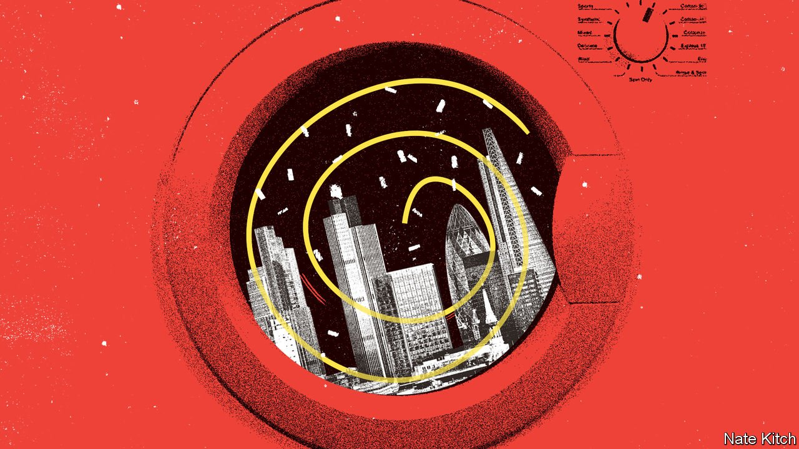

###### Dismantling Londongrad

# How to solve Britain’s dirty-money problem 

##### If the government really wants to take on the oligarchs it should fund its corruption-fighters properly 

 

> May 7th 2022 

OF THE BARRAGE of sanctions the West has inflicted on Russia over its invasion of Ukraine, the most symbolically powerful, if not the most economically consequential, have been those targeting the cronies of Vladimir Putin. Britain’s government trumpets the fact that it has announced measures against more Putin-linked plutocrats than any other country. It is less keen to talk about why that might be. London has long been a destination for dirty money. Corrupt capital flows to Britain from all over the world, but no one doubts that Russian loot is a major contributor to a money-laundering problem that the National Crime Agency puts conservatively at £100bn ($125bn) a year.

Dodgy money has been lured to London by some of the same things as the clean variety, including a long-standing openness to foreign investment and strong property rights. Another attraction, however, is the financial secrecy offered by both Britain and its network of offshore satellites, from Jersey to the Cayman Islands. That has helped make Britain murkier than classic havens such as Panama and Liechtenstein, according to a respected global financial-secrecy index. Political obsequiousness has also played a part. Successive governments looked to woo oligarchs and their billions—for instance, by hawking “investor visas” that gave them residency.


The politicians overplayed the benefits and underestimated the costs of unfurling the welcome mat. In the macroeconomic scheme of things the gains were small and concentrated, mostly filling the pockets of a select group of bankers and lawyers. The costs were more pervasive. London’s growing reputation as a repository for tainted money has undermined its financial centre and tarnished its legal system.

The government has pledged to clean things up. But if it is serious, it will have to go beyond the half-baked measures of the past. In 2016 Britain became the first G20 country to set up a public register of company owners. But it did not finish the job. The register is thinly policed: of the half-dozen convictions so far for knowingly submitting false data, the most high-profile was of an activist who posed as an ex-minister to expose its flaws. Similarly, government attempts to rein in Britain’s offshore territories have been half-hearted—witness the scandal engulfing the British Virgin Islands, whose leader has been arrested on allegations of drug-smuggling and money-laundering.

Ministers do seem more determined this time. They have scrapped the visas-for-cash scheme; proposed reforms to a libel law that lets oligarchs scare off critics; and sped up an economic-crime bill that, among other things, will force more transparency on foreign owners of British property. What Britain really needs, however, is not more laws but better enforcement.

One priority is the oversight of lawyers, who play a central role in putting together crooked offshore structures and fending off scrutiny of those who engage in financial chicanery. Ethical standards have slipped as more lawyers have been tempted by plutocrats’ fat cheques. This has put cracks in the industry’s “good chap” system of regulation, which relies heavily on self-policing. It is time for the statutory regulator, the Solicitors Regulation Authority, to show some teeth, and punish those falling short. The largest fine it has announced to date was £232,500, little more than a top-tier firm might charge a deep-pocketed Russian client for a week’s work.

A second priority is to make government investigators and prosecutors more effective. Corruption cases are hard; money trails are complex and cross borders. In Britain the task of building such cases is spread across over 100 agencies and police forces. Their combined budget for fighting cross-border corruption is just £40m-50m, around the same as the annual wage bill of the three best-paid players at Chelsea, a football club that Roman Abramovich, an oligarch under sanctions, is looking to sell.

As a result, corruption-fighting agencies suffer from a chronic lack of forensic investigators, and prosecutors lack the budgets to bring more than the occasional case. That needs to change. Cleaning up Britain’s dirty-money problem is not rocket science, but it will cost money. ■

