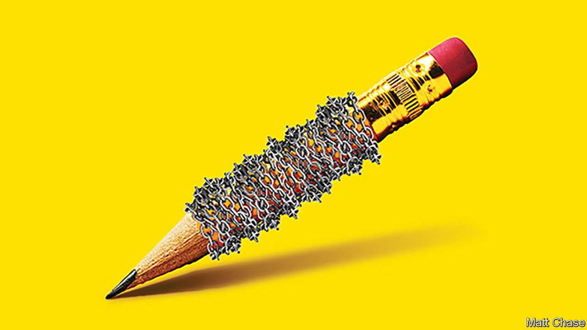

###### The gag tightens

# Press freedom is under attack. It needs defenders 

##### Autocrats pay lip service to free speech while eroding it in insidious ways 

 

> May 7th 2022 

HERE’S A THOUGHT experiment. If Russia had a , how many Russians would support Vladimir Putin’s invasion of Ukraine? Here’s another: how might the early days of covid-19 have unfolded if the virus had first emerged in a country with a free press, rather than China? Could the government of such a country have hushed it up for those crucial early weeks?

As news junkies celebrated World Press Freedom Day on May 3rd, it was worth remembering why it matters. A free press can scrutinise the mighty, expose corruption and deter abuses. For a tyrant, as Napoleon Bonaparte once lamented, “Four hostile newspapers are more to be feared than 1,000 bayonets.” The free flow of information is the lifeblood of democracy. Without it, voters cannot make informed choices. Governments struggle to notice or correct their mistakes. And free media make it easier for good ideas and useful information to spread, thereby accelerating progress.


Yet around the world, . Around 85% of people live in countries where it has been constricted in the past five years. It is now as hamstrung as it was in 1984, during the cold war. The nature of censorship has evolved since then, however. Hundreds of reporters are still jailed, and dozens are killed each year. But most modern autocrats at least pay lip service to the idea of a free press, and choose more subtle weapons with which to attack it.

State advertising budgets are lavished on fawning outlets. Critical ones get tax audits and fines for defamation. Such harassment can tip struggling media firms into the red. Some may then be bought by ruling-party cronies, who may not mind if their television stations lose money, so long as they please the people who dole out public-works contracts. Mr Putin pioneered this approach; it has been widely imitated.

Technology is being used to make life hell for uppity hacks. New tools make it easier to spy on them. Investigations last year found Pegasus eavesdropping software had been slipped into the mobile phones of almost 200 journalists, to read their messages, track them and identify their sources. Social media can be used to harass reporters. A survey found almost three-quarters of female journalists have endured online abuse. This is scariest when it is organised, and has the tacit backing of the ruling party. In India, for example, critics of the prime minister, Narendra Modi, face torrents of death and rape threats from Hindu nationalist trolls, who sometimes publish their addresses and incite vigilantes to visit them.

Even in liberal democracies, laws against libel and invasion of privacy are often abused. Oligarchs from elsewhere sue muckraking reporters in , hoping to impose on them ruinous legal costs and endless hassle. In Poland one popular newspaper, Gazeta Wyborcza, has been hit with more than 60 cases in recent years, many brought by leaders of the ruling party. A Maltese journalist who exposed state corruption was dealing with over 40 cases when she was assassinated in 2017.

How can defenders of press freedom fight back? An easy place to start would be for liberal governments to scrap archaic laws that criminalise defamation, which are still surprisingly common. They should also curb bogus lawsuits, as the European Commission is currently contemplating. Next, independent media need to find new sources of funding. Charities can chip in, as can crowdfunding and rich proprietors who care about free speech. Public broadcasters can play a useful role, but only if they have enough safeguards to be truly independent.

In more repressive places the task is harder, but technology can help. Where reporting on the ground is too risky, satellite imagery and big data sets allow journalists to pull together stories from afar. Free countries should offer them asylum, and a safe place to keep working. Where censorship is tight, citizens can use virtual private networks to access blocked content and online tools to capture web pages before they are censored.

Journalists in free countries can help those in autocracies. Cross-border collaborations have exposed scandals such as Pegasus and the Panama papers. The Washington Post’s cloud-based publishing system allowed Apple Daily, a beleaguered pro-democracy tabloid in Hong Kong, to keep publishing for longer than it otherwise could have.

The struggle will be uphill. The pandemic has given governments a plausible excuse to curb press freedom: nearly 100 have done so in the name of public safety. Donald Trump has shown how a demagogue can undermine trust in the media, and others are copying him. In a survey last year, almost 60% of respondents in 28 countries said journalists deliberately mislead the public. Some do, of course, and World Press Freedom Day is a moment for journalists who enjoy protection to ask themselves if they are making the best use of their freedom. ■

“Press freedom: what’s at stake”, a documentary film by The Economist, records our investigation into the decline of press freedom. It is available to watch .

