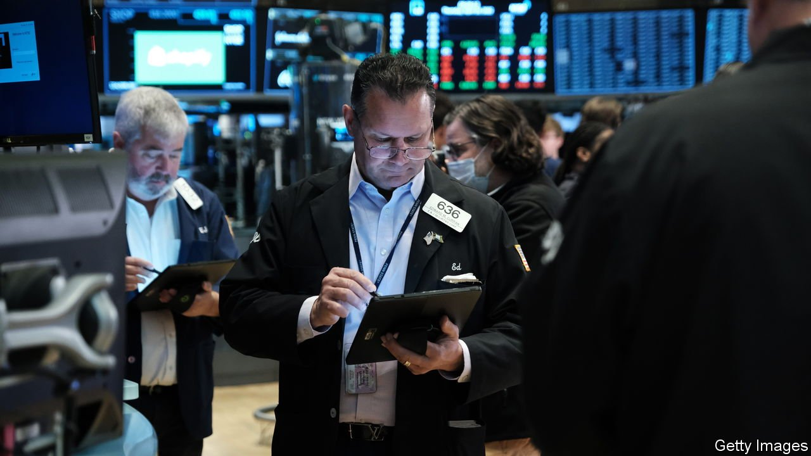
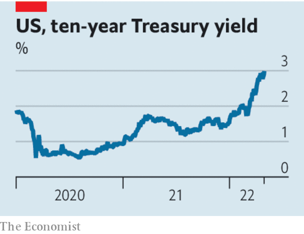

###### The rate fate that awaits

# The Fed causes gyrations in financial markets 

##### Despite a sudden rally, pain lies ahead 

 

> May 7th 2022 

AS CENTRAL BANKS do battle with the worst inflation for a generation, they are putting the easy-money policies of the past decade into reverse. This week the Federal Reserve raised interest rates by half a percentage point and announced that it would soon shrink its portfolio of bond holdings. The Bank of Australia, which not long ago was predicting it would keep rates near zero until 2024, surprised investors by increasing them on May 3rd by a quarter-point. As we published our weekly edition the Bank of England was expected to raise rates to their highest level since 2009.

Though share prices jumped after the Fed’s rate rise—in apparent relief that it is not tightening faster—financial markets have been adjusting painfully to the reality of tighter money. Global stockmarkets  and are down by 11% in 2022, as investors price in higher rates and lower growth. On May 2nd America’s ten-year Treasury yield, which moves inversely to prices, briefly hit 3% (see chart), nearly double its level at the start of the year.


One consequence of tightening financial conditions is a repricing of currencies. The dollar is up by 7% against a basket of currencies over the past year. America needs higher interest rates than any other big rich country, because of its overheating economy and labour market. Higher rates in America increase investors’ appetite for dollars, adding to dollar-demand caused by a fall in their desire to take risk elsewhere as war rages in Ukraine and China battles the corona virus. Most striking has been the greenback’s appreciation , the only currency of a big rich country in which interest rates look unlikely to rise soon. In real terms the yen is at its cheapest since the 1970s.

 


Another result is the growth in risk premiums as investors worry about pitfalls in the new economic landscape. In America measures of the “inflation risk premium”, which goes up when prices become difficult to forecast, are at their highest since 1994. Liquidity in the Treasury market . The spread on mortgage-backed securities over ten-year Treasuries has doubled since the start of the year, reflecting worries that the Fed could actively sell its mortgage bonds. There has been a modest increase in corporate-credit spreads as investors weigh the possibility that higher rates will make it harder for companies to service their debts. And in Europe the difference between what the German and Italian governments must pay to borrow for ten years has risen because of the danger that tighter monetary policy makes it harder for Italy to cope with its towering debts.

A third effect is the poor performance of even diversified investment portfolios. In America investing 60% in stocks and 40% in bonds produced an annual average return of 11% from 2008 to 2021, but has lost 10% this year. Whereas 2021 marked the apex of the “everything rally” in which most asset prices rose, 2022 could mark the start of an “everything slump”, with the end of low rates made possible by low inflation—the macroeconomic foundation of high investment returns.

As investors suffer, monetary policymakers may be tempted to change course. If they stopped raising rates and let inflation run hot, bondholders would lose money but more inflation-proof assets, such as stocks and houses, would benefit. The dollar would fall, helping the many countries which denominate some of their exports or debts in dollars.

Yet it is the duty of central banks, including the Fed, to respond to the economy at home and to stop inflation persisting at an intolerable level. Tighter financial conditions are the natural consequence of raising rates, and the adjustment has some way to go. Investors are still betting that America’s interest rates will peak at a little over 3%. That is unlikely to be high enough to rein in underlying inflation, which has risen above 5% on the Fed’s preferred measure. More pain lies ahead. ■

