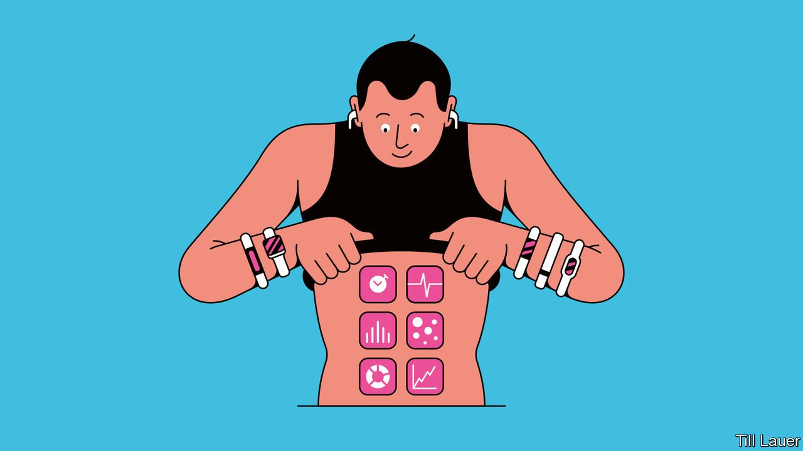

###### Medicine

# Wearable technology promises to revolutionise health care 

##### Do not let bureaucracy delay matters 

 

> May 5th 2022 

IT IS A stealthy killer. When the heart’s chambers beat out of sync, blood pools and clots may form. Atrial fibrillation causes a quarter of more than 100,000 strokes in Britain each year. Most of those would never happen if the heart arrhythmia were treated, but first it has to be found. Tests are costly and inaccurate, but Apple Watches, and soon Fitbits, can detect it, are far cheaper and can save those whose lives are in danger.

This is just one example of the revolution about to transform medicine. Smartwatches and -rings, fitness trackers and a rapidly growing array of electronically enhanced straps, patches and other “” can record over 7,500 physiological and behavioural variables. Some of them are more useful than others, obviously, but, as our Technology Quarterly in this issue explains, machine learning can filter a torrent of data to reveal a continuous, quantified picture of you and your health.


These are early days for the quantified self, and for investors in digital health it is still a wild ride. Witness the recent collapse in the share price of Teladoc, which provides online consultations, a worrying sign for other would-be disrupters. But for patients the innovation in wearable devices has just begun. Individual firms may come and go, but wearables and artificial intelligence look set to reshape health care in three big ways: early diagnosis, personalised treatment and the management of chronic disease. Each promises to lower costs and save lives.

Start with early diagnosis. Wearables can detect subtle changes that otherwise go unnoticed, leading to less severe disease and cheaper treatment. Sensors will reveal if an older person’s balance is starting to weaken. People’s gait and arm-swing change in early-stage Parkinson’s. Strength exercise can help prevent falls and broken limbs. Psychiatric diagnosis may be enhanced by tracking patterns of smartphone use—without monitoring what people see or type. A smart ring can help a woman conceive, by predicting her menstrual cycle. It can also detect pregnancy less than a week after conception (many women continue to drink or smoke for weeks before they realise they are pregnant).

Then there is the promise of seeing people as individuals, not clones of the theoretical, average human. Most drugs work in just 30-50% of patients. In one person, regularly eating bananas moderates blood sugar; in another, it raises blood sugar to levels that, over time, can cause harm. Algorithms can turn reams of data from wearables into bespoke prescriptions and diets for losing weight, controlling diabetes and so on. These regimes are more effective, less limiting and hence easier to follow than the one-size-fits-all kind. When doctors can see into a patient’s body in real time all the time, they can provide better care. In a German trial this sort of monitoring of heart-failure patients reduced mortality and the days spent in hospital by a third.

And wearables can transform chronic diseases, such as diabetes. Some 80% of disease can be prevented by changes in how people lead their lives. Apps use small devices and clever tactics of the sort employed by a personal trainer or a shrewd spouse to get people to move more, eat better and sleep more soundly. Inducing even small increases in exercise is good: adding 1,000 steps (0.7km) a day reduces mortality by 6-36% depending on how sedentary you are. Continuous monitoring also shifts the balance of care from what doctors can do in the brief occasional office consultation to what patients can do for themselves day in, day out. America spends $10,000-20,000 a year per patient with diabetes and about $280bn a year nationally, half the entire public-school budget. A diabetes-control app has been shown to reduce the cost per patient by $1,400-5,000.

The scale of all these benefits promises to be vast. Just how vast will become clearer as wearables create data, leading to innovation. The reason for optimism is that the technology is ripe. Some 200m devices were sold in 2020 and twice as many are expected to sell in 2026. One in four Americans has a wearable device. Smartphones serve as a platform for innovators. Within a year or two the device on your wrist may be measuring non-invasively your blood sugar, alcohol and hydration, as well as various markers of inflammation, kidney and liver function—all of which currently require blood to be drawn. As wearables acquire more features, users are less likely to lose interest in them and shove them into the back of a drawer.

As with any technology, wearables bring worries. Health data are valuable; they could be abused by device-makers, insurers or governments interested in social control. The techno logy may not reach the poor and those who lead chaotic lives—the people who need it most. But the greatest worry is that the bureaucracy of health care gets in the way.

The first responsibility for powering forward lies with the market. And developers are indeed starting to pay for rigorous studies that demonstrate the safety, efficacy and value of their technology. A cottage industry that ranks devices and apps on, say, clinical efficacy and privacy is helping doctors, insurers and governments sort good from bad.

But health-care professionals also have a vital role. Health care is a conservative industry—and rightly so, given the stakes. Yet it risks slowing the uptake of digital medicine not for legitimate concerns about safety, but because of the inertia of regulators, standards bodies, insurers and medical schools.

An app a day

Rules are needed to make data ownership and use more transparent, so that people understand and control what happens with their information. Standards can help guide developers to produce usable devices. Patients’ data need to be tied into medical-record systems, which are often clunky. Practitioners need treatment protocols on how to use the new tech. Doctors must be trained and reimbursed for offering digital treatments and reviewing data. Governments and insurers must work out how to build the technology into subsidised health-care systems so busy fighting fires that they struggle to invest in prevention.

It is a long and daunting list. But the pay-off, in money and well-being, is likely to be huge. Time to roll up sleeves and prepare health care for the era of the quantified self. ■

