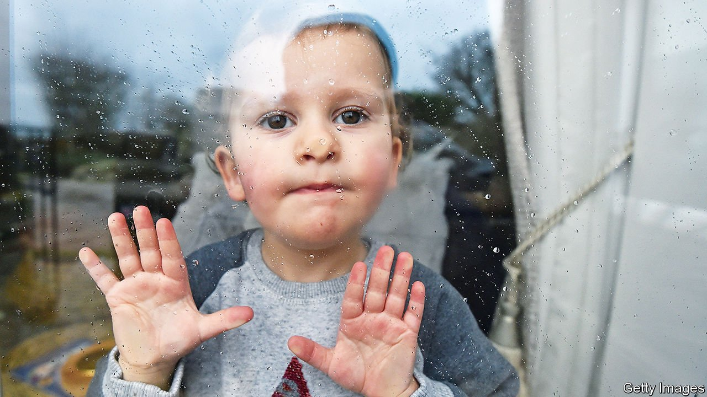
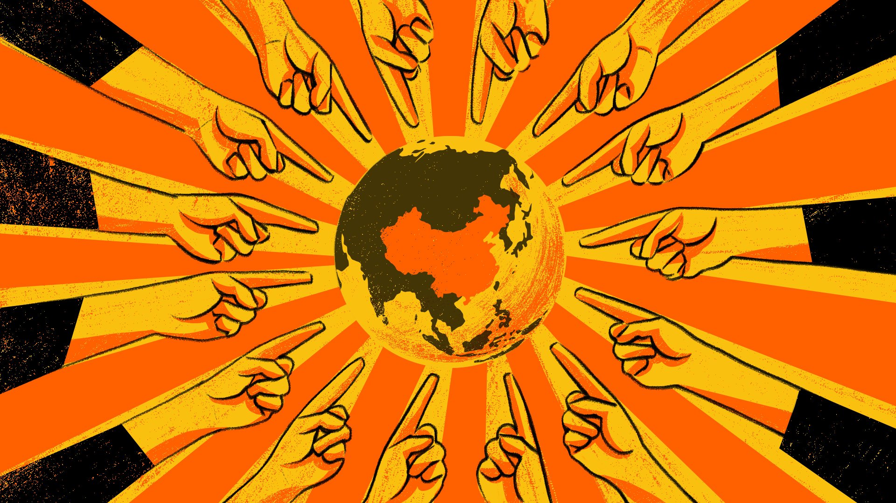
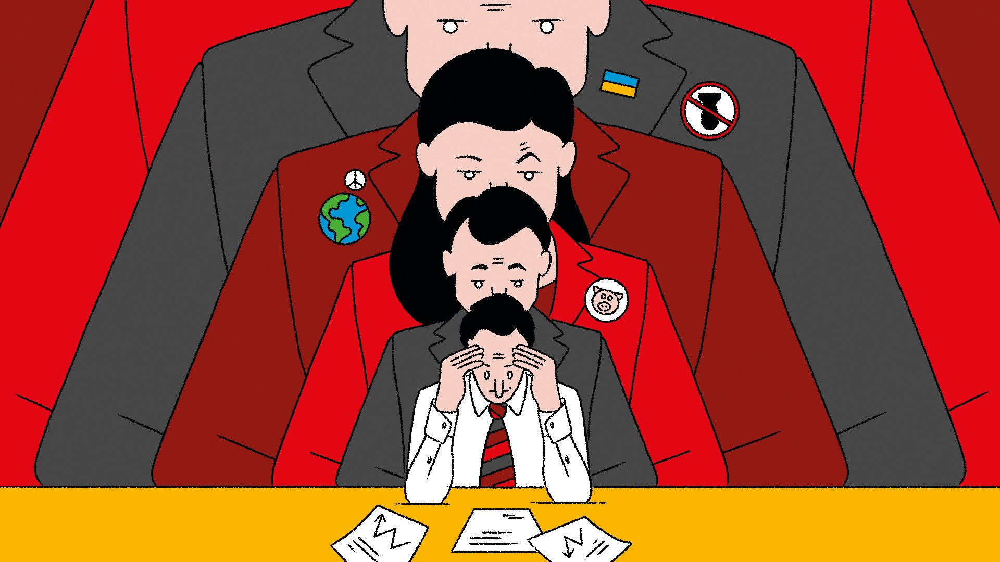
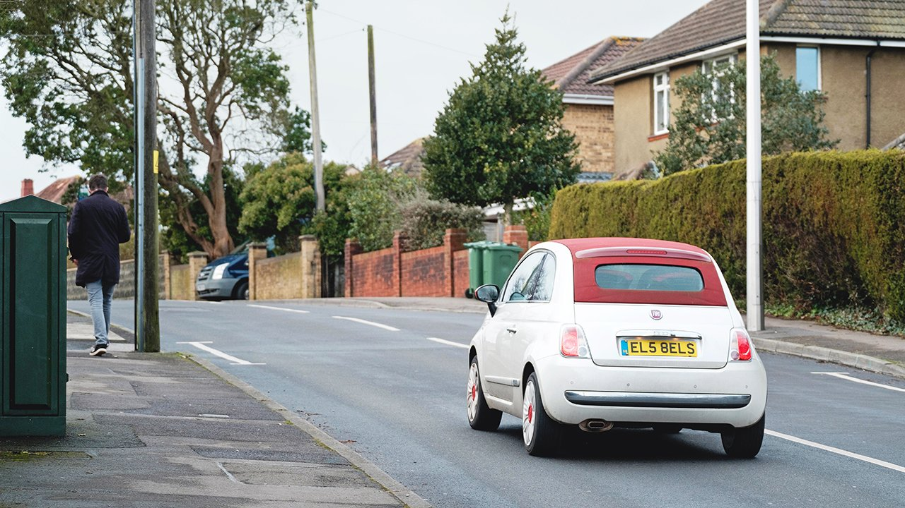

###### On children, China, quadratic voting, art, immigration, Marmite, car plates

# Letters to the editor 

##### A selection of correspondence 

 

> May 7th 2022 


Neglecting children

I was pleased to see The Economist draw attention to the ways in which the youngest children have suffered during the pandemic (“”, April 16th). This government simply doesn’t prioritise a good childhood as a public-policy outcome. The British Medical Journal recently reported that the terms of reference for the covid public inquiry “do not include the words child, childhood, babies, toddlers, school, child care, college, or for that matter, play, interaction, or socialisation.” In the summer of 2020 James Kirkup of the Social Market Foundation noted that the government’s pandemic planning prioritised the reopening of pubs and barbers over schools and nurseries. Children’s charities continually encounter a Treasury orthodoxy that sees Britain as a country of borrowers, consumers, workers and employers but not, it seems, little people who need to learn and play.


Save the Children has been giving emergency grants to families with young children throughout covid. Although books, educational toys and play packs are useful they cannot offset the cost-of-living crisis that is now tipping thousands more families into a calamity. Parents who have already been cutting back on food, heating and outings for their children are out of options. Nursery staff are reporting lost learning and behavioural problems of children. The worst is still to come.

KIRSTY MCNEILL

Executive director of policy, advocacy and campaigns

Save the Children

London

 


China’s ideological insecurity

 wrote about China’s broadside against liberal human rights (April 16th). This offensive aims to protect China’s ideological security, a key part of its national-security concept. China has been ruled by the Communist Party since 1949 on the basis that only it can lead the country to a great renaissance. The party has constantly warned and has taken action against what it sees as the pernicious influence of liberal ideologies. The Communist Party’s repression is its ideological immune system fighting off foreign ideologies both within China and abroad.

In the early days of Xi Jinping, the People’s Daily wrote about the New Black Five Categories, which were human-rights lawyers, underground religions, dissidents, internet influencers and people of so-called disadvantaged groups (Tibetans, Uyghurs?). These are analogous to the original Black Five party enemies of Mao’s time, which were landlords, rich peasants, counter-revolutionaries, bad elements and rightists. Here Mr Xi echoes, as he often does, a Maoist formulation as he defends China’s ideological security.

DAVID COWHIG

United States Foreign Service Officer, retired

Alexandria, Virginia

 


Quadratic voting for firms

“” (April 23rd) highlighted the inability of minority shareholders to exercise their proportional stakes. The core of the problem was identified in an article you ran last year (“”, December 18th 2021). As Lionel Penrose showed, the power of a holder of several votes grows as the square of their vote weight, rather than linearly, so small holders will inherently be disadvantaged. Penrose’s solution is that voting weights should grow as the square root of the stake.

This intermediate point between “one person one vote” and “one share one vote” was successfully approximated in various corporate-voting structures in the 19th century, before the canonisation of one share one vote. It is currently used approximately by the European Union for voting power as a function of population, and is used precisely by many Web 3 distributed autonomous organisations for governance as a function of crypto-tokens. It also has the virtues of discouraging concentration in asset ownership without heavy-handed antitrust policy and hostile takeovers without discriminatory poison pills.

E. GLEN WEYL

Founder

RadicalxChange Foundation

Kirkland, Washington

Politics and art

I enjoyed the  by Semyon Bychkov (April 9th) and generally agree with his views on creative freedom. However, his comment that “Art cannot and should not be used for political ends or to justify any ideology” misses the mark. Many of the works that critics label as masterpieces have indeed been used to justify political ideologies. Take a look at Picasso’s “Guernica”. Politics, art and ideology are intertwined. If Mr Bychkov had added “by the state” to his original sentence, I would have no problem agreeing with him.

NICHOLAS TEENY

Seoul

 


A strict immigration policy

The Economist has it backwards when it comes to Australia’s and Britain’s frightful refugee policies (“”, April 23rd). The Australian government tore up its commitment to human rights through offshore “processing” of asylum-seekers and its explicit policy banning Australian resettlement for any refugees arriving by boat. It is wickedly good marketing that this could be reported as being “interned”, when in fact hundreds of potentially legitimate refugees were left stranded in Nauru and Papua New Guinea. Australia has since struck deals with countries to resettle detained refugees, in effect shirking its responsibilities under the refugee convention. It is a mistake to think Australia’s refugee policy is a milder precursor to Britain’s.

LUCY SHAW

London

Love/hate

I must take issue with your correspondent’s description of Marmite as “sludge” (“”, April 16th). Marmite is, on the contrary, an unctuous indulgence, a comestible black gold, an ambrosia, even, given its derivation from the fermentation of amber nectar, not to mention its alleged numerous health benefits.

To paraphrase Omar Khayyam, a loaf of bread and marmite, a jug of wine, and thou.

ROBERT GRAHAM-BRYCE

Chicago

 


Funny car plates

I am glad to hear that Britain’s vehicle-licensing agency tries to avoid obscenities and political sensitivities when issuing number plates (“”, April 16th). In America I have been fortunate to obtain the personalised plate of “ MAN UTD” in a few states. Unfortunately it was already taken in Florida (could it be because Florida is the home state of the football team’s owners, the Glazers?). So I had to settle for “ MAN UTDZ” in recognition of Zlatan Ibrahimovic, who used to play for them.

In Iowa I was asked if “MAN UTD” was obscene. To which I replied, only in certain parts of Liverpool.

NORMAN S.J. FOSTER

Fort Lauderdale, Florida

Some years ago I inquired about a plate I thought would be quite fun. I was told that it was not a special plate and had already been randomly allocated. Indeed, the new owner probably did not think much of X32 TOH. But drivers seeing him approach in their rear-view mirrors might think otherwise.

SHAUN COOKE

Ide Hill, Kent

