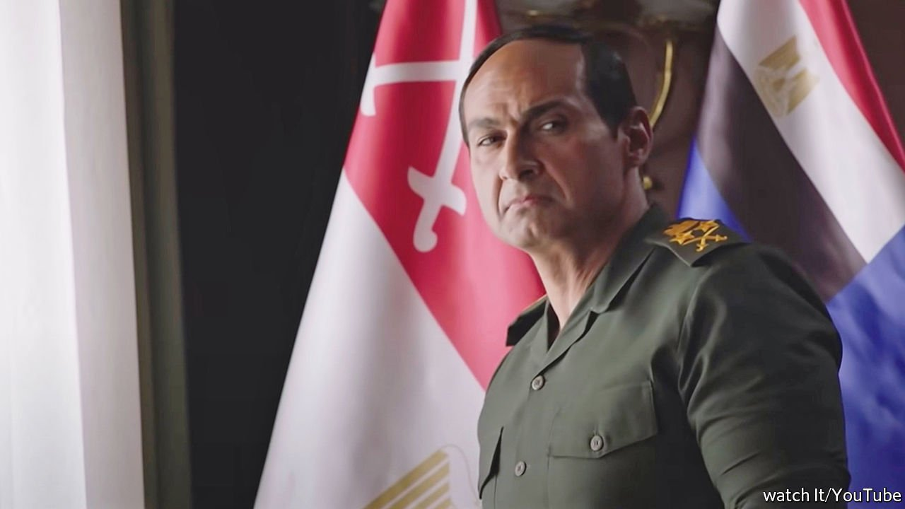

###### Written by the victors

# A lavish drama tries to rally Egyptians with dark memories 

##### But “The Choice” fails as a historical record and as propaganda 

 

> May 7th 2022 

WHEN TELEVISION viewers tuned in last month to “Al-Ikhtiyar” (“The Choice”), they knew exactly how it would end. In the penultimate episode Yasser Galal, who plays Abdel-Fattah al-Sisi, then the defence minister, enters a room full of religious and political leaders. “We must make a fateful decision,” he says. “The country needs one.” The date was July 3rd, 2013. Within hours the assembled grandees would appear on television alongside Mr Sisi, as he declared Egypt’s brief experiment with democracy to be over.

Television viewers in the Arab world are spoilt for choice during the month of Ramadan, which ended on May 1st. Studios roll out dozens of big-budget serials, with a new episode each night. “Al-Ikhtiyar”, now in its third season, was one of this year’s most heavily promoted shows.


The latest one dramatises what the producers call “the most dangerous 96 hours in modern Egyptian history”: the mass protests and subsequent coup in the summer of 2013 that overthrew Muhammad Morsi, the Muslim Brotherhood apparatchik who had become the first and only man to win a fair election in Egypt.

Mr Galal (pictured) plays his role with uncanny precision, capturing the general’s penchant for half-smiles and clasped hands. Close your eyes and his whispery, singsong voice is almost indistinguishable from the real Mr Sisi, who has been president since 2014. There is never a doubt about whom viewers should root for. Mr Sisi is portrayed as humble and pious; en route to announcing a coup, he stops for a heartfelt chat with his mother. Mr Morsi and his henchmen come off as shifty sorts, their appearances set to ominous music.

The producers describe the show grandiosely, not just as entertainment but as a “history book” for future generations. This would be laudable—if they were serious about it. Even for those who lived through them, that summer’s events were a blur. What seemed as if it could be a one-day protest against Mr Morsi, a chance for the opposition to blow off steam, progressed with bewildering speed to a bloody coup.

The show purports to take viewers inside the inner sanctum of Egypt’s security state. The credits thank the army and the interior ministry before the crew. It incorporates real-life recordings of Brotherhood officials that must have been taken in secret and had never been aired before.

The clips paint the Brotherhood as obstinate and inept, a truth many of Mr Morsi’s one-time supporters concede. But the show sheds little new light on how the deep state conspired to junk democracy. This is history written by the victors.

Gamal Abdel Nasser and Anwar Sadat, the second and third post-revolution presidents, both had their careers immortalised in film. But their appearances came long after their deaths. (Their successor, Hosni Mubarak, a man perhaps best remembered for being overthrown, may not merit a biopic.) Mr Sisi’s turn on the small screen comes at the height of his powers: he forced through constitutional amendments in 2019 that all but guarantee he will rule until 2030. This was a lavish propaganda effort, meant to rally Egyptians just when many have grown disenchanted.

Six years after it struck a $12bn deal with the IMF, Egypt has gone back for another loan, worried about how soaring food and energy prices will hurt its budget. Poverty has risen since Mr Sisi took office. Endemic problems—shoddy education and health care, urban chaos, rampant inequality and corruption—are unfixed. The president’s boosters say he saved Egypt from a “dark tunnel” of Islamist rule. But the country has not quite emerged into sunlit uplands.

ON, the network that aired the series, has not released viewing figures. Egyptians of various political hues seem to have started watching the show in large numbers, out of patriotic fervour or a desire to chuckle at propaganda, but few appear to have watched more than a couple of episodes. Journalists were urged to write puffy articles to big up the ratings. Perhaps some Egyptians wanted to relive the events of that summer. Nine years later, most have more pressing concerns. ■

