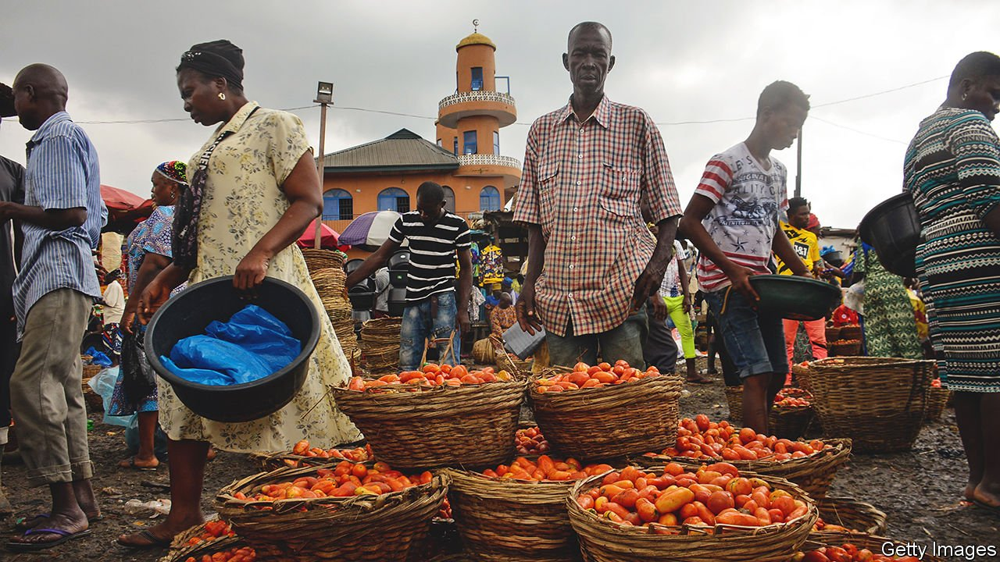

###### The paradox of untapped riches

# How market failures are holding Africa back 

##### Resources sometimes go unused, even where they are badly needed 

 

> May 5th 2022 

GHANA HAS a curious problem: it produces too much electricity. Under the terms of opaque contracts with generating companies, the government has been paying over $500m a year for power that is never used. That is odd, because the country is hardly awash with energy. The average Ghanaian uses as much electricity in a year as an American does in a fortnight. Although access has expanded rapidly, more than a quarter of rural households are not connected to the grid.

The biggest obstacle to economic development is often inadequate resources. But not always. In Ghana, generating power has proved much easier than distributing it. So, too, in several east African countries, including Uganda, where installed capacity is nearly double peak demand—and your correspondent sits writing this in a blackout. Electricity is not the only industry where resources are sometimes plentiful, and needs are obvious, but demand does not join up with supply. Call it the paradox of untapped riches: surplus and shortage, existing side by side.


Seeking hide

This riddle is most apparent in parts of the economy where the market ought to link up supply and demand. Yet in many cases lorries sit idle on roadsides, even as traders cannot find vehicles to carry their goods. Or factories run short of supplies even though the resources they need seem plentiful. Ethiopia has more livestock than anywhere else in Africa and the tanneries to turn hides into leather. Yet some of its shoe and glove makers import leather from as far afield as China. “Most of the raw hides and skins are supplied from household backyard slaughter,” explains Tesfaye Birhanu of the Leather Industry Development Institute in Addis Ababa, the capital. These can be ruined by bacteria within six hours of slaughter if not treated properly.

Even Aliko Dangote, Africa’s richest man, cannot escape the paradox. In 2016 his conglomerate opened a tomato-processing plant in northern Nigeria to turn the country’s vast crop of fresh fruit—half of which rots each year because of poor handling and storage—into the tinned paste that is currently imported. But a shortage of tomatoes forced the factory to shut down within months because of a crop failure caused by a voracious moth. Several years later the factory was still operating at a fraction of its capacity because of problems in getting enough tomatoes of the right quality.

A different variation of this paradox also arises in state-managed markets, like electricity, where governments have struggled to forecast supply and demand, and to build the infrastructure linking the two. It also appears within government institutions themselves. Because of poor management, health ministries in Africa fail to use about a fifth of the budget they are allocated, despite hospitals running short of medicines. The underspend is similar in agriculture ministries, sometimes for the simple reason that money for farm inputs such as subsidised fertiliser is released after crops have been planted.

Another mismatch is in infrastructure. Governments and investors often have money to spend. And demand for roads, ports and the like continues to grow. But bankable projects—the link between the two—are in short supply. “There is funding, a large pipeline, and a need for spending, but not enough money is being spent,” argue analysts at McKinsey, a consultancy. They reckon 80% of African infrastructure projects fail at the feasibility and business-plan stage; fewer than 10% reach the point of funding. Even high-profile schemes can stutter. By 2020, at the end of the first eight-year phase of the Programme for Infrastructure Development in Africa, an initiative led by the African Development Bank, construction had started on fewer than half the planned projects.

In a survey by the European Investment Bank, more than 60% of African banks say that a lack of “bankable” projects significantly constrains their lending to small businesses; a similar proportion of entrepreneurs tell World Bank researchers that they cannot get a loan when they need one.

What do these diverse examples have in common? One obvious theme is broken connections—quite literally, in the case of power grids. A quarter of the electricity that is sold in Ghana is lost due to derelict distribution infrastructure and theft, estimates Theo Acheampong, an energy economist at Aberdeen University. Bad roads and grasping middlemen stand between farmers and buyers.

Sometimes the missing link is information, such as the credit histories that would help banks assess the riskiness of would-be borrowers. A second lesson is that quality trumps quantity. Yes, Ethiopia has a lot of cows, but they need to be kept healthy and slaughtered skilfully if their hides are to be turned into brogues.

A few rotten tomatoes

None of these obstacles is insurmountable. Farmerline, a Ghanaian firm, uses technology to connect farmers, their suppliers, lorry drivers, warehouses and buyers. “We know how much food people are growing ahead of time, we know the location,” says Alloysius Attah, its co-founder. “It gives us an edge on how we plan our supply chain.” Tomato Jos, a startup in central Nigeria, is trying to crack the tomato-paste conundrum. It spent years talking to and then training farmers before its first tin rolled off the production line. “It’s not as simple as just setting up a factory and mopping up supply,” says Mira Mehta, its American founder. “Roads are horrible, market information is bad, tomatoes are perishable. You have to actually control your supply chain.”

Unclogging bottlenecks is often unglamorous, costly work that businesses are loth to do on their own because it will benefit free-riding competitors. “There has to be an intentional effort from government to support the market,” says Ed Brown of the African Centre for Economic Transformation, a think-tank in Accra, Ghana’s capital. In farming that may mean enforcing standards, or providing support and credit to help build up a whole supply chain. Mr Brown notes the success of Ethiopia and Kenya in developing cool storage at airports, which allows farmers to export flowers and fresh vegetables to Europe.

Economists have long known that resources alone do not make a country rich. African economies already have many of the pieces of the growth jigsaw. What matters is how they slot together. ■

