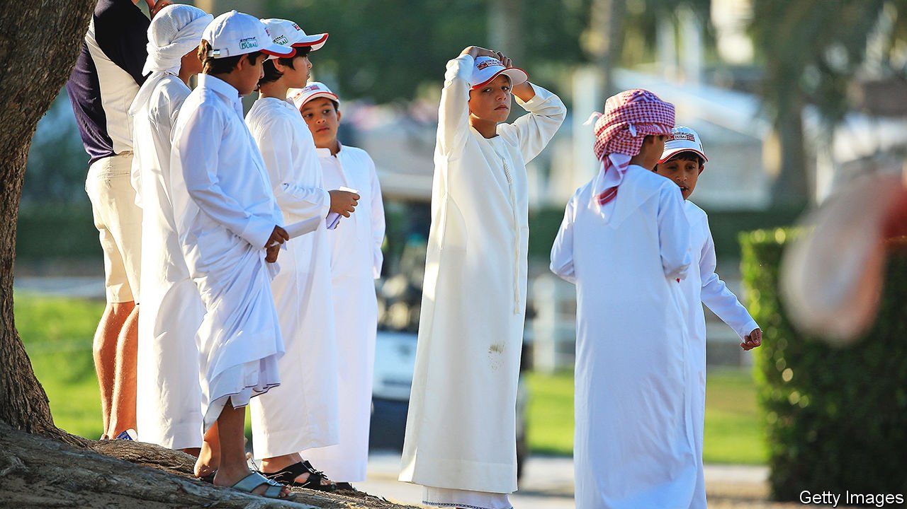
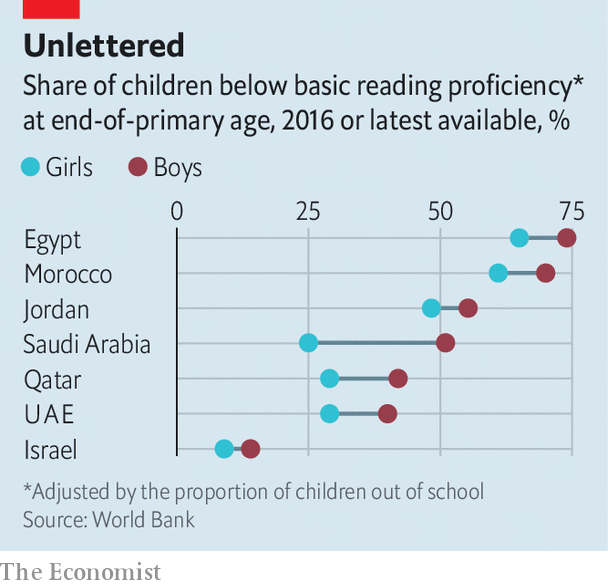

###### Boy problems

# Why Arab schoolboys are getting trounced by girls 

##### Bullying, beatings and old-fashioned attitudes all play a role 

 

> May 7th 2022 

MUHAMMAD ADMITS he was not an eager student. The young Emirati says he slept through school, if he turned up at all. When he was 17, desperate teachers arranged for him to spend one day a week in classes put on just for disaffected males. These aimed to raise ambition and to grab him with more practical kinds of schoolwork. Now 20 and completing military service, Muhammad says this last-ditch intervention saved him from flunking. A career as an army officer looks possible. Even training to be a doctor. Perhaps.

Muhammad is a graduate of Hands-on-Learning, a modest project aiming to drive down drop-out rates in Ras al Khaimah, one of the scruffier of the seven statelets that make up the United Arab Emirates (UAE). It is but one local effort to solve a sweeping regional problem. Across the Arab world, girls are less likely than boys to be at school. But in the classroom girls vastly outperform their male peers—to a degree unmatched anywhere else in the world. Boys’ shockingly bad school marks are a big drag on Arab economies, as is the continuing oppression of females. Shoddy boys’ schools are turning out insecure young men who are more likely to feel that their livelihoods depend on keeping better-educated women out of work.


The region’s boys and girls both perform badly in international tests. This makes Arab boys’ failings all the starker. The World Bank says two-thirds of ten-year-old boys in the Middle East and north Africa cannot read a simple story, compared with more than half of girls (see chart). Eight Arab school systems have the world’s widest gender gaps in science, according to international tests of 12-year-olds in 40-odd countries in 2019: in all of them boys score worse. Arab girls almost always outperform boys in high-profile tests of 15-year-olds carried out every three years by the OECD, a club mostly of rich countries. In Jordan, Qatar and the UAE the gap in 2015 was equivalent to girls having had an extra year of schooling in science and two extra years in reading.

 


Segregated schooling is part of the problem. Single-sex schools are common in Arab countries, especially in the Gulf, where boys’ failures relative to girls’ are worst. Boys’ schools tend to be crummier than girls’, in part because hiring male teachers is difficult. Whereas a job in girls’ schools can easily attract ten applicants, an opening in a boys’ school might get three or four, says an official in Saudi Arabia. An academic study of six men who were training to be teachers in the UAE found that four did not particularly want a job in a school and only three liked working with children. Men in Gulf countries can generally earn more money and status working in the army or the police. Thus many schools rely on immigrant teachers from poorer Arab neighbours, who struggle to win local pupils’ respect.

Bullying also drags down school marks and increases drop-out rates. Polling analysed by UNESCO found that more than 40% of the teenagers in the Middle East and north Africa are bullied at least once a month, compared with 32% in North America and 25% in Europe. The region’s boys were more likely to be bullied than girls, whereas globally boys and girls are bullied at about the same rate. Moreover, the bullying was much more likely to involve violence. Around 60% of boys also report getting into fights at school.

Many boys see little point in working hard, says Natasha Ridge of the Al Qasimi Foundation, an Emirati think-tank. Hidebound economies do not reward strivers. In the richest countries young men can expect a share of oil money, however badly they flunk. In other places, boys with poor scores can still hope for jobs in bloated civil services: a quarter of jobs in Egypt are in the public sector; in Saudi Arabia in 2014 the share was over twice as high. For girls the benefits of swotting are much clearer. Education is one of the few ways to gain independence from husbands and fathers.

Parents contribute to this disparity, too. Muhammad in Ras al Khaimah says he often stayed out gallivanting with friends on school nights, while his sisters, kept indoors by their parents, spent more time studying. Arab parents are less likely than those elsewhere to say they “often” read to their children, and less likely to read with sons than with daughters—even though research suggests that boys’ literacy tends to suffer more than girls’ when parents don’t nudge them towards books.

In theory preschools can help iron out these differences. But less than a third of children in the Middle East and north Africa go to one, which is about half the global rate. Prejudice complicates matters. “Boys are smarter than girls, but they can’t settle down,” says Andjy, an Egyptian teacher and mother in Alexandria.

Women are still largely locked out of workforces, despite having better school grades. Across the Middle East and north Africa only around a fifth of women have jobs. Poorly educated men are in no hurry to change that. Research outside the region confirms that less-educated males are more likely to hold sexist views, and that men who do not complete a secondary education are more likely than others to abuse a wife or partner.

Reforms under way in some countries could drive up standards and benefit left-behind boys. More Arab countries are choosing to take part in the big international tests that have helped make the region’s woeful schooling so plain. In 2019 Saudi Arabia’s government let women teach boys in the first three grades of state primary schools, though in single-sex classes. Today 45% of those boys have female teachers. In 2018 the UAE began creating mixed-sex classes in state primary schools. It is also well on its way to making pre-primary education universal.

Yet very few countries have conjured up policies or projects, such as Hands-on-Learning, that expressly aim to help boys close the gap. More must be done for girls, too, to ensure that they go to school: since 2012 progress towards equal enrolment has stalled. But tackling the boy problem is unfashionable, says Ms Ridge. Reform-minded leaders in the Arab world prefer to talk up their efforts, however meagre, to improve the lot of women. They fear that spending more on lads will make governments look like dinosaurs—even when the data show that boys are in sore need. ■

