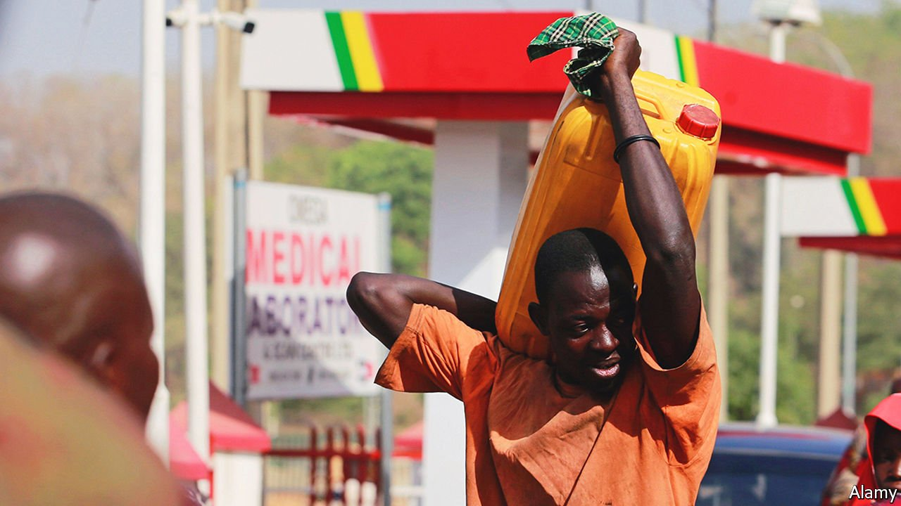

###### Pumped dry

# Why fuel shortages are spreading across Africa 

##### Expensive oil is not just driving up prices 

 

> May 7th 2022 

IN BURUNDI, DRIVERS are so desperate for fuel that they sleep on forecourts of petrol stations. Senegal has so little jet fuel that Air France’s flight from the capital, Dakar, to Paris has been stopping in the Canary Islands to fill up. Johannesburg has the same problem, which has caused United Airlines to cancel some flights from New York. From Kenya, which recently suffered its worst petrol shortage in a decade, to Lagos, where queues outside petrol stations backed onto motorways, and Cameroon, where thousands of lorries have been stranded without diesel, Africa has been short of the lifeblood of modern economies. “Everywhere, everyone is scrambling for diesel,” laments Anibor Kragha of the African Refiners and Distributors Association, an industry group.

The economic costs of shortages are huge. They bring commerce to a grinding halt, shut the millions of businesses that have to generate their own electricity and force holidaymakers to cancel trips for lack of flights. This is a blow to tourism, a large contributor to GDP in many African countries. The social impact is large, too. Hospitals cannot get drugs and ambulances are immobilised. All this makes politicians jumpy. Anger at shortages can quickly erupt in the streets.


Demand for fuel surged across the world last year as economies recovered from covid-19. Yet for the first time in 30 years global refining capacity fell, causing fuel prices to rise. Russia’s invasion of Ukraine pushed them higher still. In most places fuel has remained available, if expensive. But not in Africa, which is going through its worst supply crisis in 40 years, according to Pierre Barbe, who runs the Africa business at Vitol, the world’s biggest independent oil trader.

The shortages are not simply the result of higher prices that have made fuel unaffordable to poorer buyers in many parts of Africa. They have also been caused by several other market changes that particularly affect the continent, says Kristine Petrosyan of the International Energy Agency (IEA), an intergovernmental think-tank.

Fuel traders generally use financial markets to lessen the risk of price fluctuations. But they have to spend much more (and tie up more working capital) hedging when prices are high and volatile. Importers to Africa are often smaller than those in richer regions, and have tighter balance sheets. To conserve capital many simply import less fuel.

The problem is being aggravated by a turn in the futures market: the price for deliveries of oil at a future date has fallen far below that for immediate delivery. In more usual times traders would park dozens of full oil tankers (known as “floaters”) off the west African coast, where they would wait for higher prices. Now traders want to unload them as quickly as possible and send them to Asia through the Suez canal, avoiding Africa altogether.

Many sub-Saharan countries are particularly vulnerable because they generally buy in small amounts from floaters or tankers sailing by. Whereas many rich countries hold a 90-day supply in reserve, few sub-Saharan countries have any such backup. It is clear that there is little storage capacity in the region, although data on this are scant.

A second vulnerability is that sub-Saharan countries refine little oil domestically. Many of their refineries are badly run and operate far below capacity or are too small to compete. Refinery output in sub-Saharan Africa has fallen by half over the past decade, even as oil demand in the region has risen by 19%, according to the IEA. Sub-Saharan Africa now imports about three-quarters of its refined products on average, a greater share than any other region. That leaves it deeply exposed to external shocks. West Africa is especially vulnerable. Senegal, for example, is short on fuel in part because the country’s sole refinery has been shut for maintenance.

Having little refining capacity and barely anything in reserve is risky at the best of times. In many African countries poor logistics, bad management and distorting subsidies regularly cause supply shocks. Many African ports can only receive ships with a shallow draft, forcing big tankers to offload into little ones. They are also heavily congested, exacerbating delays. Nigeria’s recent shortages emerged after the authorities blocked the sale of 350,000 tonnes of petrol: it contained too much methanol. Exactly who messed up is hotly contested but, with tiny reserves, motorists were soon running dry. In Kenya the government subsidises petrol but does so clumsily, worsening fuel shortages. It was recently late paying the equivalent of $112m in subsidies to retailers who were already struggling with a shortage of working capital because of high prices.

Things may soon get even worse. Big oil traders are reducing purchases of Russian oil to comply with European sanctions that take effect on May 15th. This will further cut the flow to Africa of fuel refined in Europe from Russian oil.

In the long run much hope—and cash—is invested in a big refinery being built in Nigeria by the Dangote Group. Though the project is years behind schedule, it is expected to be completed later this year. Yet the project is an exception to the trend of declining capacity. Africa also needs deeper strategic reserves of fuel to weather both global shocks and local troubles. “Maybe this will be a wake-up call, the way the 1970s were to Europe,” says the IEA’s Ms Petrosyan, “because it is clear that this situation can repeat in the future.” ■

