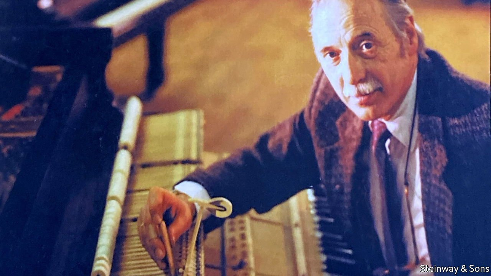

###### Travels with a piano

# Franz Mohr was the man who made great concerts possible 

##### Steinway’s chief piano tuner for 24 years died on March 28th, aged 94 

 

> May 7th 2022 

SEVERAL DECADES ago The Economist’s New York office was above the old showroom of Steinway &amp; Sons, piano-makers, on West 57th Street. The way to the office was a staircase to the left; to the right the glossy black pianos stood among rich carpets, and customers could be seen and heard shyly, or boldly, trying them out.

The showroom, however, was not Franz Mohr’s place. His realm was the basement, where the beautiful concert grands were stabled within bare walls, out of the daylight, in ideal relative humidity of 45-65%. Here, in his black Steinway apron, he was in near-constant attendance, ears cocked to his tuning fork to hear how quickly, after he struck a key, the wave died and the note was “in”, while his right arm was thrust into the innards of each creature, moving his tuning hammer along the tuning pins. When electronic strobes came in, he had no time for them. To set pitch, a tuner could rely only on hearing and touch.


Each piano had a different character. To make two sound exactly alike was an impossibility. No doubt the good Lord—to whom he turned constantly, as to his tuning fork, to hear the perfect pitch of his life—could make two the same, but where would be the joy in that? So one piano would have a big, bombastic voice, just right for Rachmaninov, and another would be refined, for chamber music. No piano could give what wasn’t there. He could, however, gradually adjust them, by both tuning and full mechanical regulation, to be as close as possible to the sound the owner wanted. Day in and day out, that was what he was doing.

Into this room the great pianists came, looking for an instrument to play in public. He would brim then with pride and excitement, but kept his mouth shut, unless the maestro asked a question. He knew his place. In his time at Steinway he was the chief tuner for Arthur Rubinstein, Van Cliburn, Glenn Gould and, more than anyone, Vladimir Horowitz, who in the 1980s was perhaps the greatest in the world. His awe at their art did not alter his feeling that the pianos were his, as much as theirs.

Their tastes were highly distinctive. Horowitz wanted a brilliant response from a petal-light touch, which most other pianists could barely control. He also liked (and here Mr Mohr’s German English ran out), a bit of “nasal-ness” in it. Rubinstein preferred a warmer, darker sound, and forbade the keys to be cleaned because it made them slippery. When Mr Mohr, new to his service, polished them, he had to apply a double- pssst of hairspray to restore their resistance. Gould wanted the hammers to make a drumming at certain speeds, so he fixed that for him, though it hurt.

As the stars toured the world he went with them, or firstly with their chosen pianos and a box of tools of his trade. Anxiously he oversaw their disassembly at Steinway and their reassembly in the concert hall, where he would tune for hours on end, sometimes going without his dinner. Often he was the only living creature there, apart from the piano itself. But he loved that! He thanked God he could stay in the background, with a servant heart, unless things went wrong. For they did: a stool set too high in Chicago, propelling Horowitz into fury, and a broken string, a bass A flat, at Carnegie Hall. He went on to fix both, gathering applause and taking bows, but could not leave those lonely stages fast enough.

In his youth, growing up in wartime Germany, he had never considered such a role. He had learned the violin, studied music at Detmold and Cologne, and hoped to be a soloist. But the Lord had planned a different future for him. Tendonitis crippled his left wrist, and he had to give up playing. He answered an ad that led him to an apprenticeship in piano mechanics, then another that took him in 1962 to Steinway in New York. It was not his dream path, but it still had to do with music. In a way it mirrored an event he had never forgotten, the burning in a bombing raid on Cologne of the Academy’s great organ, which responded to the winds that followed by groaning, then singing, through the fire.

Working with the maestros was eye-opening in itself. Cliburn, a good Texas boy, was too lazy to practise except “onstage” (he told him), and collected dozens of leather suitcases. Gould, before a recording, would soak his hands in water as hot as he could stand it, then put on gloves, then take them off to play. He made the technicians despair both with his humming as he played, and with the squeaks of the fold-up chair he insisted he must sit on.

It was Horowitz, though, and Horowitz’s piano, with whom Mr Mohr’s life became most tightly entwined. After a few delicate years, Horowitz would have no tuner but him. The piano in question, one of six the maestro used, had been built for him by Steinway in 1941, and regulated so lovingly by Mr Mohr since 1965 or so that its insides were as good as new. On this Horowitz could display his whole range, from whispering pianissimi to thundering fortissimi: mostly because it was a Steinway, as Mr Mohr loyally insisted, whose secret lay in the quality of the wood in it, but also because he had given a really high tension to the repetition spring. After Horowitz’s death in 1989 he continued to care for it, tuning and regulating it and accompanying it on tour round America, so that other pianists could play it—though this would not, he cautioned, no way! make them play like Horowitz afterwards.

Life with the maestro was not always easy, but he could cope. When the cry went up once in rehearsal, “Franz, there’s something wrong with this key!”, he told Horowitz that he could fix it in half an hour, a good chance for the maestro to take a coffee break. The break cured the problem. He did not need to touch the key.

His duties came to include holding Horowitz’s hands before a concert. They were very cold. “I admire you with your warm hands,” the maestro said once. He also said, “Franz, you are the most important person here.” “No, Maestro, you are!” “No, no,” came the reply. “If the piano’s not right, I’m not going to play!” ■

