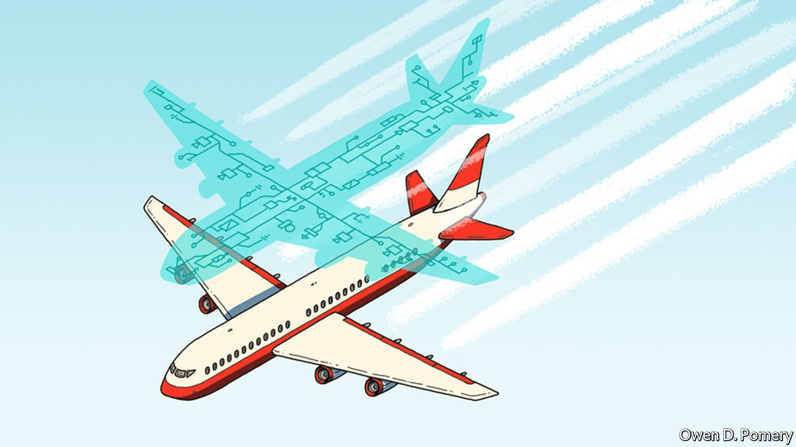

###### Future aircraft

# Digital twins in cockpits will help planes look after themselves 

##### And book themselves in for a repair, if needed 

 

> May 7th 2022 

DIGITAL TWINS are  of a component, a device or even an entire production line in a factory. Fed with data from sensors installed on its physical opposite number, the digital version can be used to plan maintenance, spot any emerging problems and simulate the effect of upgrades and design changes.  in particular are followed by their manufacturers in this way. General Electric, Rolls-Royce and Pratt &amp; Whitney, the three principal firms involved, maintain simulations of individual engines at engineering centres on the ground. These suck in real-time data from their counterparts in the air.

At Cranfield University, in Britain, however, a group of engineers hope to go further than this. They propose expanding the idea of digital twinning to produce what they rather grandiosely refer to as a “conscious aircraft”. This would involve creating a digital twin of an entire plane by merging its various monitoring systems, and interpreting the result using artificial intelligence (AI).


At present, the monitoring systems on planes tend to work independently of each other. This means, for instance, that if a sensor keeping an eye on a valve in the fuel system indicates a problem, engineers may then replace that valve, only to find that the problem remains because the actual fault is in the electrical system. Ian Jennions, the technical director of Cranfield’s Integrated Vehicle Health Management Centre, proposes instead a “reasoning system” that takes an overview of the individual monitoring systems.

Because it is not practical to put a sensor onto every potentially breakable part of an aeroplane, lest it end up too heavy to take off, this will use AI trained to find faults which can be detected from broader measurements, such as patterns of vibration and temperature changes. Moreover, such a whole-plane digital twin is likely to reside in the aircraft itself, rather than relying on vast amounts of raw data being transmitted to a maintenance base for processing. That will provide swifter analysis and avoid transmission bottlenecks.

All this will enable an aircraft to reconfigure such things as battery connections and fuel use on the fly, as it were. The reasoning system would also keep an eye on things like the weather the aircraft was operating in, because these, too, can effect the wear and tear of parts. Flying through dust clouds, for instance, can accelerate the abrasion of engine parts.

The aircraft would communicate with its pilots (assuming there were any, for some future aircraft, especially freighters, may well be drones) and also with ground engineers. Such a plane would, in some sense, be “aware” of how its various components were performing and interacting with one another. It is this level of self-awareness which the researchers use as an excuse for describing the system as conscious, a term which they say reflects a direction of travel rather than a goal.

That self-awareness would, though, allow the plane to book itself in for maintenance when needed, rather than on a fixed schedule, and to order any spare parts required in advance. The predictive maintenance such a system would provide should help avoid unscheduled stopovers and repairs. Every day which a passenger jet remains on the ground costs several hundred thousand dollars of lost revenue. Dr Jennions reckons a conscious aircraft could cut maintenance expenses by around 30%.

Such maintenance might also be automated, at least in part. Cranfield, which began as an aeronautics college in 1946, has its own airport, a hangar and a  to experiment on. The researchers are exploring the use of drones equipped with optical and thermal sensors to fly around an aircraft in a hangar, looking for external anomalies. Meanwhile, tiny snakelike service robots could crawl into enclosed areas such as fuel tanks to conduct repairs.

The Cranfield team hope to have a whole-aircraft digital twin operating by 2024 and a prototype with a degree of self-awareness flying on an aircraft by 2035. Whether such a system will include a sense of shame for lousy cabin service remains to be seen. ■

To enjoy more of our mind-expanding science coverage, , our weekly newsletter.

