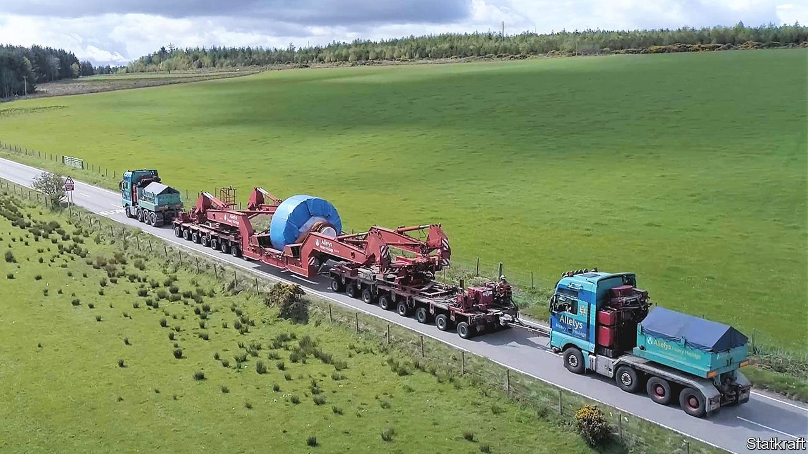

###### Grid inertia

# Green power needs more than just solar panels and wind turbines 

##### Electricity grids themselves must be tweaked to cope 

 

> May 7th 2022 

NO GOOD DEED, an old saying has it, goes unpunished. That is certainly true of the . The unreliability of solar and wind power compared with that generated by fossil fuels is well known—and with it the concomitant need for  such as large battery packs to smooth things over.

But green energy brings another, more subtle, problem. Modern electrical grids operate on alternating currents (AC), and these need to be of a fixed and reliable frequency (usually either 50Hz or 60Hz). This frequency’s stability is maintained by a phenomenon called grid inertia, which results from the real, physical inertia (as described by Isaac Newton’s first law of motion) embodied in the power-generating turbines of fossil-fuel (and also nuclear and hydroelectric) power stations.


Going for a spin

These turbines act as massive, inertia-storing flywheels. As long as their outputs are in synchrony (and one important part of grid management is to keep them that way), the resistance to change which their inertia provides stabilises the whole grid. The fewer the number of these turbines (as opposed to wind turbines, which rotate out of sync with the grid, and solar panels, which do not rotate at all), the less inertia a grid has. And in some particularly green countries this is getting to be a problem, to the extent that non-power-generating flywheels are being added to the system to provide the missing inertia.

One such place is Britain, which generates about 30% of its electrical power from wind and sunlight. On March 17th, for example, National Grid ESO—the firm that, as its name suggests, operates the country’s electricity grid—cut the opening ribbon on a plant built near Keith, in northern Scotland, by Statkraft, a Norwegian renewable-energy firm. The inertia in this plant is stored by a pair of steel flywheels (see picture of the road train required to deliver them). Each of these flywheels weighs 194 tonnes and rotates at up to 500 revolutions per minute (rpm).

A second Statkraft plant should open in the autumn, near Liverpool. Instead of large masses rotating relatively slowly, this will rely on smaller ones spinning fast (1,500rpm). Both approaches embody about the same amount of inertia, and in combination the pair will store around 2% of the inertia currently required to support Britain’s grid. That is equivalent to the inertial contribution of a conventional coal-fired station. Moreover, later in the year National Grid ESO plans to add two more systems, built by Siemens, to increase its inertia-storing potential still further.

There is, though, an alternative to building new flywheels, and that is to repurpose old ones—in other words, to redesign existing fossil-fuel stations simply to store inertia, rather than generating electricity. National Grid ESO is testing that idea, too, in a former gas-fired station in north Wales. This has been open for business as an inertia store since 2021.

The firm hopes, as well as all this, to develop ways of stabilising the network without spinning lumps of metal for their own sake. That will involve the use of what are known as grid-forming inverters.

Both solar power, which is a direct current (DC) when it comes out of the generating panel, and wind power, which is AC but still needs to be tweaked before being fed into a grid, are first processed by semiconductor-based devices called inverters. This is also true of the DC drawn from storage devices such as batteries, which are employed to smooth out irregularities in solar and wind power.

Existing inverters are described as “grid following”. This means they monitor and fit in with the established frequency of the grid they are feeding into. That suits grid managers well enough when solar and wind contribute only a small fraction of a grid’s total power, but is progressively less suitable as that contribution rises. However, inverters can be designed to be “grid forming” instead—meaning the current they put out mimics the external stabilising effect of mechanical inertia. Using grid-forming inverters rather than grid-following ones should allow much more wind and solar power to be integrated easily into a grid.

Until recently, grid-forming inverters had been tested only at small scale. In January, however, Britain’s energy regulator, Ofgem, signed off on a technical standard acceptable to both manufacturers and service providers. That will permit their large-scale deployment, and Julian Leslie, National Grid ESO’s chief engineer, says he expects big grid-forming inverters to be providing inertia within two years.

Grid lock

Being an island, Britain has a more or less self-contained electricity grid. This makes it a good place to try such an experiment. Success would encourage other island grids, both real (Australia’s and Ireland’s, for example) and metaphorical (such as Texas’s, which has few links with the rest of North America) to try. Larger grids in North America and Europe will no doubt be watching from the wings.

The quest for grid inertia, then, is an example of the nitty-gritty adjustments needed to accommodate the shift in energy production and use that is now going on. Other technologies, from electric cars to hydrogen-gas supplies, may have higher profiles. But what is happening down in the engine room of the green economy is just as important—if not more so. ■

For more coverage of climate change, register for , our fortnightly newsletter, or visit our 

