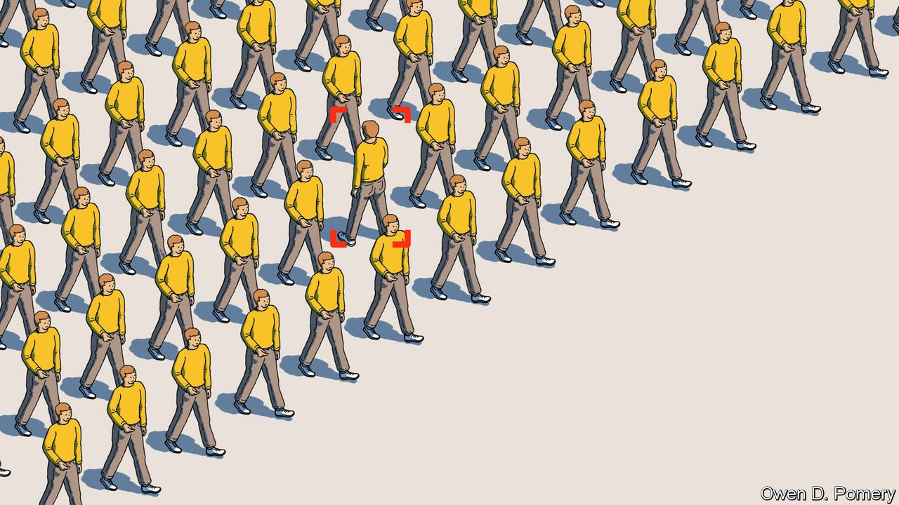

###### Aerial surveillance

# The spy in the sky that sees backwards in time 

##### Use of wide-area motion imagery is spreading 

 

> May 7th 2022 

THE WAR in Ukraine has brought the topic of eyes in the sky to general attention, as the Ukrainian army in particular has put  to good effect in identifying and destroying targets in the here and now. But aerial surveillance can also reach backwards in time, by the expedient of indiscriminately recording everything that is going on in a particular neighbourhood, and then looking for useful patterns in the resulting footage. This technique, called wide-area motion imagery (WAMI), has been around since 2006. But improvements in both the recording equipment used and the means by which the images are analysed are making it more and more valuable.

WAMI was first employed by American forces in Iraq to track down those placing roadside bombs. When such a bomb went off, it was possible to run the relevant footage in reverse and trace the events that led up to the explosion. That often allowed the bombers to be identified and dealt with. Clearly, though, the omniscience provided by WAMI can be employed for many other intelligence-related tasks, and the number of jobs the technology is being used for has thus multiplied.


But there is a problem. Explosions are easy to see. For many tasks other than bomber-hunting, however, an awful lot of staring at screens looking for things that are out-of-the-ordinary is involved. People are bad at this—and there is, besides, a lack of willing eyeballs. A study published last year by researchers at the RAND Corporation, a think-tank, showed that America’s air force has responded to the flood of data from WAMI sensors by archiving most of it without inspection. Better means of sifting WAMI footage are needed. And technology is starting to provide them.

Chips called graphic-processing units, borrowed from the video-game industry, are helping. So is machine learning, the basis of much modern artificial intelligence. But special tricks are also being deployed—for example, a mathematical technique called higher-order moments anomaly detection that can distinguish moving objects reliably from background clutter by looking at groups of pixels in a video and deciding whether their changes from frame to frame are the result of actual movement or just electronic noise.

Meanwhile, WAMI devices themselves are becoming yet more effective. The latest, announced on April 25th by Transparent Sky, a firm in Albuquerque, New Mexico, promises to take the technology to another dimension. Literally. The video images it shoots are 3D rather than the 2D of a normal WAMI feed.

Shoot first. Ask questions afterwards

WAMI began with an aircraft-borne system called Constant Hawk, which was developed by Lawrence Livermore National Laboratory, in California. Constant Hawk’s success in Iraq begat more powerful versions. Gorgon Stare, carried by drone, was designed by the armed forces themselves. A blimp-mounted arrangement called Kestrel, intended to watch over installations such as military bases, emerged from Logos Technologies, a firm that has John Marion, one of Constant Hawk’s inventors, as its president. And other countries have joined in, too. Perhaps surprisingly, China is not (as best one can tell) among them. For domestic purposes, at least, it prefers closed-circuit television. But Britain, France, Israel and Turkey all host companies that make WAMI kit.

American firms, however, still rule the roost. L3Harris, a company in Florida, sells WAMI sensors for use as automatic sentries. Their software monitors the coming and going of vehicles and pedestrians into and out of so-called watch boxes. These are protected areas surrounded by virtual trip wires, the triggering of which will cause a vehicle or individual of interest to be tracked. Motion-analysing software, meanwhile, looks for particular types of driving behaviour, such as avoiding vehicle checkpoints or travelling in convoy.

This approach can detect immediate threats. It can also, working over a longer period, carry out “pattern of life” analysis by building up a picture of what normal daily traffic looks like in an area. That permits the identification of anomalies which might signal hostile agents whose movements would otherwise be masked by the hurly-burly around them.

Double WAMI

The sensors themselves are getting better, too. For one thing, they are smaller. Constant Hawk weighed 680kg. Transparent Sky’s latest weighs in at less than 1kg.

They are also more versatile. Logos, for example, now has “multi-sensor” pods. These combine several types of instrument with WAMI, to increase effectiveness. They are now being tested by America’s navy. The latest version includes a so-called hyperspectral sensor, which sees simultaneously across many different wavelengths, including infrared and ultraviolet. It is thus able to distinguish things which the naked eye cannot, such as the difference between camouflage and vegetation.

This approach’s real power, however, lies in software which automatically passes data between sensors. Mr Marion cites a recent demonstration in which the hyperspectral sensor identified simulated homemade explosive material. That cued an inspection camera to take close-ups. The system then checked the surrounding area for recent vehicle movements, identified a car which had been nearby, and followed it. All of these data were combined into an intelligence package tailored for human consumption. Only at that point was it passed on to a human being.

Future multi-sensor pods may include other instruments, such as signals-intelligence receivers. These are bits of equipment which can detect radio-frequency communicators like mobile phones and walkie-talkies, enabling particular devices to be identified and located. That would permit the individual carrying the phone, and also those he or she came into contact with, to be tracked and photographed. Add specialised infrared cameras and LIDAR, an optical equivalent of radar, and such an instrument would also be able see through dust, haze and darkness.

So far, the costs and complexity of WAMI have kept it as a predominantly military technology. But that is starting to change. Smaller and more affordable versions are now within the reach of police, fire services and other non-military users.

Some such uses are unexceptional. ViDAR (Visual Detection and Ranging), for example, is a system developed by Sentient Vision Systems, an Australian firm, to spot life jackets in search-and-rescue missions. It has a camera that sweeps a wide area and instantly picks out items of interest. Sentient Vision claims it is 300 times faster than a human being at doing so, and can spot a life jacket even in rough seas with six-metre waves. It can also be used to detect illegal fishing.

Such innovation is good if it is used to save lives and catch the bad guys. But at the murky intersection of ordinary crime fighting and sedition it could also offer those inclined to emulate Big Brother a powerful new tool to abuse.

At the moment the employment of WAMI for crime fighting is (as far as is known) still rare. One early example was the use of Simera, a development of Kestrel, to watch an area of 160 square kilometres around the stadia used for the 2016 Olympics, in Rio de Janeiro. That was a temporary expedient, stood down once the games were over. But some police forces in America have tested WAMI out for day-to-day policing.

The most famous examples were in Baltimore, where the local cops experimented with the idea twice—first in 2016 and then in 2020. The second time around they made the mistake of monitoring a political protest as well as looking for crimes such as vehicle theft. That is precisely the sort of slippery-slope approach which civil-libertarians worry about. They were therefore taken to court by the American Civil Liberties Union. Their actions were ruled unconstitutional and both the police department and the firm involved will have to expunge all records and data collected.

This, and an analysis of the Baltimore experiments by RAND, which suggests they brought only marginal benefit to regular crime fighting, means American police forces will probably not push the point. Nor has a test of WAMI to monitor illegal crossings of America’s border with Mexico been followed up. But security services elsewhere, with political as well as crime-fighting agenda, might take a different view. WAMI may yet prove to have legitimate policing uses. But if the price of liberty is eternal vigilance, then vigilance against the misuse of this sort of vigilance needs to be eternal. ■

To enjoy more of our mind-expanding science coverage, , our weekly newsletter.

