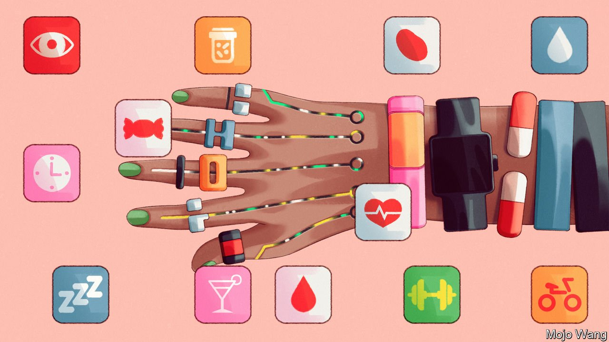
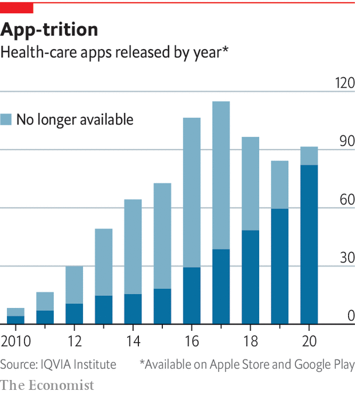

###### Killer apps, saving lives

# Apps interpreting data from wearable devices are helping people to live better 

##### But too many of the apps are poorly designed 

 

> May 1st 2022 

IT IS A TRENDLINE that gives you pause: a spike nearing the top of the blue band that marks your normal blood-sugar range, followed by a sharp dip. The culprit is obvious: the sourdough toast for breakfast half an hour before. A generous piece of banana bread the following morning leaves a completely different trace. The blood-sugar line runs nicely unperturbed right down the middle of the normal zone all the way through to lunchtime.

These are the sort of revelations that a continuous glucose monitor, a coin-sized device attached to the skin, beams to your smartphone’s screen. The device lasts for two weeks and has a tiny needle that gets just under the skin. Every few minutes it measures the concentration of sugar in the fluid between the cells there—a good proxy for what is going on in the bloodstream.


Almost as soon as the first such continuous glucose monitors started replacing finger-prick blood tests for diabetics in 2014, they began to show up on the arms of non-diabetic geeks in Silicon Valley. They were looking for ways to “hack” their metabolism into delivering, for instance, more energy or brain clarity. Their ad-hoc experiments were soon replicated by formal researchers doing broader studies of metabolism. Those, in turn, have led to the possibility of personalised nutrition.

Such metabolic studies have changed the scientific thinking on what a healthy diet looks like. It has turned out that many seemingly healthy people often have large post-meal spikes in blood sugar, which have been linked to the development of pre-diabetes. Without any intervention pre-diabetes turns into diabetes in 37-70% of cases within four years. The sugar dips that often follow the spikes were recently found to be problematic, too, because they make people feel hungry. People who are “big dippers” consume about 300 more calories a day than those who are not.

In 2015 researchers in Israel showed that an AI-based algorithm they had developed could predict someone’s blood-sugar reaction to various foods. The algorithm’s inputs included blood tests, sleep, exercise, height and weight, which all affect daily metabolic variations. They also included the composition of the gut microbiome, the trillions of bacteria residing in the gut whose collective job is to process what we eat. Microbiome analysis is done by shotgun genomic sequencing of everything found in a stool sample.

In the past five years startups in America, Europe and Asia have launched AI-based personalised-nutrition apps that build on these discoveries. One of them, Zoe, sends customers a set of specially formulated muffins. By knowing exactly what is in the food being eaten, and measuring the changes in blood sugar and fat that come about in response, the company can create a predictive model of its customers’ metabolism. Its algorithm then whips up a bespoke catalogue of foods and meals, with predicted blood-sugar reactions to each. Tushar Vashisht, co-founder of HealthifyMe, an Indian startup that provides digital coaching for weight loss, says the trove of data from customers who can afford various connected devices and blood tests as inputs for their bespoke plans is useful far beyond those customers. It can help to build apps for people who do not have such devices, which would rely on AI-derived proxies of weight, blood sugar and so on.

For such systems to keep metabolisms in balance, they have to be adhered to. Knowing what is happening inside your body is no help if you do nothing to change the pattern of behaviour involved. Just being told that it is in your interests is not, typically, enough. So apps sold as ways of achieving health gains on the basis of measurements made by wearables typically incorporate a variety of behavioural nudges to keep the user focused.

The AI innovation in such personalised diets makes them easier to maintain in the long term because it gives people options on how to make the foods that the algorithm says are particularly bad for them a little less bad. The algorithms may suggest small tweaks, such as sprinkling some nuts on that ice cream or going for a long walk after eating it. January AI, another personalised-nutrition startup, says it has derived the nutrition contents of 16m grocery-store items, recipes and menus of local restaurants, which makes it easier for users to plan and track meals.

It is still early days, but results reported by users of such precision-nutrition programmes look encouraging. Users say they are losing weight, have higher energy levels and are sleeping better. Some diabetic users no longer need medication. Studies of several apps are under way to confirm and quantify these benefits.

However, thoughtful suggestions that make compliance easier are the exception. As too often with the design of new tech products, behavioural science is an afterthought. When she began researching her book, Natasha Schüll, the cultural anthropologist from NYU, found trying to decode the logic behind many health-tech products very frustrating. Then she realised that there was no logic. It was “a pinch or two of positive psychology thrown in with the infrastructure of a punitive Skinner box, thrown in with some other notion of the brain” ending up as “a hotch-potch of ad-hoc things that was not that studied or scientific”. The typical design strategy, she concluded, “was just throwing things at the wall”.

 


This may be why many of the apps fail to establish themselves in people’s lives (see chart). There are more than 400,000 health and wellness apps on the Apple and Google app stores with 250 new ones added daily. Appetite for them is healthy, with around 5m app downloads per day. But 95% of those downloads will be deleted within 24 hours.

The problem is that people do not just need a product that is well designed. They need a product that is well designed for them, says Liz Ashall-Payne from Orcha, a British organisation that evaluates the quality of health apps for clients like the National Health Service. As she points out, buying a pair of trousers online is made easy by filters for size, colour and style, but no such system exists on the app stores. A teenager seeking help for anxiety will need a different type of app to his grandparent wanting the same thing.

A lot of dead wood

Orcha has rated 7,000 health apps on three criteria: privacy, user experience and evidence that they work. Only about a quarter of them meet its quality threshold on all three. Mental-health apps are particularly weak. But quality is improving, says Ms Ashall-Payne. She attributes that to the guidelines for health apps that were set recently by British health authorities, which gave developers clarity on what “good” looks like. As the market matures the bad products will die out, “but it’s going to take time”.

Making people stick to healthy behaviours is probably the biggest challenge in public health. That makes innovations which boost compliance particularly exciting. Technology developed by Sweetch, an Israeli startup, is making the advice dispensed by health apps more practical and personalised. Sweetch’s AI-based algorithm is a hybrid of a personal secretary and a motivational coach. It keeps track of whatever it is the user must do, such as walking a certain number of steps or checking their weight weekly, and finds the best time to suggest they do it.

The vigilant bot may spot, for example, that you have a 20-minute gap between meetings and suggest you pop out for a walk to the coffee shop a few blocks away to do your steps. It changes your activity goals up and down depending on how you are doing, to prevent you from becoming demotivated and ditching the whole thing. The prompts are available in 33 different tones of voice: combinations of words that can be friendly, begging, commanding and so on. Yoni Nevo, Sweetch’s chief executive, says that the algorithm evaluates about 700m possible combinations of things to say to an individual on any given day. It takes about four to five weeks for the algorithm to learn what makes you tick by trying different combinations of all these things.

Device manufacturers, for their part, are starting to realise that when it comes to giving people health data, less is sometimes more. Many people are happier when they are simply told whether things are fine or not, rather than being flooded with all sorts of data to make sense of before breakfast. Some smart scales now just buzz approvingly when you step on them to confirm that your weight and body-fat composition are in your target range, rather than giving you the metrics. Wearables like the Oura ring are now able to tell you not just what your heart rate, sleep or temperature trends are, but also what that means—and what changes might improve things. And when the data show that things have gone off kilter, novel digital treatments may come to the rescue. ■

